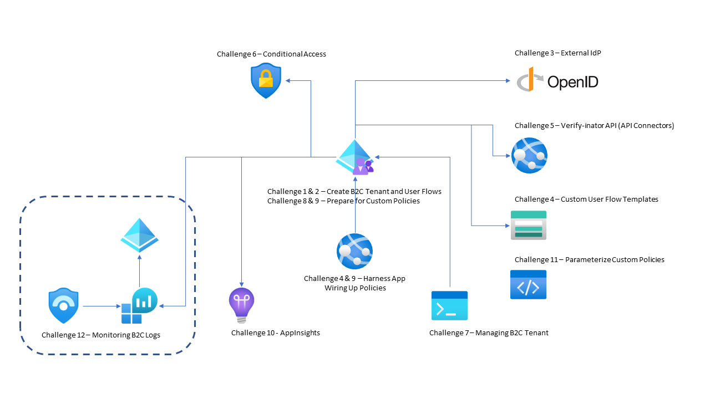
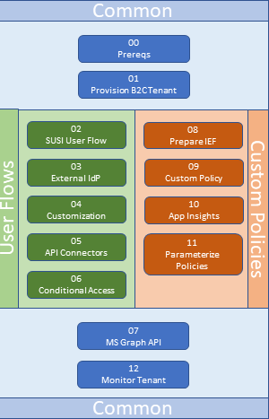

# Identity for Developers

## Introduction

The Identity for Developers Hack will provide you a deep dive experience into enabling customer-facing identity solutions for your applications. Identity is a booming area of the Microsoft Cloud platform and enabling identity solutions in your engagements allows for faster production deployments. Azure Active Directory B2C enables you to provide custom identity access management solutions for your applications.

## Learning Objectives

In this hack, we'll enable identity solutions using Azure Active Directory B2C, demonstrating how to:

  1. Create and integrate out of the box user flows

  2. Create and integrate customized policies

  3. Call REST APIs for token enrichment and claims validation

  4. Monitor and report on your B2C tenant

## Overall Architecture

In this hack, you will build Azure AD B2C policies that enable users to be able to sign up, sign in, edit their profile, and delete their account. Along the way, you will enable API integration, conditional access checks, monitoring, and other services. The below diagram shows the various services this hack involves, along with the corresponding challenges where you will encounter these services. The section that follows this provides additional information and links to the specific challenges.

## Challenges

Challenge 0: **[Prepare Your Environment for B2C](Student/00-pre-reqs.md)**

- Get yourself ready to develop Identity solutions

Challenge 1: **[Getting Started with B2C](Student/01-provision-b2c.md)**

- Provision a B2C Tenant

Challenge 2: **[Sign Me Up! Sign Me In!](Student/02-susi.md)**

- Create a simple Sign Up and Sign In user flow and test it in the Azure AD B2C portal

Challenge 3: **[External Identity Providers](Student/03-external-idp.md)**

- Set up the ability for your users to log in to your app with a GitHub, Facebook, or Gmail identity

Challenge 4: **[Logos, Colors, and Custom Text](Student/04-l14n.md)**

- Add a bit of flare to your sign up and sign in pages by adding a custom template and colors, wiring up your User Flows to an ASPNETCORE MVC app, and use language customization to modify string values displayed to the user

Challenge 5: **[Claims Enrichment - The ID Verify-inator!!](Student/05-claims-enrichment.md)**

- Enrich the claims that you collect about a user during the sign up process by calling out to a custom REST API

Challenge 6: **[Conditional Access - Are You Who You Say You Are?](Student/06-conditional-access.md)**

- Create and enforce Conditional Access policies in your tenant such as enforcing MFA (including Microsoft Authenticator) and detecting Risky Login Behavior

Challenge 7: **[Admin the B2C Tenant with MS Graph](Student/07-admin-graph.md)**

- Use the MS Graph API to query your B2C tenant. Also use the Graph API to update various objects in your B2C tenant, such as policies, keys, and identity providers.

Challenge 8: **[Preparation for Identity Experience Framework](Student/08-prepare-ief.md)**

- We'll need custom policies, so let's get things ready. Apply the Trust Framework and also create an OIDC IdP for your external IdP

Challenge 9: **[Creating Custom Policies](Student/09-custom-policy.md)**

- Implement a custom policy for Sign In that will call to your custom REST API to perform claims enrichment for users that signed up prior to Challenge 5. Also, we'll break the Sign Up and Sign In policy to be just a Sign Up policy.

Challenge 10: **[Getting Insights Into B2C](Student/10-appinsights.md)**

- Enable App Insights in your custom policy so you can track a user through the various steps in the Orchestration. Add custom events to your Orchestration and track them in App Insights.

Challenge 11: **[Parameterize Your Policies](Student/11-parameterize.md)**

- Take your custom policies and parameterize the values that could change from environment to environment, and use the B2C extension to VS Code to generate environment-specific policy files.

Challenge 12: **[Hey, What's Going On In My B2C Tenant??](Student/12-monitor.md)**

- Monitor your B2C tenant by combining logs and app insights logs

## Challenge Flow

This Identity Hack can be broken into two smaller hacks: one focusing just on User Flows and the other focusing on Custom Policies. If you want a hack focused on one of these tracts, this diagram illustrates the common challenges and the tract-specific challenges:

If you want to experience both User Flows and Custom Policies, then exercise each challenge in order.
## Prerequisites

- Your own Azure subscription with Owner access
- Visual Studio Code
- Azure CLI

## Repository Contents

- `./Student`
  - Student's Challenge Guide
- `./Student/Resources/HarnessApp`
  - Sample AspNetCore app to be used to interact with your B2C tenant
- `./Student/Resources/MSGraphApp`
  - Sample DotNetCore Console app to be used to query your B2C tenant
- `./Student/Resources/Verify-inator`
  - Sample AspNetCore WebApi app to be called by your B2C tenant's SignUp User Flows
- `./Student/Resources/PageTemplates`
  - Sample HTML page template that can be used to customize User Flows and Custom Policies
- `./Coach`
  - Coach's Guide and related files

## Contributors

- David Hoerster
- Nick Thomas
- Tim Sullivan
