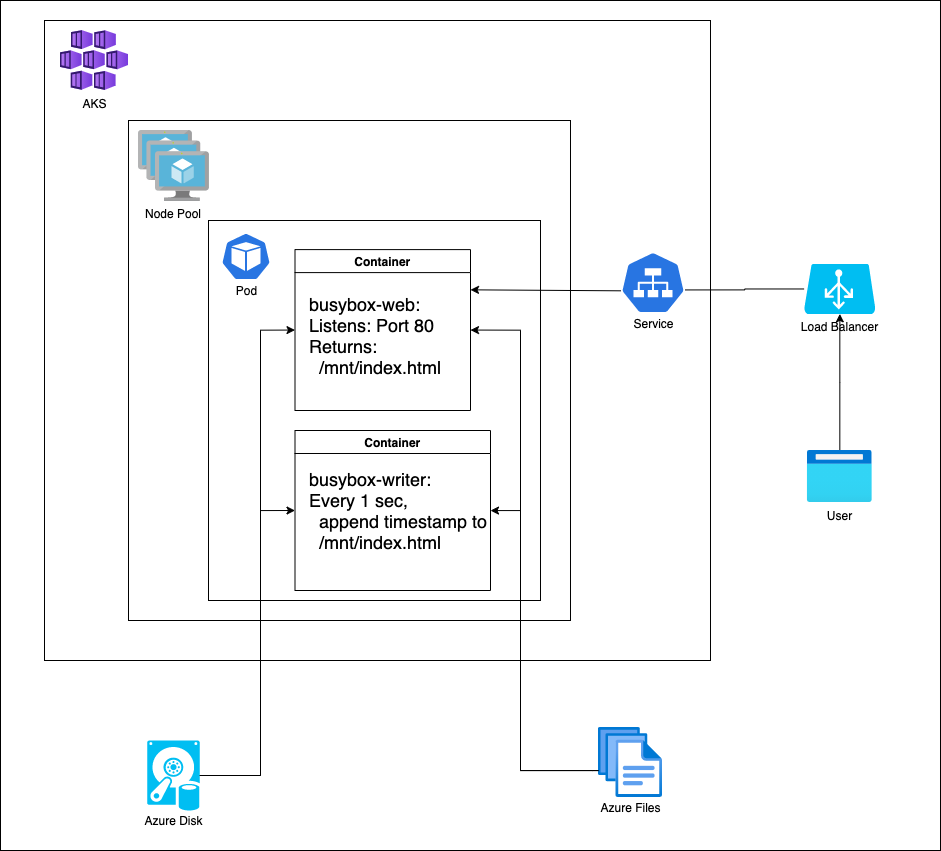
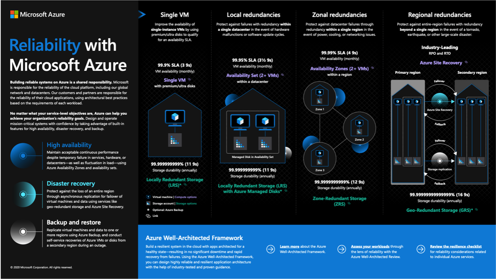

# **WTH - Advanced Kubernetes**

Tommy Falgout - US OCP CSA

---

# Agenda

* Introductions
* WTH is WTH?
* Data Volumes Walkthrought
  - Key Concepts
  - Demo
* Q&A

---

# Introduction

- Choose-Your-Own-Adventure WTH
  - Multiple, individual challenges
  - Pick the ones you’re interested in

---

# Objectives

- Create and deploy Helm charts
- Build resiliency into your pods
- Scale your cluster
- Use Git as the Source of Truth for your cluster
- Learn about the features of a Service Mesh
- Bring data into your web application

---

# Prerequisites

Before starting this hack you should have hands-on experience with the following:
- AKS
- Kubernetes Ingress
- Github (Repo, Cloning)
- Docker Hub

---

# Challenge #1 - Setup

- Only required challenge
- Key Concepts
  - Azure CLI
  - Docker / Helm
  - Github / Dockerhub / ACR
  - AKS / ACR
  - curl / jq
  - kubectx /  kubens / kube-aliases
- You will:
  - Create your AKS Cluster
  - Install tools used in other challenges

---

# Challenge #2 - Helm

- Helm is the package manager for Kubernetes
- Key Concepts
  - Helm Chart
  - Helm Release
  - Ingress / Ingress Controller
- You will:
  - Create a Helm chart
  - Deploy a Helm release

---

# Challenge #3 - Resiliency

- Processes fail.  Will your system too?
- Key Concepts
  - Liveness Probe
  - Readiness Probe
- You will:
  - Run multiple replicas of a pod
  - Enable the Liveness Probe
  - Enable the Readiness Probe

---

# Challenge #4 - Scaling

- Learn how to scale as well as when to scale
- Key Concepts
  - Horizontal Pod Autoscaler
  - Cluster Scaling
  - Requests / Limits
- You will:
  - Scale the pods (app)
  - Scale the cluster (VM)
  - Learn Requests and Limits

---

# Challenge #5 - GitOps

- Car drifting is cool.  Configuration drifting isn’t.
- Key Concepts
  - Kubernetes Operator
  - Flux
- You will:
  - Learn principles behind GitOps
  - Install Flux
  - Update your cluster via a change on GitHub

---

# Challenge #6 – Service Mesh

- Service Meshes provide more control and insight into your cluster
  - At a cost
- Key Concepts
  - Mutual TLS (mTLS)
  - Distributed Tracing
  - Envoy
- You will:
  - Review the different Service Meshes
  - Install Istio, Linkerd, and/or Consul
  - Enable some of the basic functionality of each

---

# Challenge #6 – Service Mesh - Comparison

|  Name | Uses | Supported by | Platform | Complexity |
| --- | --- | --- | --- | --- |
| Istio | Envoy | Google | K8S + VM | Heavy |
| Linkerd | Text | Buoyant | K8S Only | Light |
| Consul | Text | Hashicorp | K8S + VM | Medium |

---

# Challenge #7 – Data Volumes

Used when your application runs in a container, but still needs access to local files

Key Concepts:
- Persistent Volumes / Persistent Volume Claims
- Access Modes
- Storage Class

You will:
- Deploy a sample app which stores state
- The app writes to a file every second with a timestamp.  Web requests to the app returns the file contents
- Terminate the app to see how it responds to failure

---

# Challenge #7 – Data Volumes – Key Concepts

Storage Class (SC) – Defines a storage profile
  - e.g. Azure Managed Disk with Standard_LRS in EastUS

Persistent Volume Claims (PVC) – A request for storage using a SC
  - e.g. 1 GB Disk using the above SC

Persistent Volumes (PV)– Instance of storage
  - e.g. `/subscriptions/df8428d4-bc25-4601-b458-1c8533ceec0b/resourceGroups/mc_sandbox_sandbox_eastus2 /providers/Microsoft.Compute/disks/kubernetes-dynamic-pvc-593afd0e-4af4-49b5-a145-26a7bcd39a3e`

---

# Challenge #7 – Data Volumes – Key Concepts

Access Modes – The permission for the volumes

- ReadWriteOnce (RWO) - The volume can be mounted as read-write by a single node
  - Supported: Azure Disk, Azure Files
- ReadOnlyMany (ROX) - The volume can be mounted read-only by many nodes
  - Supported: Azure Files
- ReadWriteMany (RWX) - The volume can be mounted as read-write by many nodes
  - Supported: Azure Files

---

---

# Challenge #7 – Data Volumes – Gotchas

Availability Zones
- Volumes that use Azure managed disks are currently not zone-redundant resources.
- Volumes cannot be attached across zones and must be co-located in the same zone as a given node hosting the target pod.

Know your IOPS requirements
- Azure Files is slower than Azure Disk

---

# Challenge #7 – Data Volumes – Pop Quiz

- Which of these storage solutions would you choose for:
- Relational DB Instance? (e.g. MySQL)
- API which saves files on shared directory for permanent storage?
- API which saves files for temp storage?

---

# Challenge #8 – BC/DR

---

# Challenge #8 – BC/DR (Key Concepts)

Availability Set
- Logical group of VM's across Fault Domain (rack) and Update Domain (OS)
- e.g. VMSS or VMAS

Availability Zone (AZ)
- Physical zone (distinct power source, network, cooling)
- e.g. Zone 1 in West US

Region
- Group of Datacenters
- e.g. West-US

---

# Challenge #8 – BC/DR (Key Concepts)

Service Level Objectives (SLO)
- Internal goals
- More stringent
- Target for service Metric
- e.g. 99% of requests will be completed in 5ms

---

# Challenge #8 – BC/DR (Key Concepts)

| Availability % | Downtime per year | Downtime per quarter | Downtime per month | Downtime per week | Downtime per day |
| --- | --- | --- | --- | --- | --- |
| 99% ("two nines") | 3.65 days | 21.9 hours | 7.31 hours | 1.68 hours | 14.40 minutes 
| 99.5% ("two and a half nines") | 1.83 days | 10.98 hours | 3.65 hours | 50.40 minutes | 7.20 minutes |
| 99.9% ("three nines")  | 8.77 hours | 2.19 hours | 43.83 minutes | 10.08 minutes | 1.44 minutes | 
| 99.95% ("three and a half nines") | 4.38 hours | 65.7 minutes | 21.92 minutes | 5.04 minutes | 43.20 seconds | 
| 99.99% ("four nines") | 52.60 minutes | 13.15 minutes | 4.38 minutes | 1.01 minutes | 8.64 seconds | 
| 99.999% ("five nines") | 5.26 minutes | 1.31 minutes | 26.30 seconds | 6.05 seconds | 864.00 milliseconds

---

# Challenge #8 – BC/DR (Key Concepts)

High Availability (HA)
- Maintain acceptable performance despite service, hardware or DC failure
- e.g. VM Scale Set, Availability Zones

Business Continuity / Disaster Recovery (BC/DR)
- Protect against loss of an entire region
- e.g. South Central US goes down

Backup and Restore
- Replicate data to 1+ regions
- e.g. Azure Backup

---

# Challenge #8 – BC/DR (Stateless)

You will:
- Create 2 AKS clusters (east-us, west-us)
- Deploy a sample stateless app + service with Public IP
- Deploy a Traffic Manager instance
- Watch traffic go from one primary region to backup

