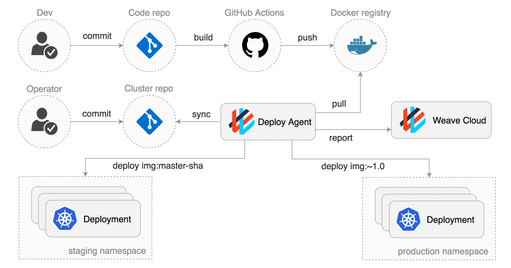

# Challenge 5 - GitOps

[< Previous Challenge](./04-scaling.md)&nbsp;&nbsp;&nbsp;&nbsp;&nbsp;&nbsp;&nbsp;&nbsp;[Next Challenge>](./06-service-mesh.md)

## Introduction

GitOps is a term coined by WeaveWorks for implementing Continuous Delivery for Cloud Native applications.  The core concept is using a Git repository as the source of truth for the desired state of infrastructure.  Flux is the tool written by WeaveWorks to implement GitOps for Kubernetes.


Credit: <https://www.weave.works/blog/why-is-a-pull-vs-a-push-pipeline-important>

## Description

- Install Flux on your Cluster
    - HINT: [Getting Started with Flux](https://docs.fluxcd.io/en/latest/tutorials/get-started/)
    - Use the yaml approach, do NOT use the "Getting started with Helm" guide
- Fork [https://github.com/fluxcd/flux-get-started](https://github.com/fluxcd/flux-get-started) in your Github Repo
- Give write access to your Github repo
- Make a small change to the deployment
    - Example: Add `--ui-message='Welcome to Flux'` to the container command
    - HINT: You can use `fluxctl sync` if you're impatient
- Using GitOps, expose the service at podinfo.$INGRESS_IP.nip.io
    - HINT: Here's a sample Ingress 

```
apiVersion: extensions/v1beta1
kind: Ingress
metadata:
  name: podinfo-ingress
  namespace: demo
spec:
  rules:
  - http:
      paths:
      - backend:
          serviceName: podinfo
          servicePort: 9898
    host: podinfo.<REPLACE WITH INGESS IP>.nip.io
```

## Success Criteria

- By only changing your GitHub repo, you have done the following
    - Created a new namespace `demo`
    - Created a deployment for podinfo in the demo namespace
    - Made a change to the deployment and verified the change in the cluster

## Optional Challenge

- Install the Helm Operator for Flux
- Add a helm chart to your repo
- Verify that the Helm chart was deployed to the cluster
- Make a change to the Helm chart and verify the change in the cluster
