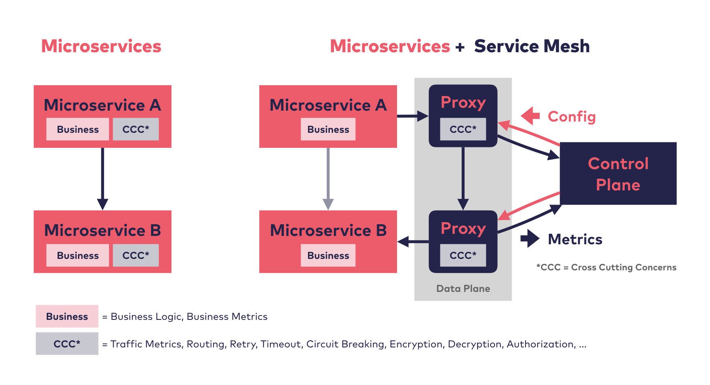

# Challenge 6 - Service Mesh

[< Previous Challenge](./05-gitops.md)&nbsp;&nbsp;&nbsp;&nbsp;&nbsp;&nbsp;&nbsp;&nbsp;[Next Challenge>](./07-data-volumes.md)

## Introduction

A service mesh provides capabilities like traffic management, resiliency, policy, security, strong identity, and observability to your workloads.

Some of the most popular features include:
* Encrypting all traffic inside the cluster
* Canary and phased rollouts
* Traffic Management and manipulation
* Observability (e.g. distributed tracing)

Credit: <https://servicemesh.es>

There are multiple service meshes, these are the 3 most popular (all of which use [Envoy](https://www.envoyproxy.io/) as the proxy):
* [Istio](https://istio.io) - The most popular service mesh.  Pro:  Well known, most feature.  Con: Resource intensive, high complexity
* [Linkerd](https://linkerd.io/) - CNCF Incubating Project.  Pro: Light-weight, low complexity.  Con: Deeply integrated with K8S
* [Consul](https://www.hashicorp.com/products/consul/) - Written by Hashicorp.  Pro: Azure Consul Service.  Con: Full features are with Consul Connect

Microsoft has also written the [Service Mesh Interface](https://smi-spec.io/) to abstract the Service Mesh requirements from the implementation.  Most popular service meshes have adopted it.

## Description

For this challenge, we will deploy a Service Mesh and review some of the top features.  Because there are different service meshes with similar functionality, we will not be prescriptive in the choice of the service mesh.  If you're not sure which one, choose Istio.  It has the most features and walk-through documentation.

Each of the Service Meshes have their own set of documentation for how to implement these features.  Please follow the instructions for your specific service mesh.

1. Install the Service Mesh CLI
    - e.g. istioctl For Istio, linkerd for Linkerd
1. Install the Service Mesh on your Kubernetes cluster
1. Enable Mutual TLS
1. Apply distributed tracing with Jaeger
1. Enable high-level metrics 
1. Test the "Fault Injection" feature
1. Use Flagger to automate a canary release
    - NOTE: make sure to disable mTLS before configuring Flagger

## Success Criteria

- After enabling distributed tracing, make a request to the service and confirm you can see how long it takes in each service.
- Verify that you can only access pod to pod traffic via HTTPS
- You can view the high-level metrics in Grafana

## Hints

- If using Cloud Shell:
    - It may use an older version of `istioctl`.  Instead of `istioctl install`, use `istioctl manifest apply`
    - None of the dashboards/port-forwarding will work because the ports are opened on the Cloud Shell, NOT on your local host.
