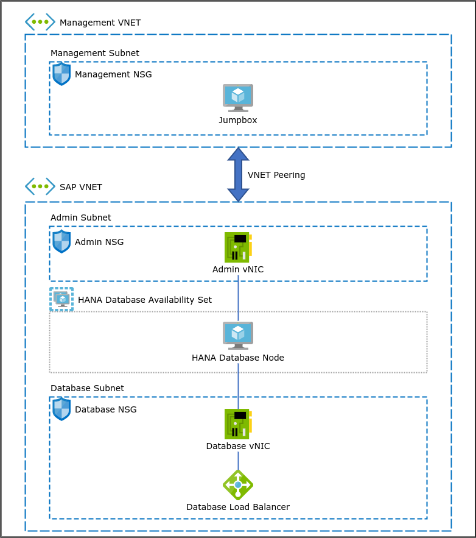
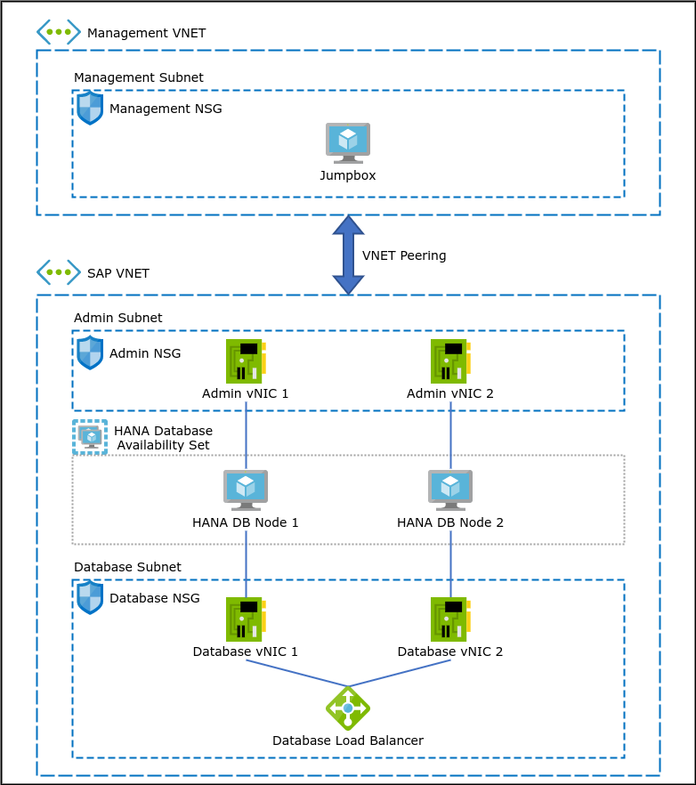

# HANA Single-Node Instance

This scenario deploys a single-node HANA instance and a Windows and/or Linux Jumpbox on Azure Cloud.

# Clustered HANA Instance

This scenario deploys a two-node HANA instance and a Windows and/or Linux Jumpbox on Azure Cloud.

