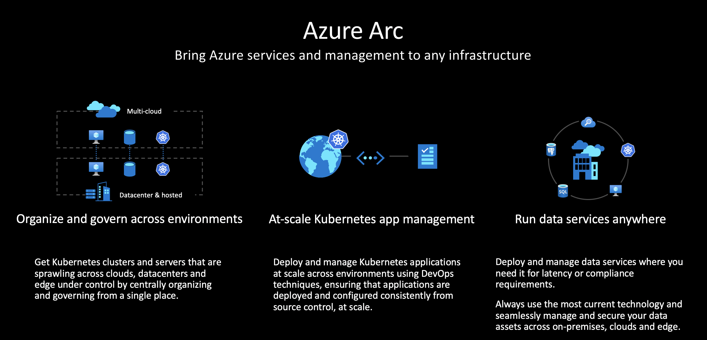

# What The Hack - Azure Arc enabled servers Hack

## Introduction
 
 [Azure Arc enabled servers](https://docs.microsoft.com/en-us/azure/azure-arc/servers/overview) allows customers to use Azure management tools on any server running in any public cloud or on-premises environment. In this hack, you will be working on a set of progressive challenges to showcase the core features of Azure Arc. 
 
 In the first few challenges, you will set up your lab environment and deploy servers somewhere other than Azure. Then, you will use Azure Arc to project these servers into Azure, and begin to enable Azure management and security tools on these servers. On successive challenges, you will apply [Azure Policy](https://docs.microsoft.com/en-us/azure/governance/policy/overview) and enable other Azure services like [Azure Security Center](https://docs.microsoft.com/en-us/azure/security-center/) on your projected workloads.

## Learning Objectives

This hack will help you learn:

1. Azure Arc enabled servers basic technical usage
2. How Azure Arc enabled servers works with other Azure services
3. How Azure Arc enabled servers enables Azure to act as a management plane for any workload in any public or hybrid cloud

## Challenges
 - [Challenge 0](./Student/challenge00.md) - Complete Prerequisites (Do before you attend the hack)
 - [Challenge 1](./Student/challenge01.md) - Onboarding servers with Azure Arc
 - [Challenge 2](./Student/challenge02.md) - Policy for Azure Arc connected servers
 - [Challenge 3](./Student/challenge03.md) - Arc Value Add: Integrate Security Center
 - [Challenge 4](./Student/challenge04.md) - Arc Value Add: Enable Sentinel
 - [Challenge 5](./Student/challenge05.md) - Arc Value Add: Azure Lighthouse
 

## Prerequisites
- Your own Azure subscription with Owner RBAC rights at the subscription level
- [Visual Studio Code](https://code.visualstudio.com)
- [Git SCM](https://git-scm.com/download)

## Repository Contents (Optional)
- `../Student`
  - Student Challenge Guides
- `../Student/Resources`
  - Student's resource files, code, and templates to aid with challenges

## Contributors
- Dale Kirby
- Lior Kamrat
- Ali Hussain
