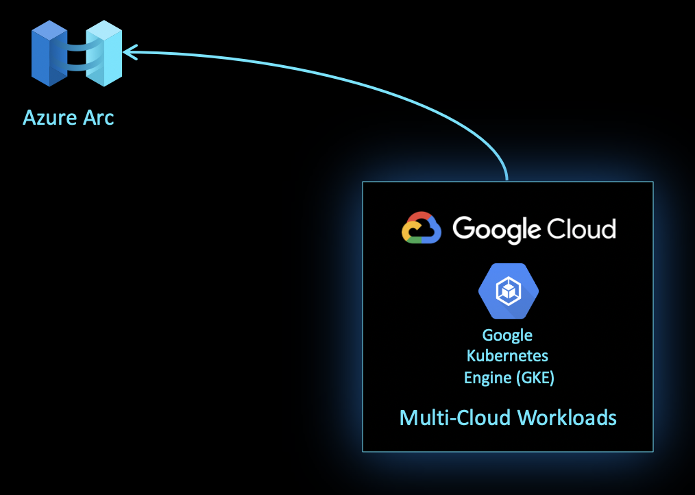

# What The Hack - Azure Arc enabled Kubernetes Hack

## Challenge 1 - Deploy Kubernetes cluster on GCP
[Back](challenge00.md) - [Home](../readme.md) - [Next](challenge02.md)

### Introduction

Before we begin managing Kubernetes clusters through Azure Arc enabled Kubernetes, we first need to deploy Kubernetes clusters. In this challenge we are going to deploy a cluster  on a competitive cloud platform that being GCP.

 

Once this challenge is complete, we will have a cluster deployed and ready to be managed by Azure Arc enabled Kuberentes. With the cluster is deployed, we will be able to manage the cluster centrally via the Azure portal.

### Challenge

1. Deploy a Google Kubernetes Engine (GKE) cluster on Google Cloud Platform.
    * Run ```kubectl get nodes -o wide``` with the ```kubectl``` context being that of the newly GKE cluster to verify cluster is ready to be Arc enabled.

### Success Criteria

This challenge will be complete when a GKE cluster is successfully deployed and ready to be enabled for Azure Arc enabled Kubernetes.

[Back](challenge00.md) - [Home](../readme.md) - [Next](challenge02.md)