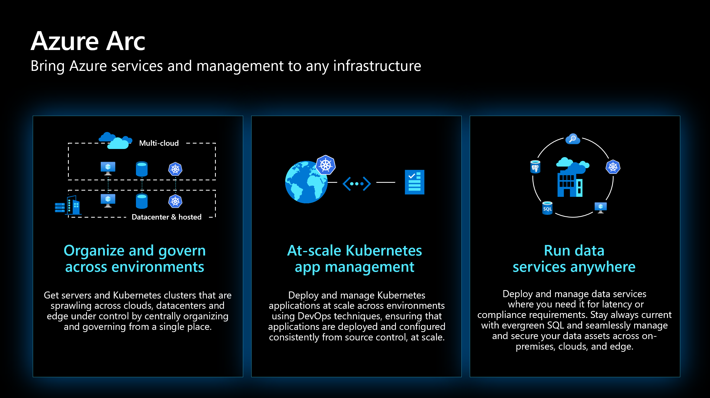
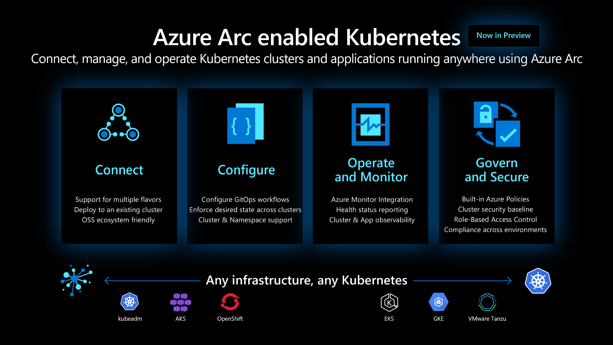

# What The Hack - Azure Arc enabled Kubernetes Hack

# Introduction
 
For customers who want to simplify complex and distributed environments across on-premises, edge and multi-cloud, [Azure Arc](https://azure.microsoft.com/en-us/services/azure-arc/) enables deployment of Azure services anywhere and extends Azure management to any infrastructure.

* **Organize and govern across environments**. Get databases, Kubernetes clusters, and servers sprawling across on-premises, edge and multi-cloud environments under control by centrally organizing and governing from a single place.

* **Manage Kubernetes Apps at scale**. Deploy and manage Kubernetes applications across environments using DevOps techniques. Ensure that applications are deployed and configured from source control consistently.

 
The goal of this challenge based hack is to distill the skills required to deploy managed Kubernetes service in competitive clouds and have it be Arc enabled and managed. The management of Arc enabled Kubernetes clusters deployed on competitive platforms is going to be highlighted by conducting day two scenarios such as GitOps, and inventory management.

## Learning Objectives

This hack will help you learn:

1. How to deploy Kubernetes in competitive platforms
2. Onboard Kubernetes clusters onto Azure Arc
3. Inventory manage Arc enabled K8s clusters
4. Learn day two operational scenarios such as:
	* Enabling Monitoring and setup alerts
	* Enable GitOps on remote K8s clusters
	* Enable Azure Policy on remote K8s clusters
	* Manage clusters via Azure Policy

## Challenges
 - [Challenge 0](./Student/challenge00.md) - Setup (Pre-day)
 - [Challenge 1](./Student/challenge01.md) - Deploy Kubernetes cluster on GCP
 - [Challenge 2](./Student/challenge02.md) - Deploy Kubernetes cluster locally
 - [Challenge 3](./Student/challenge03.md) - Onboard clusters onto Azure Arc
 - [Challenge 4](./Student/challenge04.md) - Enable Monitoring and Alerting
 - [Challenge 5](./Student/challenge05.md) - Enable GitOps
 - [Challenge 6](./Student/challenge06.md) - Enable Azure Policy
 - [Challenge 7](./Student/challenge07.md) - Manage remote cluster via Azure Policy
 

## Prerequisites
The prerequisites for the hack are covered in [challenge 0](./Student/challenge00.md).

## Repository Contents (Optional)
- `../Student`
  - Student Challenge Guides
- `../Student/Resources`
  - Student's resource files, code, and templates to aid with challenges

## Contributors
- Dale Kirby
- Lior Karmat
- Ali Hussain
- Laura Nicolas 
