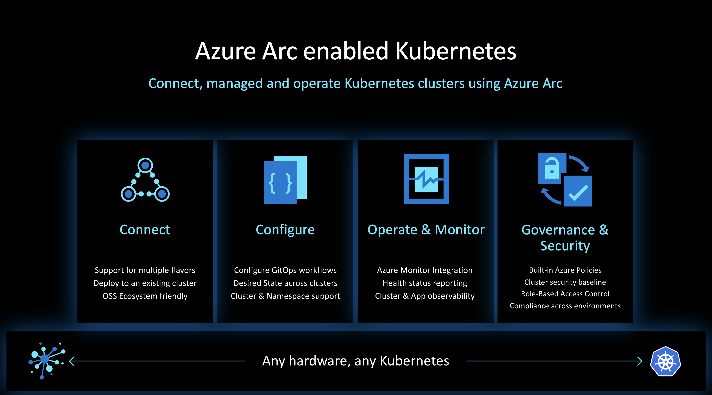

# What The Hack - Azure Arc for Servers Hack

# Introduction
 
For customers who want to simplify complex and distributed environments across on-premises, edge and multi-cloud, [Azure Arc](https://azure.microsoft.com/en-us/services/azure-arc/) enables deployment of Azure services anywhere and extends Azure management to any infrastructure.

* **Organize and govern across environments**. Get databases, Kubernetes clusters, and servers sprawling across on-premises, edge and multi-cloud environments under control by centrally organizing and governing from a single place.

* **Manage Kubernetes Apps at scale**. Deploy and manage Kubernetes applications across environments using DevOps techniques. Ensure that applications are deployed and configured from source control consistently.

 
The goal of this challenge based hack is to distill the skills required to deploy managed Kubernetes service in competitive clouds and have it be Arc enabled and managed. The management of Arc enabled Kubernetes clusters deployed on competetive platforms is going to be highlighted by conducting day two scenarios such as GitOps, and inventory management.

## Learning Objectives

This hack will help you learn:

1. How to deploy Kubernetes in competetive platforms
2. Onboard Kuberentes clusters onto Azure Arc
3. Inventory manage Arc enabled K8s clusters
4. Learn day two operational scenerios such as:
	* Enabling Monitoring and setup alerts
	* Enable GitOps on remote K8s clusters
	* Enable Azure Policy on remote K8s clusters
	* Manage clusters via Azure Policy

## Challenges
 - [Challenge 0](./Student/challenge00.md) - Setup (Pre-day)
 - [Challenge 1](./Student/challenge01.md) - Deploy Kubernetes cluster on GCP
 - [Challenge 2](./Student/challenge02.md) - Deploy Kubernetes cluster locally
 - [Challenge 3](./Student/challenge03.md) - Onboard clusters onto Azure Arc
 - [Challenge 4](./Student/challenge04.md) - Enable Monitoring and Alerting
 - [Challenge 5](./Student/challenge05.md) - Enable GitOps
 - [Challenge 6](./Student/challenge06.md) - Enable Azure Policy
 - [Challenge 7](./Student/challenge07.md) - Manage remote cluster via Azure Policy
 

## Prerequisites
The prerequisites for the hack are covered in [challenge 0](./Student/challenge00.md).

## Repository Contents (Optional)
- `../Student`
  - Student Challenge Guides
- `../Student/Resources`
  - Student's resource files, code, and templates to aid with challenges

## Contributors
- Dale Kirby
- Lior Karmat
- Ali Hussain
- Laura Nicolas 

# Random Notes

Learning Objectives

In this hack, you will be working on a set of "Day 2" operational best practices for Arc for K8s. You will learn:

## Pre-Day
  - Azure Arc Overview
  - Pre-day Requirements
  - Laptop admin access
  - GCP access to deploy GKE
  - An Azure Subscription which can deploy an AKS cluster
	- SSH Keys
	- Access to a Bash Shell (Cloud Shell, WSL, etc.)
	- With contributor Role
	- Docker on laptop

## Day 1
 - How to deploy Arc K8s in competitive clouds (90 mins)
	- K8s on GKE
	- minikube on laptop
		- If minikube not possible
			- Azure Kubernetes Service (automate if chosen)
			- Rancher on laptop 
	- Onboard ( 60 mins)
		- GKE to Arc for K8s 
		- Minikube (or alternative) to Arc for K8s
	- Inventory Management ( 60 mins)
		- Tagging Assets
		- Query with Resource Graph Explorer
		- Best practices around tagging
	- Operations (2 Hours)
		- Onboard Azure Monitor for Containers Log analytics – Easy Way (90 min)
		- Enable Alerts (CPU/Mem constraints) (30 mins)

	Total Day 1: 5.5 Hours
	
## Day 2 - Arc for K8s Scenarios

- GitOps ( 1.5 Hours )
	- Use GitOps in a connected Cluster
		- Technologies involved (Flux, etc)
	- Policy (3.5 Hours)
		- Enable Azure Policy add-on (30 mins)
			- Nuts and bolts of enabling Azure Policy
			- Technologies involved (OPA, Gatekeeper, Language)
		- Policies for Arc for K8s
			- Audit Policy ( Check if gatekeeper and OPA installed)
			- GitOps policy
			- Resource Limits Policy 
		- Build automation demo to apply policy across inventory 
			- (maybe Lior to investigate)

	Day 2: 5.5
	
# Different Hack or 3 Day hack

  - GitOps with Helm
  - Observability on Arc (Advanced Monitoring)
  - Real world example using Prometheus, Grafana (and/or) Azure Monitor
  - Deploy a full stack monitoring solution to Arc clusters
  - Fleet management
	- Deploy to a remote cluster - Get a new Cluster to a desired state with 1 configuration
	- Deploy to multiple clusters - Get 2 clusters to a desired state with 2 different configurations along with a base configuration
  - Bonus – Real world implementation
    - Deploy policy via ARM Template
    - To be investigated
  - Terraform Deployment
	
Assumptions
	Before starting this hack you should have hands-on experience with the following:
			
Prerequisites
	• Pre-day Requirements
		○ Laptop admin access
		○ GCP access to deploy GKE
		○ An Azure Subscription which can deploy an AKS cluster
			▪ SSH Keys
		○ Access to a Bash Shell (Cloud Shell, WSL, etc.)
			▪ With contributor Role
		○ Docker on laptop
		○ IDE of your choice, preferably VSCode
