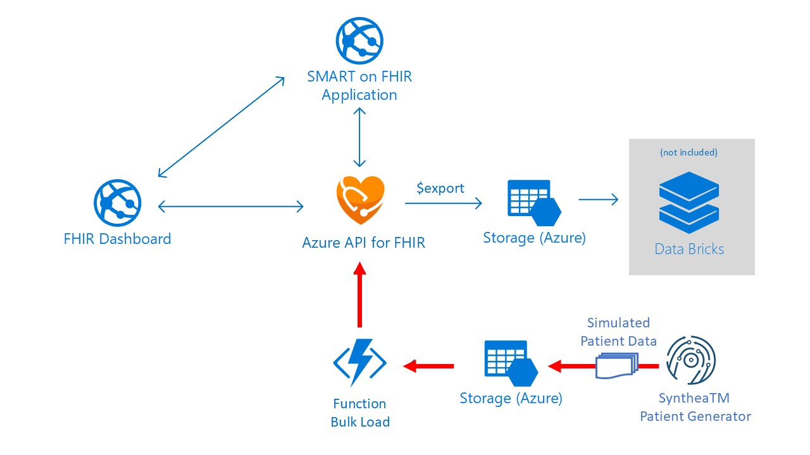

# Coach's Guide: Challenge 1 - Extract and load FHIR patient medical records

[< Previous Challenge](./Solution00.md) - **[Home](./readme.md)** - [Next Challenge>](./Solution02.md)

## Notes & Guidance

In this challenge, you will implement the FHIR Server Samples reference architecture to ingest and load patient data in FHIR.  You will generate synthetic FHIR patient data for bulk load into FHIR Server.  To generate synthetic patient data, you will use **[SyntheaTM Patient Generator](https://github.com/synthetichealth/synthea#syntheatm-patient-generator)** open source Java tool to simulate patient records in FHIR format.  

**FHIR bulk load scenario**

In this scenario, you will deploy a storage account with a BLOB container called `fhirimport`.  Synthea generated FHIR patient data files (JSON) are copied into this storage container, and automatically ingested into FHIR Server.  This bulk ingestion is performed by a BLOB triggered function app as depicted below:



**Deploy FHIR Server Samples reference architecture for Bulk Load scenario**
- To deploy **[FHIR Server Samples PaaS scenario (above)](https://github.com/microsoft/fhir-server-samples)**:
    - First, clone the **['FHIR Server Samples' git repo](https://github.com/microsoft/fhir-server-samples)** to your local project repo, i.e. c:/projects and find the deployment scripts folder
        ```
        git clone https://github.com/Microsoft/fhir-server-samples
        cd fhir-server-samples/deploy/scripts
        ```
    - Before running the **[FHIR Server Samples deployment script](https://github.com/microsoft/fhir-server-samples/blob/master/deploy/scripts/Create-FhirServerSamplesEnvironment.ps1)**, you MUST login to your Azure subscription and connect to Azure AD with your primary/secondary tenant that has directory admin role access required for this setup.
        ```
        Login-AzAccount
        Connect-AzureAd -TenantDomain <AAD TenantDomain>
        ```

        NOTE: 
        - If you have full Administrator access to a AD tenant where you can create App Registrations, Role Assignments, Azure Resources, then Primary AD tenant is same as Secondary AD tenant and use the same AD tenant for both.
        - If you don't have Administrator access:
            - Primary (Resource) AD tenant: This tenant is Resource Control Plane where all your Azure Resources will be deployed to.
            - Secondary (Data) AD tenant: This tenant is Data Control Plane where all your App Registrations will be deployed to.
            
    - **[Deploy FHIR Server Samples](https://github.com/microsoft/fhir-server-samples#deployment)** with the managed Azure API for FHIR (PaaS) scenario:
        - Run `Create-FhirServerSamplesEnvironment.ps1` from the cloned `./deploy/scripts` folder.
    - To Validate your deployment, 
        - Check Azure resources created in {ENVIRONMENTNAME} and {ENVIRONMENTNAME}-sof Resource Groups
        - Check App Registration in secondary AAD tenat that **[all three different client application types are registered for Azure API for FHIR](https://docs.microsoft.com/en-us/azure/healthcare-apis/fhir-app-registration)**
        - Check 'Azure API for FHIR' > Authentication > 'Allowed object IDs' configuration in Azure Portal to ensure that the Azure AD object IDs of the 3 registered client applications have been added. This will allow these client apps to access this Azure API for FHIR.


**Generate FHIR patient data using SyntheaTM Patient Generator tool**

**[SyntheaTM Patient Generator](https://github.com/synthetichealth/synthea#syntheatm-patient-generator)**
SyntheaTM is a Synthetic Patient Population Simulator. The goal is to output synthetic, realistic (but not real), patient data and associated health records in a variety of formats.  Read **[Synthea wiki](https://github.com/synthetichealth/synthea/wiki)** for more information.
- **[Developer Quick Start](https://github.com/synthetichealth/synthea#developer-quick-start)**
    - **[Installation](https://github.com/synthetichealth/synthea#installation)**
        - System Requirements: SyntheaTM requires Java 1.8 or above.
        - Clone the SyntheaTM repo, then build and run the test suite:
            ```
            $ git clone https://github.com/synthetichealth/synthea.git
            $ cd synthea
            $ ./gradlew build check test
            ```
    - **[Changing the default properties](https://github.com/synthetichealth/synthea#changing-the-default-properties)**
        ```
        exporter.baseDirectory = ./output/fhir
        ...
        exporter.ccda.export = false
        exporter.fhir.export = true
        ...
        # the number of patients to generate, by default
        # this can be overridden by passing a different value to the Generator constructor
        generate.default_population = 1000
        ```
        
        Note:The default properties file values can be found at src/main/resources/synthea.properties. By default, synthea does not generate CCDA, CPCDA, CSV, or Bulk FHIR (ndjson). You'll need to adjust this file to activate these features. See the **[wiki](https://github.com/synthetichealth/synthea/wiki)** for more details.
    - Generate Synthetic Patients
        Generating the population 1000 at a time...
        ```
        ./run_synthea -p 1000
        ```
    - For this configuration, Synthea will output 1000 patient records in FHIR formats in `./output/fhir` folder.

**Bulk Load Synthea generated patient FHIR Bundles to FHIR Server**
- Copy Synthea generated patient data to `fhirimport` BLOB, which will automatically trigger a function app to persist them to FHIR Server 
    - To **[Copy data to Azure Storage using AzCopy commandline](https://docs.microsoft.com/en-us/azure/storage/common/storage-use-azcopy-v10)**
        - **[Download AzCopy](https://docs.microsoft.com/en-us/azure/storage/common/storage-use-azcopy-v10#download-azcopy)**
        - **[Run AzCopy](https://docs.microsoft.com/en-us/azure/storage/common/storage-use-azcopy-v10#run-azcopy)**
        - Add directory location of AzCopy executable to your system path
        - Type `azcopy` or `./azcopy` in Windows PowerShell command prompts to get started
        - Use a SAS token to copy Synthea generated patient bundle JSON file(s) to fhirimport Azure Blob storage
               Sample AzCopy command:
               ```
               azcopy copy "<your Synthea ./output/fhir directory>" "<fhirimport blob container URL appended with SAS token>"
               ```
    - Alternatively **[Copy data to Azure Storage using Azure Storage Explorer UI](https://docs.microsoft.com/en-us/azure/storage/common/storage-use-azcopy-v10#use-azcopy-in-azure-storage-explorer)**
        - Navigate to Storage Account blade in Azure Portal, expand BLOB CONTAINERS and click on 'fhirimport' to list container content
        - Click 'Upload', and in 'Upload blob' window, browse to Synthea './result/fhir' folder and select a FHIR Patient bundle .json file(s)
    - Monitor Log Stream in function app 'FhirBundleBlobTrigger'
        - Verify in log that 'FhirBundleBlobTrigger' function auto runs when new blob detected
            Sample log output:
            ```
            Executing 'FhirBundleBlobTrigger' (Reason='New blob detected...)...
            ...
            Uploaded /...
            ...
            Executed 'FhirBundleBlobTrigger' (Succeeded, ...)
            ```
**Use Postman to retrieve Patients data via FHIR Patients API**
- Open Postman and **[import Postman data](https://learning.postman.com/docs/getting-started/importing-and-exporting-data/)**: 
    - In Postman, click Import.
    - Select your Environment and Collection json files in your `./Student/Resources/Postman` folder.
    - Confirm the name, format, and import as, then click Import to bring your data into your Postman.
    - You will get confirmation that WTH Collection and Environment were imported and see in Postman a new 'WTH FHIR' in Collections (left) blade and top right Environment Var drop-down list.
   - Select 'WTH FHIR' environment and click 'Environment Quick Look' button to see a list of env vars: 
    - Click 'Edit' to open Management Environments window and input the corresponding FHIR environment values:
        - adtenantId: This is the tenant Id of the Secondary (Data) AD tenant
        - clientId: This is the client Id that is stored in Secret "{your resource prefix}-service-client-id" in "{your resource prefix}-ts" Key Vault.
        - clientSecret: This is the client Secret that is stored in Secret "{ENVIRONMENTNAME}-service-client-secret" in "{ENVIRONMENTNAME}-ts" Key Vault.
        - bearerToken: The value will be set when "AuthorizeGetToken SetBearer" request below is sent.
        - fhirurl: This is https://{ENVIRONMENTNAME}.azurehealthcareapis.com from Azure API for FHIR you created in Task #1 above.
        - resource: This is the Audience of the Azure API for FHIR https://{ENVIRONMENTNAME}.azurehealthcareapis.com you created. You can find this Audience in Azure Portal when you click Authetication in Azure API for FHIR resource.
    - Click the Update button and close the MANAGE ENVIRONMENTS window.
- Run FHIR API HTTP Requests:
    - First, open "AuthorizeGetToken SetBearer" and confirm WTH FHIR environment is selected in the top-right environment drop-down. 
        - Click the Send button to pass the values in the Body to AD Tenant, get the bearer token back and assign it to variable bearerToken.
    - Open "Get Patient" and click the 'Send' button. This will return all Patients stored in your FHIR Server. (Postman may not show all of the results.)
    - Open "Get Patient Count" and click the 'Send' button.  This will return Count of Patients stored in your FHIR Server.  
    - Open "Get Patient Filter ID" and click the 'Send' button.  This will return a Patient with that ID. Change the ID to one you have loaded and validate that it exists.
    - Open "Get Patient Filter Exact" and click the 'Send' button.  This will return a Patient with the specified given name. Specify a given name from your FHIR import and validate it exists.
    - Open "Get Patient Filter Contains" and click the 'Send' button.  This will return Patients with Given name that contains the specified letters. Specify a partial given name from your FHIR import and validate it exists.
    
    NOTE: bearerToken has expiration, so if you get Authentication errors in any requests, re-run "AuthorizeGetToken SetBearer" to get a new bearerToken.


