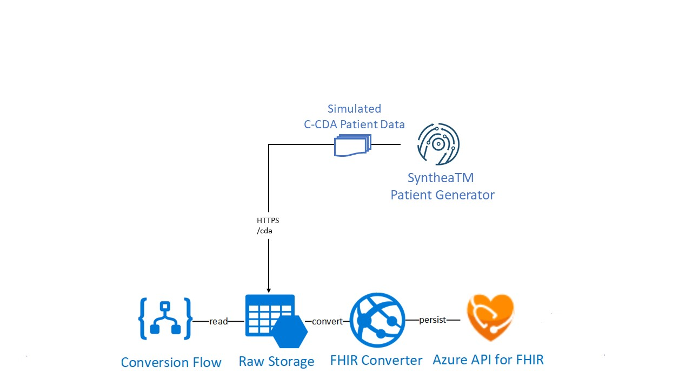

# Coach's Guide: Challenge 2 - Extract, transform and load patient clinical data

[< Previous Challenge](./Solution01.md) - **[Home](./readme.md)** - [Next Challenge>](./Solution03.md)

## Notes & Guidance

In this challenge, you will implement the Health Architecture FHIR Converter sample reference architecture to ingest, transform, and load patient clinical data into FHIR Server.  You will generate synthetic patient clinical data, convert them into FHIR Bundle and ingest them into FHIR Server.  To generate synthetic patient data, you will use **[SyntheaTM Patient Generator](https://github.com/synthetichealth/synthea#syntheatm-patient-generator)** open source Java tool to simulate patient clinical data in HL7 C-CDA format.  

**Clinical data ingest and convert Scenario**

In this scenario, you will develop a logic app based workflow to perform the C-CDA-to-FHIR conversion using **[FHIR Converter API](https://github.com/microsoft/FHIR-Converter/blob/master/docs/api-summary.md)** and import the resulting FHIR bundle into FHIR Server.



**Deploy Health Architecture samples for C-CDA-to-FHIR ingest and convert scenarios**

- Deploy **[FHIR Converter](https://github.com/microsoft/FHIR-Converter#deploying-the-fhir-converter)** reference architecture using the **[Quickstart template](https://portal.azure.com/#create/Microsoft.Template/uri/https%3A%2F%2Fraw.githubusercontent)** to expose the C-CDA Conversion service endpoint: `https://<fhirhl7conv_SERVICE_NAME>.azurewebsites.net/api/convert/cda/ccd.hbs`
- Deploy a new logic app based workflow to perform the C-CDA-to-FHIR conversion and import the resulting FHIR bundle into FHIR Server.  Your BLOB triggered logic app needs to perform the following steps in the workflow:
    - Step 1: Trigger workflow when a BLOB is added or modified in `cda` container
    - Step 2: Get BLOB content from C-CDA XML file from `cda` container.
    - Step 3: Compose BLOB content as Input object.
    - Step 3: HTTP - Call FHIR Converter API
        - Method: POST
        - URI: `https://<fhirhl7conv_SERVICE_NAME>.azurewebsites.net/api/convert/cda/ccd.hbs`
        - Body: Compose object output (file content)
    - Step 4: Import Response Body (FHIR bundle) to FHIR Server 
        - Connected to FHIR Server through **[FHIR Server Proxy](https://github.com/rsliang/health-architectures/blob/master/FHIR/FHIRProxy/readme.md)**
        - Set message object to retuned FHIR resource

**Generate patient clinical data using SyntheaTM Patient Generator tool**

**[SyntheaTM Patient Generator](https://github.com/synthetichealth/synthea#syntheatm-patient-generator)**
SyntheaTM is a Synthetic Patient Population Simulator. The goal is to output synthetic, realistic (but not real), patient data and associated health records in a variety of formats.  Read **[Synthea wiki](https://github.com/synthetichealth/synthea/wiki)** for more information.
- **[Developer Quick Start](https://github.com/synthetichealth/synthea#developer-quick-start)**
    - **[Installation](https://github.com/synthetichealth/synthea#installation)**
        - System Requirements: SyntheaTM requires Java 1.8 or above.
        - Clone the SyntheaTM repo, then build and run the test suite:
            ```
            $ git clone https://github.com/synthetichealth/synthea.git
            $ cd synthea
            $ ./gradlew build check test
            ```
        Note: This step may have been done in Challenge 1

    - **[Changing the default properties](https://github.com/synthetichealth/synthea#changing-the-default-properties)**
        ```
        exporter.baseDirectory = ./output/cda
        ...
        exporter.ccda.export = true
        exporter.fhir.export = false
        ...
        # the number of patients to generate, by default
        # this can be overridden by passing a different value to the Generator constructor
        generate.default_population = 1000
        ```
        
        Note:The default properties file values can be found at src/main/resources/synthea.properties. By default, synthea does not generate CCDA, CPCDA, CSV, or Bulk FHIR (ndjson). You'll need to adjust this file to activate these features. See the **[wiki](https://github.com/synthetichealth/synthea/wiki)** for more details.
    - Generate Synthetic Patients
        Generating the population 1000 at a time...
        ```
        ./run_synthea -p 1000
        ```
    - For this configuration, Synthea will output 1000 patient records in FHIR formats in `./output/cda` folder.

**Bulk Load Synthea generated patient FHIR Bundles to FHIR Server**
- Copy the Synthea generated C-CDA patient data (XML) in `./output/cda` folder to `cda` BLOB container in `{ENVIRONMENTNAME}store` Storage Account created for FHIR Converter.  This will automatically trigger the new logic app C-CDA to FHIR conversion workflow created above to convert and persist resulted FHIR bundle into FHIR Server. 
    - To **[Copy data to Azure Storage using AzCopy commandline](https://docs.microsoft.com/en-us/azure/storage/common/storage-use-azcopy-v10)**
        - **[Download AzCopy](https://docs.microsoft.com/en-us/azure/storage/common/storage-use-azcopy-v10#download-azcopy)**
        - **[Run AzCopy](https://docs.microsoft.com/en-us/azure/storage/common/storage-use-azcopy-v10#run-azcopy)**
        - Add directory location of AzCopy executable to your system path
        - Type `azcopy` or `./azcopy` in Windows PowerShell command prompts to get started
        - Use a SAS token to copy Synthea generated patient clinical data XML file(s) to hl7ingest Azure Blob storage
               Sample AzCopy command:
               ```
               azcopy copy "<your Synthea ./output/cda directory>" "<hl7ingest blob container URL appended with SAS token>"
               ```
    - Alternatively **[Copy data to Azure Storage using Azure Storage Explorer UI](https://docs.microsoft.com/en-us/azure/storage/common/storage-use-azcopy-v10#use-azcopy-in-azure-storage-explorer)**
        - Navigate to Storage Account blade in Azure Portal, expand BLOB CONTAINERS and click on 'cda' to list container content
        - Click 'Upload', and in 'Upload blob' window, browse to Synthea './result/cda' folder and select C-CDA XML files to upload
    - Monitor Log Stream in function app 'cdafhirconvert.BlobTrigger1'
        - Verify in log that 'FhirBundleBlobTrigger' function auto runs when new blob detected
            Sample log output:
            ```
            Executing 'hl7ingestBlobTrigger' (Reason='New blob detected...)...
            ...
            Uploaded /...
            ...
            Executed 'hl7ingestBlobTrigger' (Succeeded, ...)
            ```
**Use Postman to retrieve Patients clinical data via FHIR Patients API**
- Open Postman and **[import Postman data](https://learning.postman.com/docs/getting-started/importing-and-exporting-data/)**.
- Run FHIR API HTTP Requests to validate imported clinical data.

Note: See challenge 1 solution file for detailed guide on using Postman to access FHIR Server APIs.


