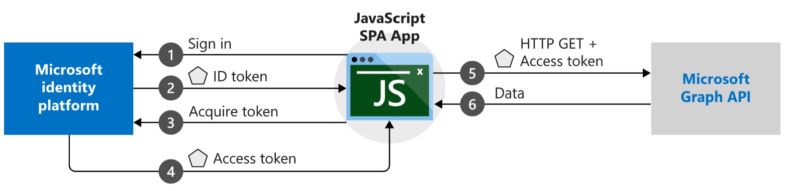

# Coach's Guide: Challenge 3 - Search FHIR EHR Data

[< Previous Challenge](./Solution02.md) - **[Home](./README.md)** - [Next Challenge>](./Solution04.md)

## Notes & Guidance

In this challenge, you will create a new Single Page App (SPA) integrated with Microsoft Authentication Library (MSAL) to connect, read and search for FHIR patient data.



- Make sure the following Node.js prerequistes have been completed
  - To see if you already have Node.js and npm installed and check the installed version, run: 
    ```bash
    node -v
    npm -v
    ```

  - Download and install **[Node.js and npm](https://docs.npmjs.com/downloading-and-installing-node-js-and-npm)**
    - Download latest **[Node.js pre-built installer](https://nodejs.org/en/download/)** for your platform
    - Run the installer downloaded to install node.js
    - Post installation, a cmdline window will popup to install additional tools for Node.js.  In the cmdline window, 
    ```Command
    Press any key to continue...
    ```
- Create a new JavaScript SPA patient search app 
  - **Option 1: Create a Node.js SPA AAD MSAL Patient Search app**
    - This step-by-step guide will create a vanilla JavaScript SPA to query protected web API, i.e. Microsoft Graph API, but you will modify it to access FHIR Server web API that accepts tokens from the Microsoft identity platform endpoint. 
    - In this scenario, after a user signs in, an access token is requested and added to HTTP requests through the authorization header. This token will be used to acquire patient data via FHIR Server API.
    - Setup you web server or project, download **[project files](https://github.com/Azure-Samples/active-directory-javascript-graphapi-v2/archive/quickstart.zip)**
    - Create and initialize your project
      - Initialize your SPA, run `npm init` at your project root folder
      - Install required dependencies, run 
        ```bash
        npm install express --save
        npm install morgan --save
        ```

    - Create a simple server to serve your SPA in `server.js` file.
        - Setup front-end source folder, i.e. `JavaScriptSPA`
        - Setup route for `index.html`
        - Start the server
    - Create the SPA UI in `index.html` file that handles the following:
      - Implements UI built with Bootstrap 4 Framework
      -	Imports script files for 
        - configuration, 
        - authentication,
        - API call
    - Access and update DOM elements in `ui.js` file
      - User authentication interface (SignIn/SignOut)
      - Display patient search results interface
    - **[Register your app](https://docs.microsoft.com/en-us/azure/active-directory/develop/tutorial-v2-javascript-spa#register-your-application)**
      - Set a redirect URL to your JavaScrip Web App URL (Azure and Local) in the `Public Client` `Web Platform Configuration` of your App Registration tenant.
        - Note: These URIs will accept as destinations when returning authentication responses (tokens) after successfully authenticating users.
    - Configure your JavaScript SPA parameters for authentication, in `authConfig.js` file, where:
        - `clientId`: <Enter_the_Application_Id_Here> is the Application (client) ID for the application you registered.
        - `authority`: <Enter_Authority_URL_Here> is the Authority value from FHIR Server Authentication setting.
        - `redirectUri`: <Enter_the_redirect_uri> is your JavaScrip Web App URL from App Service.
        - `Scope`: <Enter FHIR_Server_endpoint/.default>
    - Process MSAL authentication and acquire token to call FHIR Server API in `authPopup.js` file
    - Store REST endpoint for FHIR server in `graphConfig.js` file
    - Make REST call to FHIR Server in `graph.js` file
      - Create helper function `callMSGraph()` to make the HTTP GET request against the protected FHIR API resource that requires a token. 
        - This method appends the acquired token in the HTTP Authorization header.
        - The request then uses `fetch` method to call the API and returns the response to the caller. 
    - Add search components in `index.html` to implement patient lookup.
      - Add a search input textbox to enter search criteria
      - Add a submit button to perform the patient search

  - **Option 2: Create React AAD MSAL Patient Search SPA**
    - Build a new SPA in React using **[Create React App](https://reactjs.org/docs/create-a-new-react-app.html#create-react-app)** toolchain.  It sets up your development environment with latest JavaScript features and optimizes your app for production. 
    
      - You’ll need to have Node >= 8.10 and npm >= 5.6 on your machine. To create a project, run:
        ```bash
        npx create-react-app react-patient-search
        cd react-patient-search
        npm start
        ```
        
        **Note:** `npx` on the first line above refers to a package runner tool that comes with npm 5.2+.

    - Use **[Microsoft Authentication Library for JavaScript (MSAL.js) 2.0](https://github.com/AzureAD/microsoft-authentication-library-for-js/blob/dev/lib/msal-browser/README.md#microsoft-authentication-library-for-javascript-msaljs-20-for-browser-based-single-page-applications)** for Browser-Based Single-Page Applications
      -Install **[MSAL React package](https://github.com/AzureAD/microsoft-authentication-library-for-js/blob/dev/lib/msal-browser/README.md#installation)**, run:
        ```bash
        npm install react react-dom
        npm install @azure/msal-react @azure/msal-browser
        ```
    - Setup `index.js` in root project folder to handle the app startup and basic HTTP web server functionality similar what's done in traditional Apache.
      - Import `react-dom` package to provide DOM-specific methods to be used in the app.
        ```DotNet
        import ReactDOM from "react-dom";
        ```
      - Setup **[React Redux store](https://react-redux.js.org/introduction/basic-tutorial)** to make it available to the app. 
        ```DotNet
        import { Provider } from "react-redux";
        import { basicReduxStore } from "./reduxStore";
        ```
      - Setup `react-dom` `render` method to render React app to the web page.
      - **[Providing the Redux store](https://react-redux.js.org/introduction/basic-tutorial#providing-the-store)** by wrapping the app with the `<Provider />` API provided by React Redux in the `ReactDOM.render()` function.
        ```DotNet
        ReactDOM.render(
          <Provider store={basicReduxStore}>
            <App />
          </Provider>,
          document.getElementById("root")
        );
        ```
    - Create React SPA UI in `App.js` to handle MS Identity Platorm authentication services and patient search UI functionalities.
      - Import authentication provider and instantiate it only once as a singleton service.
      - Implement patient search UI built with Bootstrap 4 Framework.
          - **[Include React Bootstrap package in your app](https://react-bootstrap.github.io/getting-started/introduction/)**
          - **[Create a simple search app in your React app](https://medium.com/developer-circle-kampala/how-to-create-a-simple-search-app-in-react-df3cf55927f5)**
            - Create a search component
            - Add a search input textbox and submit button to perform the search
            - Create helper functions to handle search events in JavaScript
    -	Setup MSAL authentication services in `authService.js`:
        - MSAL configuration
        - Initialize **[MSAL (@azure/msal-react)](https://github.com/AzureAD/microsoft-authentication-library-for-js/blob/dev/lib/msal-browser/docs/initialization.md#initialization-of-msal)** in React app
        - Configure **[Authority and Redirect URL](https://github.com/AzureAD/microsoft-authentication-library-for-js/blob/dev/lib/msal-browser/docs/initialization.md#optional-configure-redirect-uri)** properties in `authProvider.js`
        - MSAL client authentication,
          - **[Single-page application: Sign-in and Sign-out](https://docs.microsoft.com/en-us/azure/active-directory/develop/scenario-spa-sign-in?tabs=javascript2)**
    - Create patient search function `callPatientSearch.js` to setup and call FHIR API using `fetch` method
      - Single-page application: **[Call a web API](https://docs.microsoft.com/en-us/azure/active-directory/develop/scenario-spa-call-api?tabs=javascript#call-a-web-api)** 
      - use the `acquireTokenSilent` method to acquire or renew an access token before you call a web API
    - Access and update DOM elements in `updateUI.js` to render patient search results

- (Optional) Include any other modern UI features to improve the user experience.
- **[Register your app](https://docs.microsoft.com/en-us/azure/active-directory/develop/tutorial-v2-javascript-spa#register-your-application)**
  - Set a redirect URL to your local and Azure JavaScript Web App URL in the `Public Client` `Web Platform Configuration` of your App Registration tenant with directory admin access.

    **Note:** These URIs will accept as destinations when returning authentication responses (tokens) after successfully authenticating users.

- Test and run your code locally 
  - Set redirectUri to `https://localhost:3000` in `authConfig.js` file 
  - Run at cmdline:
    ```bash
    npm install
    nmp start
    ```
- **[Deploy your React web app](https://docs.microsoft.com/en-us/azure/app-service/quickstart-nodejs?pivots=platform-linux#deploy-to-azure)** to Azure from VS Code
  - Set `redirectUri` to `https://[react-patient-search-app-name].azurewebsites.net` in `authConfig.js` file
  - Deploy your React web app using VS Code and the Azure App Service extension
- Test updated sample JavaScript app with patient Lookup feature
  - Browse to App Service website URL in In-private / Incognito window
  - Sign in with your secondary tenant (or tenant where App Registration is configured) used in deploying FHIR Server Samples reference architecture
  - You should see a list of patients that were loaded into FHIR Server
  - Enter full or partial name (Given or Family) in the Search box and click Search button
    - This will call the FHIR API interface that filters patient data that contains the specified Given name or Family name configured and return the patient search results to browser
 