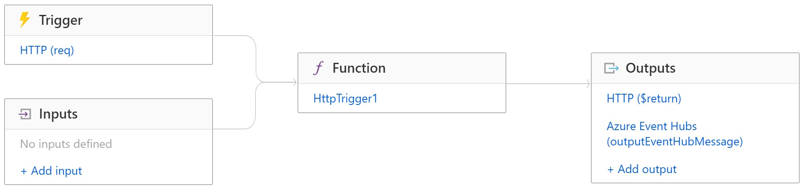
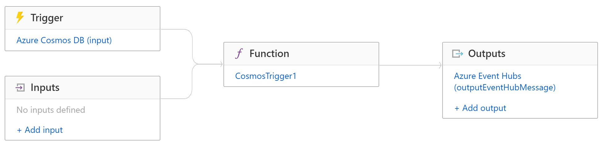

# Coach's Guide: Challenge 3 - Stream patient data with event-driven architecture

[< Previous Challenge](./Solution02.md) - **[Home](./readme.md)** - [Next Challenge>](./Solution04.md)

# Notes & Guidance

In this challenge, you will implement an event-driven architecture for streaming patient data from the FHIR Server to Azure Cosmos DB.

In the end-to-end **[Serverless streaming with Event Hubs](https://azure.microsoft.com/en-us/services/event-hubs/#features)** platform below, the data flow (blue) shows a serverless function retrieves patient data from FHIR Server and drops them to Event Hubs, and then a Stream Analytics job ingests patient data from Event Hubs and writes stream processing results as JSON output to Cosmos DB.


## Deploy Azure Event Hubs
- **[Quickstart: Deploy Azure Event Hubs](https://github.com/Azure/azure-quickstart-templates/tree/master/201-event-hubs-create-event-hub-and-consumer-group/)**
- Install @azure/event-hubs npm module, run:
    `
    $ npm install @azure/event-hubs
    `

## Update Azure Function to read from FHIR server and drop to Eventhub
- Client creation
The simplest usage is to use the static factory method EventHubClient.createFromConnectionString(_connection-string_, _event-hub-path_). Once you have a client, you can use it for:
    - Sending events
    - You can send a single event using client.send() method.
    - You can even batch multiple events together using client.sendBatch() method.

- Receiving events
    - There are two ways to receive events using the EventHub Clien

- Send an event with partition key:

  ```
  const { EventHubClient, EventPosition } = require('@azure/event-hubs');

  const client = EventHubClient.createFromConnectionString(process.env["EVENTHUB_CONNECTION_STRING"], process.env["EVENTHUB_NAME"]);

  async function main() {
    // NOTE: For receiving events from Azure Stream Analytics, please send Events to an EventHub where the body is a JSON object.
    // const eventData = { body: { "message": "Hello World" }, partitionKey: "pk12345"};
    const eventData = { body: "Hello World", partitionKey: "pk12345"};
    const delivery = await client.send(eventData);
    console.log("message sent successfully.");
  }

  main().catch((err) => {
    console.log(err);
  });

  - Send multiple events as a batch
  const { EventHubClient, EventPosition } = require('@azure/event-hubs');

  const client = EventHubClient.createFromConnectionString(process.env["EVENTHUB_CONNECTION_STRING"], process.env["EVENTHUB_NAME"]);

  async function main() {
    const datas = [
      { body: "Hello World 1", applicationProperties: { id: "Some id" }, partitionKey: "pk786" },
      { body: "Hello World 2" },
      { body: "Hello World 3" }
    ];
    // NOTE: For receiving events from Azure Stream Analytics, please send Events to an EventHub
    // where the body is a JSON object/array.
    // const datas = [
    //   { body: { "message": "Hello World 1" }, applicationProperties: { id: "Some id" }, partitionKey: "pk786" },
    //   { body: { "message": "Hello World 2" } },
    //   { body: { "message": "Hello World 3" } }
    // ];
    const delivery = await client.sendBatch(datas);
    console.log("message sent successfully.");
  }

  main().catch((err) => {
    console.log(err);
  });
  ```

- Create function app httptrigger to outputEventHubMessage (for FHIR Server PaaS scenario)
Function App integration:


  - Create a new function app instance
  - Add a new function using HTTP trigger template
    - http trigger name
    - Select Authroization level to control if API key is needed (Function, Anonymous or Admin)
  - Add Event Hubs output binding
    - Setup new Event Hub connection string
      - Event Hub name
      - Event Hub RootManageSharedAccessKey name

  function.json sample code:
  ```
  {
    "bindings": [
      {
        "authLevel": "function",
        "name": "req",
        "type": "httpTrigger",
        "direction": "in",
        "methods": [
          "get",
          "post"
        ]
      },
      {
        "name": "$return",
        "type": "http",
        "direction": "out"
      },
      {
        "name": "outputEventHubMessage",
        "direction": "out",
        "type": "eventHub",
        "connection": "ChangeFeeds_RootManageSharedAccessKey_EVENTHUB",
        "eventHubName": "outeventhub"
      }
    ]
  }
  ```

  C# code sample:
  ```
  #r "Newtonsoft.Json"

  using System.Net;
  using Microsoft.AspNetCore.Mvc;
  using Microsoft.Extensions.Primitives;
  using Newtonsoft.Json;

  public static async Task<IActionResult> Run(HttpRequest req, ILogger log)
  {
      log.LogInformation("C# HTTP trigger function processed a request.");

      string name = req.Query["name"];

      string requestBody = await new StreamReader(req.Body).ReadToEndAsync();
      dynamic data = JsonConvert.DeserializeObject(requestBody);
      name = name ?? data?.name;

      string responseMessage = string.IsNullOrEmpty(name)
          ? "This HTTP triggered function executed successfully. Pass a name in the query string or in the request body for a personalized response."
                  : $"Hello, {name}. This HTTP triggered function executed successfully.";

              return new OkObjectResult(responseMessage);
  }
  ```

- Create function app cosmosdbtrigger to outputEventHubMessage (for FHIR Server open source scenario)
Function App integration:


  - Create a new function app instance
  - Add a new function using Cosmos DB trigger template
    - Setup new Cosmos DB account connection
    - Input Database name
    - Input Collection name
  - Add Event Hubs output binding
    - Setup new Event Hub connection string
      - Event Hub name
      - Event Hub RootManageSharedAccessKey name

  function.json sample code:
  ```
  {
    "bindings": [
      {
        "type": "cosmosDBTrigger",
        "name": "input",
        "direction": "in",
        "connectionStringSetting": "[your cosmos db connection string]",
        "databaseName": "[your database name]",
        "collectionName": "[your collection name]",
        "leaseCollectionName": "leases",
        "createLeaseCollectionIfNotExists": true
      },
      {
        "name": "outputEventHubMessage",
        "direction": "out",
        "type": "eventHub",
        "connection": "[your event hub]_RootManageSharedAccessKey_EVENTHUB",
        "eventHubName": "outeventhub"
      }
    ]
  }
  ```

  C# code sample:
  ```
   #r "Microsoft.Azure.DocumentDB.Core"
  using System;
  using System.Collections.Generic;
  using Microsoft.Azure.Documents;

  public static void Run(IReadOnlyList<Document> input, ILogger log)
  {
      if (input != null && input.Count > 0)
      {
          log.LogInformation("Documents modified " + input.Count);
          log.LogInformation("First document Id " + input[0].Id);
      }
  }
  ```

