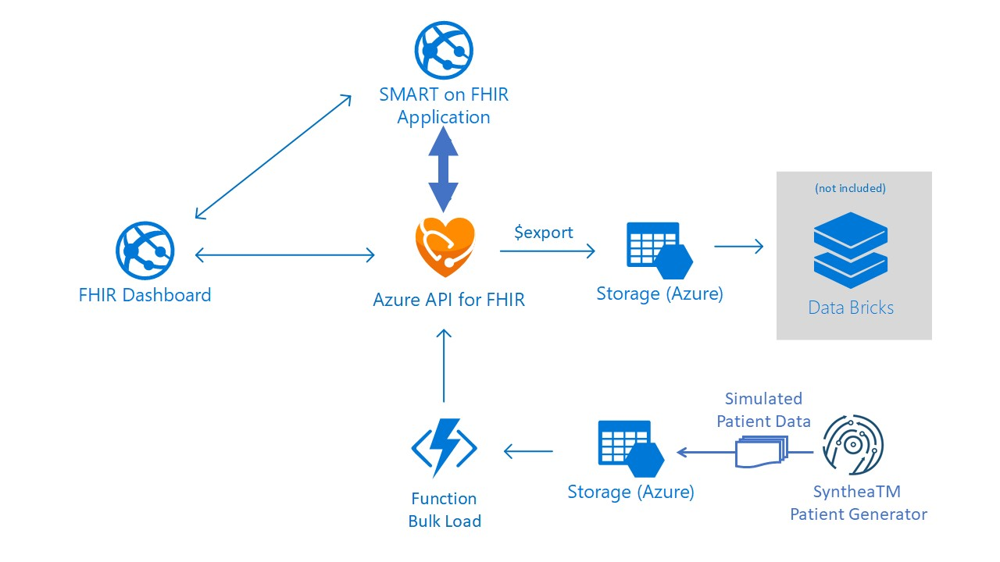

# Coach's Guide: Challenge 5 - Explore patient medical records and encounters through FHIR Patient Dashboard and SMART on FHIR apps

[< Previous Challenge](./Solution04.md) - **[Home](./readme.md)** - [Next Challenge>](./Solution06.md)

## Notes & Guidance

In this challenge, you will explore patient medical records and SMART on FHIR apps through the FHIR Dashboard app. 

**[What is SMART on FHIR?](https://docs.microsoft.com/en-us/azure/healthcare-apis/fhir-faq#what-is-smart-on-fhir)** 
SMART ((Substitutable Medical Applications and Reusable Technology) on FHIR is a set of open specifications to integrate partner apps with FHIR Servers and other Health IT systems, i.e. Electronic Health Records and Health Information Exchanges.  By creating a SMART on FHIR application, you can ensure that your application can be accessed and leveraged by different systems.

Azure API for FHIR has a built-in **[Azure AD SMART on FHIR proxy](https://docs.microsoft.com/en-us/azure/healthcare-apis/use-smart-on-fhir-proxy)** to integrate partner apps with FHIR Servers and EMR systems through FHIR interfaces. This set of open specifications describes how an app should discover authentication endpoints for FHIR Server and start an authentication sequence.  Specifically, the proxy enables the **[EHR launch sequence](https://hl7.org/fhir/smart-app-launch/#ehr-launch-sequence)**.  

**Explore patient medical records and SMART on FHIR apps**
- Open {ENVIRONMENTNAME}dash App Service and copy 'URL' from Overview blade
- Open browser in In-private/Incognito mode and navigate to FHIR Dashboard app URL (above) 
- Use the dashboard user credentials to sign in (captured during FHIR Server Samples deployment in challenge 1)
  - In popup Consent dialog box, Accept consent to permissions requested by the Confidential Client app to get access to FHIR Server.
- After a successful login, explore patient medical records through FHIR Dashboard app, including:
    - Patient and its FHIR bundle details
    - Patient medical details
        - Conditions
        - Encounters
        - Observations
- Explore SMART on FHIR Apps through FHIR Dashboard app, including:
    - Growth Chart
    - Medications