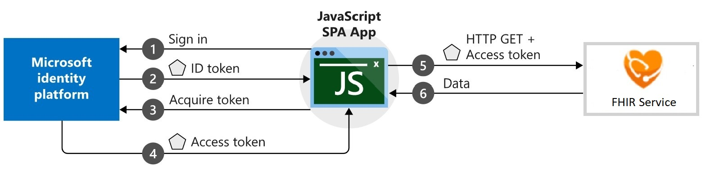

# Coach's Guide: Challenge 6 - Create a new Single Page App (SPA) for patient search

[< Previous Challenge](./Solution05.md) - **[Home](./readme.md)**

## Notes & Guidance

In this challenge, you will create a new Single Page App (SPA) integrated with Microsoft Authentication Library (MSAL) to connect, read and search for FHIR patient data.



- Make sure the following Node.js prerequistes have been completed
  - To see if you already have Node.js and npm installed and check the installed version, run: 
    ```
    node -v
    npm -v
    ```

  - **[Download and install Node.js and npm](https://docs.npmjs.com/downloading-and-installing-node-js-and-npm)**
    - Download latest **[Node.js pre-built installer](https://nodejs.org/en/download/)** for your platform
    - Run downloaded node-v14.15.1-x64.msi executable to install node.js 
    - Post installation, a cmdline window will popup to install additional tools for Node.js.  In the cmdline window, `Press any key to continue...`
- Create a new JavasScript SPA patient search app 
  - **Option 1: Create a Node.js SPA AAD MSAL Patient Search app**
  This step-by-step guide will create a vanilla JavaScript SPA to query protected web API, i.e. Microsoft Graph API, but you will modify it to access FHIR Server web API that accepts tokens from the Microsoft identity platform endpoint. In this scenario, after a user signs in, an access token is requested and added to HTTP requests through the authorization header. This token will be used to acquire patient data via FHIR Server API.
  - Setup you web server or project, **[download project files](https://github.com/Azure-Samples/active-directory-javascript-graphapi-v2/archive/quickstart.zip)**
  - Create and initialize your project
    - Initialize your SPA, run `npm init` at your project root folder
    - Install required dependencies, run 
      ```
      npm install express --save
      npm install morgan --save
      ```

    - Create a simple server to serve your SPA, add `server.js` file from `./Coach/Solutions` folder
  - Create the SPA UI, add `index.html` file from `./Coach/Solutions` folder, which does the following:
    - Implements UI built with Bootstrap 4 Framework
    -	Imports script files for 
      - configuration, 
      - authentication,
      - API call
  - Access and update DOM elements, add `ui.js` file from `/Coach/Solutions` folder
  - **[Register your app](https://docs.microsoft.com/en-us/azure/active-directory/develop/tutorial-v2-javascript-spa#register-your-application)**
    - Set a redirect URL to your JavaScrip Web App URL (Azure and Local) in the "Public Client" Web Platform Configuration of your App Registration tenant.
      - Note: These URIs will accept as destinations when returning authentication responses (tokens) after successfully authenticating users.
  - Configure your JavaScript SPA parameters for authentication, add `authConfig.js` from `./Coach/Solutions` folder
    - Where:
      - clientId: <Enter_the_Application_Id_Here> is the Application (client) ID for the application you registered.
      - authority: <Enter_Authority_URL_Here> is the Authority value from FHIR Server Authentication setting.
      - redirectUri: <Enter_the_redirect_uri> is your JavaScrip Web App URL from App Service.
      - Scope: <Enter FHIR_Server_endpoint/.default>
  - For authentication and token acquisition logic, add `authPopup.js` file from `./Coach/Solutions` folder
  - Store REST endpoint for FHIR server, add `graphConfig.js` file from `./Coach/Solutions` folder
  - Make REST call to FHIR Server, add `graph.js` file from `./Coach/Solutions` folder
    - The `callMSGraph()` method is used to make an HTTP GET request against a protected resource, i.e. FHIR Server, that requires a token. The request then returns the content to the caller. This method adds the acquired token in the HTTP Authorization header.
  - Add search components to implement patient lookup.
  - Run your code locally 
    - Set redirectUri to `https://localhost:3000` in `authConfig.js` file 
    - Run at cmdline:
      ```
      npm install
      nmp start
      ```

  - **Option 2: Create React AAD MSAL Patient Search SPA**
    - Build a new SPA in React using `Create React App` toolchain.  It sets up your development environment with latest JavaScript features and optimizes your app for production. Note: You’ll need to have Node >= 8.10 and npm >= 5.6 on your machine. To create a project, run:
        `npx create-react-app react-patient-search`
        `cd react-patient-search`
        `npm start`
      Note: npx on the first line is not a typo — it’s a package runner tool that comes with npm 5.2+.
    - Use **[Microsoft Authentication Library for JavaScript (MSAL.js) 2.0](https://github.com/AzureAD/microsoft-authentication-library-for-js/blob/dev/lib/msal-browser/README.md#microsoft-authentication-library-for-javascript-msaljs-20-for-browser-based-single-page-applications)** for Browser-Based Single-Page Applications
      -Install **[MSAL React package](https://github.com/AzureAD/microsoft-authentication-library-for-js/blob/dev/lib/msal-browser/README.md#installation)**, run:
        ```
        npm install react react-dom
        npm install @azure/msal-react @azure/msal-browser
        ```
      - **[Initialize of MSAL (@azure/msal-react) in React app](https://github.com/AzureAD/microsoft-auth-entication-library-for-js/blob/dev/lib/msal-browser/docs/initialization.md)**
      - **[Configure Authority and Redirect URL](https://github.com/AzureAD/microsoft-authentication-library-for-js/blob/dev/lib/msal-browser/docs/initialization.md#optional-configure-redirect-uri)** properties in `authProvider.js`
        ```
        const msalConfig = {
          auth: {
              clientId: 'your_client_id',
              authority: 'https://login.microsoftonline.com/common/'
              redirectUri: 'https://contoso.com'
          }
        };
        ```
      - **[Login APIs in MSAL to retrieve an authorization code](https://github.com/AzureAD/microsoft-authentication-library-for-js/blob/dev/lib/msal-browser/docs/login-user.md)**
      - **[Exchange your authorization code for an access token containing the user consented scopes to allow your app to securely call the API](https://github.com/AzureAD/microsoft-authentication-library-for-js/blob/dev/lib/msal-browser/docs/acquire-token.md)**
    - Quickstart using the **[sample react msal app](https://github.com/AzureAD/microsoft-authentication-library-for-js/tree/dev/samples/msal-browser-samples/VanillaJSTestApp2.0)**
      - **[onPageLoad sample app](https://github.com/AzureAD/microsoft-authentication-library-for-js/tree/dev/samples/msal-browser-samples/VanillaJSTestApp2.0/app/onPageLoad)** to setup Config object to be passed to Msal on creation.
    - **[Add a patient search in your React app](https://medium.com/developer-circle-kampala/how-to-create-a-simple-search-app-in-react-df3cf55927f5)**
      - Create a search component in a new file called `Search.js`
      - Import search component in the index.js file
        `ReactDOM.render(<Search />, document.getElementById('root'));`
      - Add a search input and a button to perform the search in the `render` method of your Search.js file by replacing the `return` statement with below:
        ```
        return (
          <div>
          <h1>Welcome to the meal search app</h1>
          <input name="text" type="text" placeholder="Search" />
          <button>Search</button>
          </div>
        );
        ```
      - (Optional) You can style it a little bit by creating a Search.css file, for example:
        ```
        * {
        margin: 0;
        padding: 0;
        }
        h1 {
        color: #4286f4;
        margin-top: 30px;
        margin-bottom: 60px;
        }
        div {
        text-align: center;
        width: 80%;
        margin: 0 auto;
        }
        input {
        width: 100%;
        margin: 10px;
        padding: 18px 10px;
        border-radius: 4px;
        border: 1px solid #4e5766;
        box-shadow: 1px 0.5px #888888;
        font-size: 18px;
        }
        button {
        padding: 12px 10px;
        width: 30%;
        border-radius: 4px;
        background-color: #4286f4;
        color: #ffffff;
        cursor: pointer;
        font-size: 18px;
        }
        ```
      - Store search value entered by user in a variable
        ```
        state = {
          searchValue: '',
        };
        ```
        ```
        <input
          name="text"
          type="text"
          placeholder="Search"
          onChange={event => this.handleOnChange(event)}
          value={this.state.searchValue}
        />
        ```
      - Create handleOnChange function to process search event
        ```
        handleOnChange = event => {
          this.setState({ searchValue: event.target.value });
        };
        ```
      - Setup the Search button to perform the `handleSearch` function upon a onClick event
        ```
        <button onClick={this.handleSearch}>Search</button>
        ```
      - Create `handleSearch` function to call makeApiCall function to perform the search
        ```
        handleSearch = () => {
          this.makeApiCall(this.state.searchValue);
        }
        ```
      - Create 'makeApiCall' function

        Note: Search function should call FHIR service endpoint: `{fhirurl}/Patient?given:contains=[pass-your-search-text]`
        ```
        makeApiCall = searchInput => {
          var searchUrl = `{fhirurl}/Patient?given:contains=${searchInput}`;
          fetch(searchUrl)
          .then(response => {
            return response.json();
          })
          .then(jsonData => {
            console.log(jsonData.meals);
            this.setState({ patients: jsonData.meals });
          });
        };
        ```
      - Add array variable used in makeApiCall to hold patients returned from fetching patients containing the search term the user entered in the search field
        ```
        state = {
          searchValue: "",
          patients: []
        };
        ```
      - Render patient data in array
        ```
        {this.state.patients ? (
        <div>
          {this.state.patients.map((patient, index) => (
          <div key={index}>
            <h1>{patient.strPatient}</h1>
          </div>
          ))}
        </div>
        ) : (
        <p>Try searching for a patient</p>
        )}
        ```
- (Optional) Include any other modern UI features to improve the user experience.
- Test updated sample JavaScript app with patient Lookup feature
  - Browse to App Service website URL in In-private / Incognito window
  - Sign in with your secondary tenant (or tenant where App Registration is configured) used in deploying FHIR Server Samples reference architecture
  - You should see a list of patients that were loaded into FHIR Server
  - Enter full or partial name (Given or Family) in the Search box and click Search button
    - This will call the FHIR API interface that filters patient data that contains the specified Given name or Family name configured and return the patient search results to browser
 