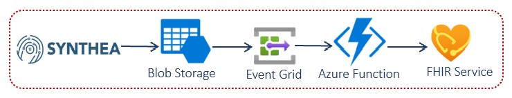

# Challenge 1: Extract and load FHIR synthetic medical data

[< Previous Challenge](./Challenge00.md) - **[Home](../readme.md)** - [Next Challenge>](./Challenge02.md)

## Introduction

In this challenge, you will implement the FHIR Server Samples reference architecture to ingest and load patient data in FHIR.  You will generate synthetic FHIR patient data for bulk load into FHIR Server.  To generate synthetic patient data, you will use **[SyntheaTM Patient Generator](https://github.com/synthetichealth/synthea#syntheatm-patient-generator)** open source Java tool to simulate patient records in FHIR format.  

### FHIR bulk load scenario
In this scenario, you will deploy a storage account with a BLOB container called `fhirimport`.  Synthea generated FHIR patient data files (JSON) are copied into this storage container, and automatically ingested into FHIR Server.  This bulk ingestion is performed by a BLOB triggered function app as depicted below:

<center></center>

## Description

You will implement the FHIR Bulk Load scenario in Microsoft Health Architecture as follows:
- Deploy **[FHIR Server Samples](https://github.com/microsoft/fhir-server-samples)** PaaS scenario (above) to ingest and bulk load Synthea generated FHIR patient data into FHIR Server in near real-time.
   - Clone **['FHIR Server Samples'](https://github.com/microsoft/fhir-server-samples)** git repo.
   - Deploy **[FHIR Server Samples](https://github.com/microsoft/fhir-server-samples#deployment)** environment.
      - Before running this **[PowerShell deployment script](https://github.com/microsoft/fhir-server-samples/blob/master/deploy/scripts/Create-FhirServerSamplesEnvironment.ps1)**, you MUST login to your Azure subscription and connect to Azure AD with your secondary tenant (can be primary tenant if you already have directory admin privilege) that provides you with directory admin role access required for this setup.

      **NOTE:** The connection to Azure AD can be made using a different tenant domain than the one tied to your Azure subscription. If you don't have privileges to create app registrations, users, grant admin consent, etc. in your Azure AD tenant, you can create a new secondary tenant, which will just be used for demo identities, etc. 

   - Post deployment, save your admin tenant user credential to be used in later challenges for web app sign-in.
         
   - To Validate your deployment, 
      - Check Azure resources created in `{ENVIRONMENTNAME}` and `{ENVIRONMENTNAME}-sof` Resource Groups
      - Check `App Registration` in secondary AAD tenant that all three different **[client application types are registered](https://docs.microsoft.com/en-us/azure/healthcare-apis/fhir-app-registration#application-registrations)** for Azure API for FHIR
- Generate simulated patient data in FHIR format using **[SyntheaTM Patient Generator](https://github.com/synthetichealth/synthea#syntheatm-patient-generator)**.

   - Update the **[default properties](https://github.com/synthetichealth/synthea#changing-the-default-properties)** for FHIR output
      - Set Synthea export directory: 
      `exporter.baseDirectory = ./output/fhir`
      - Enable FHIR bundle export: 
      `exporter.fhir.export = true`
      - Generate 1000 patient records: 
      `generate.default_population = 1000`
        
      ```properties
      exporter.baseDirectory = ./output/fhir
      ...
      exporter.ccda.export = false
      exporter.fhir.export = true
      ...
      # the number of patients to generate, by default
      # this can be overridden by passing a different value to the Generator constructor
      generate.default_population = 1000
      ```

      **Note:** The default properties file values can be found at src/main/resources/synthea.properties. By default, synthea does not generate CCDA, CPCDA, CSV, or Bulk FHIR (ndjson). You'll need to adjust this file to activate these features. See the **[wiki](https://github.com/synthetichealth/synthea/wiki)** for more details.

- Copy Synthea generated FHIR bundle JSON files in its `./output/fhir` folder to `fhirimport` BLOB container.
   - You can copy data to Azure Storage using **[Azure AzCopy](https://docs.microsoft.com/en-us/azure/storage/common/storage-use-azcopy-v10)** commandline tool or **[Azure Storage Explorer](https://docs.microsoft.com/en-us/azure/storage/blobs/storage-quickstart-blobs-storage-explorer#upload-blobs-to-the-container)** user interface.
- Test FHIR bulk load using Postman `FHIR API` collection to retreive FHIR patient data loaded.
   - You can import Postman collection and environment variables for FHIR API from the **[Student Resources folder for Postman](./Resources/Postman)** folder.
   - You need to register your **[public client application](https://docs.microsoft.com/en-us/azure/healthcare-apis/tutorial-web-app-public-app-reg)**  to connect Postman desktop app to FHIR Server.

## Success Criteria

   - You have provisioned FHIR Bulk Load environment in Azure.
   - You have generated synthetic patient data in FHIR format.
   - You have loaded FHIR patient data into FHIR Server.
   - You have retrieved the new FHIR patient data using Postman.

## Learning Resources

- **[Azure API for FHIR samples](https://github.com/microsoft/fhir-server-samples)**
- **[Synthea Patient Generator](https://github.com/synthetichealth/synthea#syntheatm-patient-generator)**
- **[Synthea wiki](https://github.com/synthetichealth/synthea/wiki)**
- **[Copy data to Azure Storage using Azure AzCopy tool](https://docs.microsoft.com/en-us/azure/storage/common/storage-use-azcopy-v10)**
- **[Copy data to Azure Storage using Azure Storage Explorer](https://docs.microsoft.com/en-us/azure/storage/blobs/storage-quickstart-blobs-storage-explorer#upload-blobs-to-the-container)** 
- **[Import Postman data, including collections, environments, data dumps, and globals.](https://learning.postman.com/docs/getting-started/importing-and-exporting-data/)**
- **[Register your public client application for Postman](https://docs.microsoft.com/en-us/azure/healthcare-apis/tutorial-web-app-public-app-reg)** 
- **[Access Azure API for FHIR using Postman](https://docs.microsoft.com/en-us/azure/healthcare-apis/access-fhir-postman-tutorial)**
