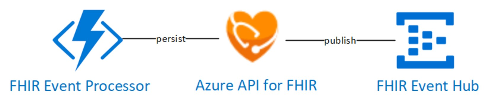

# Challenge 2: Stream FHIR CRUD events to Event Hub for topic subscribers

[< Previous Challenge](./Challenge01.md) - **[Home](../readme.md)** - [Next Challenge>](./Challenge03.md)

## Introduction

In this challenge, implent **[FHIR Event Processor](https://github.com/microsoft/health-architectures/tree/master/FHIR/FHIREventProcessor)** services to import and process valid HL7 messages, persist them into FHIR server and publish successful FHIR server CRUD events to an Event Hub.  Any consumers subscribed to this Event Hub topic in order to orchestrate post-processing event-driven workflows. 



You will extend previous challenge's HL7 Ingest and Convert architecture to include the FHIR Event Processor component as follows:


## Description

- Deploy **[HL7 Ingest, Conversion Samples](https://github.com/microsoft/health-architectures/tree/master/HL7Conversion#hl7tofhir-conversion)** logic app based workflow to perform orderly conversion from HL7 to FHIR via FHIR Converter, persist the HL7 messages into FHIR Server and publish FHIR CRUD change events to Event Hubs for post-Processing workflows.
- Deploy the HL7 Ingest and Conversion Workflow.
    - **[Download or Clone the Microsoft Health Archtectures GitHub repo](https://github.com/microsoft/health-architectures)**
    - Open a bash shell into the Azure CLI 2.0 environment
    - Switch to HL7Conversion subdirectory of this repo
    - Run the deployhl72fhir.bash script and follow the prompts
- Send in an hl7 message via HL7 over HTTPS:
    - Locate the sample message samplemsg.hl7 in the root directory of the repo
    - Use a text editor to see contents
    - From the linux command shell run the following command to test the hl7overhttps ingest
    ```
    curl --trace-ascii - -H "Content-Type:text/plain" --data-binary @samplemsg.hl7 <your ingest host name from above>/api/hl7ingest?code=<your ingest host key from above>
    ```
    - You should receive back an HL7 ACK message to validate that the sample hl7 message was accepted securely stored into blob storage and queued for HL7 to FHIR Conversion processing on the deployed service bus queue
    - To test the end-to-end Conversion process, you can see execution from the HL7toFHIR Logic App Run History in your HL7toFHIR resource group. This will also provide you with detailed steps to see the transform process in the Logic App run.

## Success Criteria
- You have extracted patient data from FHIR Server and loaded them to Azure Cosmos DB.

## Learning Resources

- **[FHIR Event Processor](https://github.com/microsoft/health-architectures/tree/master/FHIR/FHIREventProcessor)**
**[HL7 Ingest, Conversion Samples](https://github.com/microsoft/health-architectures/tree/master/HL7Conversion#hl7tofhir-conversion)**
- **[Quickstart: Create an Azure Cosmos account, database, container, and items from the Azure portal](https://docs.microsoft.com/en-us/azure/cosmos-db/create-cosmosdb-resources-portal)**
- **[Quickstart: Create a JavaScript function in Azure using Visual Studio Code](https://docs.microsoft.com/en-us/azure/azure-functions/functions-create-first-function-vs-code?pivots=programming-language-javascript)**