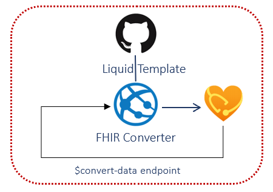

# Challenge 2: Extract and Load HL7v2 & C-CDA EHR Data

[< Previous Challenge](./Challenge01.md) - **[Home](../README.md)** - [Next Challenge>](./Challenge03.md)

## Introduction

In this challenge, you will use the **[\$convert-data](https://docs.microsoft.com/en-us/azure/healthcare-apis/fhir/convert-data#use-the-convert-data-endpoint)** operation, which is a service integrated into the FHIR service within Azure Health Data platform, to convert HL7v2 message and C-CDA XML legacy formats for persistance in FHIR.  The $convert-data endpoint in FHIR service uses the Liquid template engine and default templates from the **[FHIR Converter](https://github.com/microsoft/FHIR-Converter)** OSS project to perform data mapping between these legacy formats to FHIR.  

**[FHIR Converter](https://github.com/microsoft/FHIR-Converter)** is an open source project that transforms health data sources from legacy formats to FHIR bundles that are persisted to a FHIR server.  Microsoft FHIR Converter with Liquid engine supports HL7v2, C-CDA, JSON and FHIR STU3 to FHIR R4 conversions.  It uses default **[Liquid templates](https://shopify.github.io/liquid/)** to define data mapping between these legacy data formats to FHIR, and the template can be **[customized](https://docs.microsoft.com/en-us/azure/healthcare-apis/fhir/convert-data#customize-templates)** to meet your specific conversion requirements.

**[$convert-data](https://docs.microsoft.com/en-us/azure/healthcare-apis/fhir/convert-data#use-the-convert-data-endpoint)** operation is the custom API endpoint in the FHIR service meant to convert data from different data types to FHIR.

## Description

**Prepare API Request to convert legacy health data into FHIR**
- Setup API request **[using the $convert-data endpoint](https://docs.microsoft.com/en-us/azure/healthcare-apis/fhir/convert-data#using-the-convert-data-endpoint)** in the FHIR service and configure **[Parameter Resource](https://docs.microsoft.com/en-us/azure/healthcare-apis/fhir/convert-data#parameters-resource)** in the request body.

**Convert data using the $convert-data endpoint**
- Test send **[sample HL7v2](https://github.com/microsoft/FHIR-Converter/tree/main/data/SampleData/Hl7v2)** and **[sample C-CDA](https://github.com/microsoft/FHIR-Converter/tree/main/data/SampleData/Ccda)** requests in the request body payload and make the appropriate $convert-data API calls to receive FHIR Bundle response.

## Success Criteria
- You have created new HL7 and C-CDA request operations in Postman.
- You have tested sending sample HL7v2 message and received a FHIR "resourceType": "Bundle" response after calling $convert-data with a HL7v2 payload.
- You have tested sending sample C-CDA XML data and received a FHIR "resourceType": "Bundle" response after calling $convert-data with a C-CDA payload.

## Learning Resources

- **[Convert legacy health data to FHIR](https://docs.microsoft.com/en-us/azure/healthcare-apis/fhir/convert-data)**
- **[FHIR Converter](https://github.com/microsoft/FHIR-Converter)**
- **[FHIR Converter pre-installed templates for C-CDA and HL7v2](https://github.com/microsoft/FHIR-Converter/tree/main/data/Templates)**
- **[Sample HL7v2 messages](https://github.com/microsoft/FHIR-Converter/tree/main/data/SampleData/Hl7v2)**
- **[Sample C-CDA XML data](https://github.com/microsoft/FHIR-Converter/tree/main/data/SampleData/Ccda)**
- **[HL7v2 to FHIR Conversion template](https://github.com/microsoft/FHIR-Converter/blob/main/docs/HL7v2-templates.md)**
- **[VS Code FHIR Converter template authoring tool](https://marketplace.visualstudio.com/items?itemName=ms-azuretools.vscode-health-fhir-converter)**

