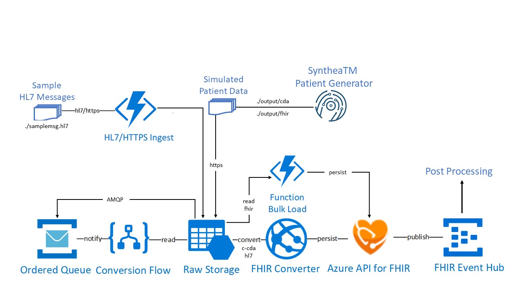

# Challenge 3: Ingest and stream medical events for post-processing

[< Previous Challenge](./Challenge02.md) - **[Home](../readme.md)** - [Next Challenge>](./Challenge04.md)

## Introduction

In this challenge, you will deploy a Health Architecture **[FHIR Event Processor](https://github.com/microsoft/health-architectures/tree/master/FHIR/FHIREventProcessor)** serverless solution that provides the following services within **[FHIR Converter](https://github.com/microsoft/FHIR-Converter)**:
- Import and process valid HL7 bundles and persist them to a FHIR Compliant store
- FHIR Server Proxy connection to FHIR Server without exposing credentials
- Publish successful FHIR CRUD events referencing FHIR Resources to an event hub

Note: This function is deployed and configured as a part of the **[HL7 to FHIR Conversion](https://github.com/microsoft/health-architectures/tree/master/HL7Conversion#hl7tofhir-conversion)** reference architecture.


**[FHIR Converter](https://github.com/microsoft/FHIR-Converter)** is an open source project that runs as a REST web service for converting health data from legacy formats to FHIR bundles.  Microsoft FHIR Converter currently supports HL7v2 and C-CDA to FHIR conversion.  It uses pre-installed **[Handlebars templates](https://handlebarsjs.com/)** to define data mapping for HL7v2 to FHIR and C-CDA to FHIR conversion.  It can be deploy separately or as part of the **[HL7 to FHIR Conversion](https://github.com/microsoft/health-architectures/tree/master/HL7Conversion#hl7tofhir-conversion)** pipeline.

**[HL7 Ingest Platform](https://github.com/microsoft/health-architectures/tree/master/HL7Conversion#deploying-your-own-hl7-ingest-platform)** reference architeture is deployed to ingest HL7 messages and produce a consumable event in a Service Bus queue for processing by FHIR Event Processor function app.  It provides a sample `samplemsg.hl7` for testing the hl7overhttps ingest service.

**[HL7 to FHIR Conversion](https://github.com/microsoft/health-architectures/tree/master/HL7Conversion#hl7tofhir-conversion)** reference architecture deployment will create a Logic App based workflow that is triggered whenever new HL7 message is added to the queue of hl7ingest Service Bus. This conversion workflow performs the following tasks:
- Orderly conversion from HL7 to FHIR via the **[FHIR Converter](https://github.com/microsoft/FHIR-Converter)**
- Persists converted HL7v2 message into FHIR Server through secure proxied FHIR Server connection (FHIR Server Proxy). 
- Publishes FHIR change events referencing FHIR Resources to an Event Hub.


Note: After successful deployment, the FHIR converter pipeline is integrated with the HL7 Ingest platform.

### Let's put it all together...
You will extend the FHIR Server Samples reference architecture from previous challenges with HL7 Ingest and FHIR Converter reference architectures to form the end-to-end ingest, transform and load event-driven platform as shown below:



## Description

- **Deploy HL7 Ingest Platform** reference architecture.

    Hint:
    - **[Download or Clone the Microsoft Health Archtectures GitHub repo](https://github.com/microsoft/health-architectures)**
    - Open a bash shell into the Azure CLI 2.0 environment
    - Switch to 'HL7Conversion' subdirectory in your local repo
    - Run the `./deployhl7ingest.bash` script and follow the prompts
        - Enter your subscription ID
        - Enter a Resource Group name (new or existing)
        - Enter Resource Group location
        - Enter deployment prefix (environment name)
- Deploy **[HL7toFHIR Conversion Workflow](https://github.com/microsoft/health-architectures/tree/master/HL7Conversion#-deploying-your-own-hl7tofhir-conversion-workflow)** reference architecture.

    Hint:
    - **[Download or Clone the Microsoft Health Archtectures GitHub repo](https://github.com/microsoft/health-architectures)** if you have not done so.
    - Open a bash shell into the Azure CLI 2.0 environment
    - Switch to HL7Conversion subdirectory of this repo
    - Run the `deployhl72fhir.bash` script and follow the prompts
        - Enter your subscription ID
        - Enter a Resource Group name (new or existing)
        - Enter Resource Group location
        - Enter deployment prefix (environment name)
        - Enter a resource group name to deploy the converter to: [EVIRONMENTNAME]hl7conv
        - Enter the name of the HL7 Ingest Resource Group (from above hl7ingest deployment)
        - Enter the name of the HL7 Ingest storage account (from above hl7ingest deployment)
        - Enter the name of the HL7 ServiceBus namespace (from above hl7ingest deployment)
        - Enter the name of the HL7 ServiceBus destination queue (from above hl7ingest deployment)
        - Enter the destination FHIR Server URL
        - Enter the FHIR Server Service Client Application ID
        - Enter the FHIR Server Service Client Secret:
        - Enter the FHIR Server/Service Client Audience/Resource (https://azurehealthcareapis.com)
        - Enter the FHIR Server/Service Client Tenant ID  
          
- Validate resources created in the deployment

    Hint:
    - Storage account: [ENVIRONMENTNAME]store#####
    - FHIR Event Hub Namespace: fehub###
    - FHIR Event Hub: fhirevents
    - FHIREventProcessor Function App: fhirevt####
    - Application Insights: fhirevt####
    - Logic App: HL7toFHIR.  Workflow steps are:
        - When a message is received in a hl7ingest queue (HL7ServiceBus)
        - Get blob content (hl7blobstorage)
        - Connections - Custom Logic App connection (HL7FHIRConverter)
        - Import Bundle to FHIR Server (Connected thru FHIR Server Proxy)

- Test send sample HL7v2 message via hl7overhttps ingestion service.

    Hint:
    - Locate the sample message `samplemsg.hl7` in the root directory of the cloned Health Architecture GitHub repo
    - Use a text editor to see contents
    - From the Linux command shell run the following command to test the hl7overhttps ingest
        ```
        curl --trace-ascii - -H "Content-Type:text/plain" --data-binary @samplemsg.hl7 <your ingest host name from above>/api/hl7ingest?code=<your ingest host key from above>
        ```
    - You should receive back an HL7 ACK message to validate that the sample hl7 message was accepted securely stored into blob storage and queued for HL7 to FHIR Conversion processing on the deployed service bus queue
    - To validate the end-to-end HL7 Conversion process, you can see execution from the HL7toFHIR Logic App Run History in your HL7toFHIR resource group. This will also provide you with detailed steps to see the transform process in the Logic App run.

## Success Criteria
- You have deployed HL7 Ingest, Conversion reference architectures that includes the FHIR Event Processor and FHIR Converter components.
- You have tested sending sample HL7v2 message via HL7OverHTTPS ingest service.
- You have validated the end-to-end HL7 Ingest and Conversion process.
- You have validated FHIR CRUD event is published to Event Hub for post-processing.

## Learning Resources

- **[FHIR Event Processor](https://github.com/microsoft/health-architectures/tree/master/FHIR/FHIREventProcessor)**
- **[HL7 Ingest, Conversion Samples](https://github.com/microsoft/health-architectures/tree/master/HL7Conversion#hl7tofhir-conversion)**
- **[FHIR Converter](https://github.com/microsoft/FHIR-Converter)**
- **[FHIR Converter API Details](https://github.com/microsoft/FHIR-Converter/blob/master/docs/api-summary.md)**
- **[Using FHIR Bundle Conversion APIs](https://github.com/microsoft/FHIR-Converter/blob/master/docs/convert-data-concept.md)**
- **[FHIR Converter pre-installed templates for C-CDA and HL7v2](https://github.com/microsoft/FHIR-Converter/tree/master/src/templates)**
- **[Sample HL7 messages](https://github.com/microsoft/FHIR-Converter/tree/master/src/sample-data/hl7v2)**
- **[How to create a FHIR Converter template](https://github.com/microsoft/FHIR-Converter/blob/master/docs/template-creation-how-to-guide.md)**
- **[Browser based FHIR Converter template editor](https://github.com/microsoft/FHIR-Converter/blob/master/docs/web-ui-summary.md)**


