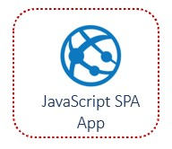

# Challenge 3: Search FHIR EHR Data

[< Previous Challenge](./Challenge02.md) - **[Home](../README.md)** - [Next Challenge>](./Challenge04.md)

## Introduction

In this challenge, you will create a new JavaScript Single Page App (SPA) integrated with Microsoft Authentication Library (MSAL) to connect to the FHIR service, search for patient(s) and display the search results in a web app.

## Description

- Create a new JavaScript Web App or Single-Page App (SPA).
  - Web App: **[Deploy sample web app with MSAL in Azure App Service Web App to read FHIR data in FHIR service](https://learn.microsoft.com/en-us/azure/healthcare-apis/azure-api-for-fhir/tutorial-web-app-write-web-app)**
  - Node.js: git clone sample code for **[Node.js JavaScript SPA with MSAL](https://learn.microsoft.com/en-us/azure/active-directory/develop/tutorial-v2-javascript-auth-code)** 
  - React: Use **[Create React App](https://reactjs.org/docs/create-a-new-react-app.html#create-react-app)** frontend build pipeline (toolchain) to generate the initial project structure.

- Integrate and configure the Microsoft Authentication Library (MSAL) with your JavaScript SPA app to connect and fetch data from protected FHIR web API.
  
    - You need to use MSAL to authenticate and acquired access token as a bearer in your FHIR API HTTP request within the web app.

    

- Create a patient lookup by Given or Family name in JavaScript SPA app.
  - Explore the `FHIR API` collection imported into Postman earlier to obtain the appropriate API request for the patient search query.

- (Optional) Include any other modern UI features to improve the user experience.
- **[Register your app](https://learn.microsoft.com/en-us/azure/active-directory/develop/tutorial-v2-javascript-spa#register-your-application)** on AAD tenant with directory admin access to connect web app with FHIR Server for both local and Azure web app URLs.

    Hint: Ensure that the Reply URL matches the local and Azure Web App URL.

- Build and test JavaScript SPA app locally.
  - To run locally, you'll need to change the `redirectUri` property to: `http://localhost:3000/`.
- Deploy JavaScript SPA web app to Azure App Service.
  - To run on Azure, you'll need to change the `redirectUri` property to: `<YOUR_AZURE_APP_SERVICE_WEBSITE_URL>`.
- Test the JavaScript SPA Patient Search app:
  - Browse to App Service website URL in a new in-private/Incognito window.
  - Sign in with your admin tenant user credential saved in **[challenge 1](./Challenge01.md)**.
  - Enter full/partial name in the patient search textbox and click the search button.
  - You should see a list of FHIR patient(s) that matches your search criteria.

## Success Criteria
- You have created a JavaScript SPA Patient Search app and deployed it to Azure App Service.
- You have tested patient lookup in the Patient Search web app.

## Learning Resources

- **[Write Azure App Service Web App to read FHIR data in FHIR service (includes sample code) ](https://learn.microsoft.com/en-us/azure/healthcare-apis/azure-api-for-fhir/tutorial-web-app-write-web-app)**
- **[Build and host a web app with Azure Web Apps](https://ms.portal.azure.com/?quickstart=true#view/Microsoft_Azure_Resources/QuickstartAnchorServicesBlade/goalId/create-a-web-app)**
- **[Create a new JavaSCript SPA using MSAL to call protected Web API](https://learn.microsoft.com/en-us/azure/active-directory/develop/tutorial-v2-javascript-auth-code)**
- **[Vanilla JavaScript Single-page Application secured with MSAL.js v2](https://github.com/Azure-Samples/ms-identity-javascript-v2)**
- **[Create React App integrated toochain](https://reactjs.org/docs/create-a-new-react-app.html#create-react-app)**
- **[Microsoft Authentication Library for React (@azure/msal-react)](https://www.npmjs.com/package/@azure/msal-react)**
- **[Initialization of MSAL (@azure/msal-react) in React app](https://github.com/AzureAD/microsoft-authentication-library-for-js/blob/dev/lib/msal-browser/docs/initialization.md)**
- **[Samples for the MSAL.js 2.x library](https://github.com/AzureAD/microsoft-authentication-library-for-js/blob/dev/lib/msal-browser/README.md#advanced-topics)**
- **[Getting Started: Using React AAD MSAL library components to integrate MSAL with AAD in your React app](https://www.npmjs.com/package/react-aad-msal#checkered_flag-getting-started)**
- **[Sample JavaScript code to acquired access token as a bearer in an HTTP request to call protected web API](https://docs.microsoft.com/en-us/azure/active-directory/develop/scenario-spa-call-api?tabs=javascript#call-a-web-api)**
- **[Sample React JS code to perform a search](https://github.com/lytes20/meal-search-app)**
- **[Deploy your Node.js app using VS Code and the Azure App Service extension](https://docs.microsoft.com/en-us/azure/app-service/quickstart-nodejs?pivots=platform-linux#deploy-to-azure)**
- **[Hosting options and deployment scenarios to move your node.js app from a local or cloud repository to Azure](https://docs.microsoft.com/en-us/azure/developer/javascript/how-to/deploy-web-app)**
- **[Deploying React apps to Azure with Azure DevOps](https://devblogs.microsoft.com/premier-developer/deploying-react-apps-to-azure-with-azure-devops/)**
- **[Register your app](https://docs.microsoft.com/en-us/azure/active-directory/develop/tutorial-v2-javascript-spa#register-your-application)**
- **[Register a web app public client application](https://docs.microsoft.com/en-us/azure/healthcare-apis/tutorial-web-app-public-app-reg#connect-with-web-app)**