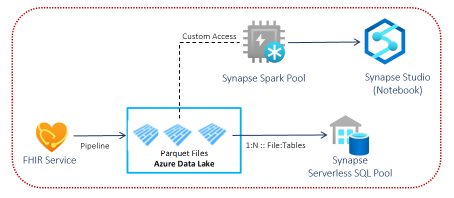

# Challenge 4: Explore and Analyze FHIR EHR Data

[< Previous Challenge](./Challenge03.md) - **[Home](../README.md)** - [Next Challenge>](./Challenge05.md)

## Introduction

In this challenge, you will deploy the OSS **[FHIR-to-Synapse Analytics Pipeline](https://github.com/microsoft/FHIR-Analytics-Pipelines/blob/main/FhirToDataLake/docs/Deployment.md)** to move FHIR data from Azure FHIR service to a Azure Data Lake storage in near real time and making it available to a Synapse workspace, which will enable you to query against the entire FHIR dataset with tools such as Synapse Studio, SSMS, and/or Power BI.

This pipeline is an Azure Function solution that extracts data from the FHIR server using FHIR Resource APIs, converts them to hierarchical Parquet files, and writes them to Azure Data Lake storage in near real time. It contains a script to create External Tables and Views in Synapse Serverless SQL pool pointing to the Parquet files.  You can also access the Parquet files directly from a Synapse Spark Pool to perform custom transformation to downstream systems, i.e. USCDI datamart, etc.

## Description

You need to deploy an instance of FHIR service (done in challenge 1) and a **[Synapse Workspace](https://learn.microsoft.com/en-us/azure/synapse-analytics/quickstart-deployment-template-workspaces)**.

- **Deploy the FHIR-to-Synapse Analytics Pipeline**
    - To **[deploy the pipeline](https://github.com/microsoft/FHIR-Analytics-Pipelines/blob/main/FhirToDataLake/docs/Deployment.md#1-deploy-the-pipeline)**, run this **[ARM template](https://portal.azure.com/#create/Microsoft.Template/uri/https%3A%2F%2Fraw.githubusercontent.com%2FMicrosoft%2FFHIR-Analytics-Pipelines%2Fmain%2FFhirToDataLake%2Fdeploy%2Ftemplates%2FFhirSynapsePipelineTemplate.json)** for pipeline deployment through the Azure Portal.      
- **Provide Access of the FHIR server to the Azure Function**
    - **[Assign the FHIR Data Reader role](https://learn.microsoft.com/en-us/azure/healthcare-apis/configure-azure-rbac#assign-roles-for-the-fhir-service)** to the Azure Function created from the deployment above
- **Verify the data movement** as the function app deployed will run automatically and the time taken to write the FHIR dataset to the storage account will depend on the amount of data stored in the FHIR server. 
    
    Hint:
    - You will see folders for only those Resources that are present in your FHIR server. Running the PowerShell **[script](https://github.com/microsoft/FHIR-Analytics-Pipelines/blob/main/FhirToDataLake/scripts/Set-SynapseEnvironment.ps1)** will create folders for other Resources.

- **Provide privilege to your account**
    - You must provide the following roles to your account to run the PowerShell script in the next step (and revoke these roles after the installation if needed)
        - **[Assign Synapse Administrator role](https://learn.microsoft.com/en-us/azure/synapse-analytics/get-started-add-admin#synapse-rbac-synapse-administrator-role-for-the-workspace)** in your Synapse Workspace
        - **[Assign the Storage Blob Data Contributor role](https://learn.microsoft.com/en-us/azure/storage/blobs/assign-azure-role-data-access?tabs=portal#assign-an-azure-role)** in your Storage Account for running the PowerScript below.
- **Provide access of the Storage Account to the Synapse Workspace**
    - **[Assign the Storage Blob Data Contributor role](https://learn.microsoft.com/en-us/azure/storage/blobs/assign-azure-role-data-access?tabs=portal#assign-an-azure-role)** to your Synapse Workspace.
- **Run the PowerShell script**
    - Run the PowerShell **[script](https://github.com/microsoft/FHIR-Analytics-Pipelines/blob/main/FhirToDataLake/scripts/Set-SynapseEnvironment.ps1)** to create External Tables and Views in Synapse Serverless SQL Pool pointing to the Parquet files in the Storage Account.

## Success Criteria
- You have verfied that Parquet files are stored in the Storage Account after the Azure Function execution is completed 
- You have verified that there are folders corresponding to different FHIR resources in the container's results folder.
- You have queried the `fhirdb` data in Synapse Studio to explore the External Tables and Views to see the exported FHIR resource entities.
- You have validated that new persisted FHIR data are fetched automatically to the Data Lake and are available for querying.

## Learning Resources

- **[FHIR Analytics Pipeline](https://github.com/microsoft/FHIR-Analytics-Pipelines)**
- **[FHIR to Synapse Sync Agent](https://github.com/microsoft/FHIR-Analytics-Pipelines/blob/main/FhirToDataLake/docs/Deployment.md#fhir-to-synapse-sync-agent)**
- **[Data mapping from FHIR to Synapse](https://github.com/microsoft/FHIR-Analytics-Pipelines/blob/main/FhirToDataLake/docs/Data-Mapping.md)**
