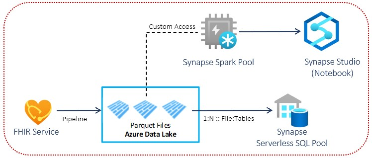

# Challenge 4: Connect to FHIR Server and read FHIR data through a JavaScript app

[< Previous Challenge](./Challenge03.md) - **[Home](../readme.md)** - [Next Challenge>](./Challenge05.md)

## Introduction

In this challenge, you will deploy a sample JavaScript app to connect and read FHIR patient data.  You will configure public client application registration to allow JavaScript app to access FHIR Server.

**[Public Client Application registrations](https://docs.microsoft.com/en-us/azure/healthcare-apis/register-public-azure-ad-client-app)** are Azure AD representations of apps that can authenticate and authorize for API permissions on behalf of a user. Public clients are mobile and SPA JavaScript apps that can't be trusted to hold an application secret, so you don't need to add one.  For a SPA, you can enable implicit flow for app user sign-in with ID tokens and/or call a protected web API with Access tokens.

## Description

You will deploy a FHIR sample JavaScript app in Azure to read patient data from the FHIR service.
- **[Create a new Azure Web App](https://docs.microsoft.com/en-us/azure/healthcare-apis/tutorial-web-app-write-web-app#create-web-application)** in Azure Portal to host the FHIR sample JavaScript app.
- Check in secondary Azure AD tenant (can be same as your primary AAD tenant if you already have admin privileges) that a **[Resource Application](https://docs.microsoft.com/en-us/azure/healthcare-apis/register-resource-azure-ad-client-app)** has been registered for the FHIR Server resource.

    **Note:**
    - If you are using the Azure API for FHIR, a Resource Application is automatically created when you deploy the service in same AAD tenant as your application.
    - In the FHIR Server Sample environment deployment, a Resource Application is automatically created for the FHIR Server resource.

- **[Register your public client application to connect web app to FHIR Server](https://docs.microsoft.com/en-us/azure/healthcare-apis/tutorial-web-app-public-app-reg#connect-with-web-app)** in Secondary Azure AD tenant (can be primary tenant if you already have directory admin privilege) to allow the deployed Web App to authenticate and authorize for FHIR Server API access.
    - Ensure that the Reply URL matches the Web App URL
        - In AAD `App Registration`, configure a new `Web Platform` under `Authentication` blade
            - Set `Redirect URIs` to your [Web App URL]
            - Enable `Implicit Grant` by selecting Access token and ID tokens
            - Configure permissions for Azure Healthcare APIs with `User_Impersonation` permission (if needed)
 
- Write a new JavaScript application to connect and read FHIR patient data
    - Start with the sample code from the **[FHIR patient JavaScript app](https://docs.microsoft.com/en-us/azure/healthcare-apis/tutorial-web-app-write-web-app)**.
    - Initialize **[MSAL (Mirosoft Authentication Library) provider](https://docs.microsoft.com/en-us/graph/toolkit/providers/msal)** configuration for your FHIR environment:
        - `clientId` - Update with your client application ID of public client app registered earlier
        - `authority` - Update with Authority from your FHIR Server (under Authentication)
        - `FHIRendpoint` - Update the FHIRendpoint to have your FHIR service name
        - `Scopes` - Update with Audience from your FHIR Server (under Authentication)

- Deploy your sample code from your local repo to your App Service `wwwroot` folder.
    - Use App Service Editor in-browser editing tool in Azure Portal to update your `index.html` code under the `wwwroot` folder.

- Test sample JavaScript app
  - Browse to App Service website URL in In-private / Incognito window.
  - SignIn with your secondary tenant used in deploying FHIR Server Samples reference architecture.
  - You should see a list of patients that were loaded into FHIR Server.

## Success Criteria
- You have deployed a FHIR sample Web App in Azure that connects to FHIR Server and retrieves FHIR patient data displayed in a web page.

## Learning Resources

- **[Deploy a JavaSript app to read data from FHIR service](https://docs.microsoft.com/en-us/azure/healthcare-apis/tutorial-web-app-fhir-server)**
- **[Register a web app public client application](https://docs.microsoft.com/en-us/azure/healthcare-apis/tutorial-web-app-public-app-reg#connect-with-web-app)**
- **[Test FHIR API setup with Postman](https://docs.microsoft.com/en-us/azure/healthcare-apis/tutorial-web-app-test-postman)**
- **[Write Azure web app to read FHIR data](https://docs.microsoft.com/en-us/azure/healthcare-apis/tutorial-web-app-write-web-app)**
- **[Overview of Mirosoft Authentication Library (MSAL)](https://docs.microsoft.com/en-us/azure/active-directory/develop/msal-overview)**
- **[Initial MSAL provider in HTML or JavaScript](https://docs.microsoft.com/en-us/graph/toolkit/providers/msal)**
