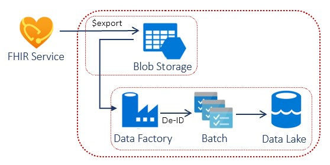

# Challenge 5: Explore FHIR medical records through FHIR Dashboard and SMART on FHIR apps

[< Previous Challenge](./Challenge04.md) - **[Home](../readme.md)** - [Next Challenge>](./Challenge06.md)

## Introduction

In this challenge, you will explore patient medical records and SMART on FHIR apps through the FHIR Dashboard app. 

**[What is SMART on FHIR?](https://docs.microsoft.com/en-us/azure/healthcare-apis/fhir-faq#what-is-smart-on-fhir)** 
SMART ((Substitutable Medical Applications and Reusable Technology) on FHIR is a set of open specifications to integrate partner apps with FHIR Servers and other Health IT systems, i.e. Electronic Health Records and Health Information Exchanges.  By creating a SMART on FHIR application, you can ensure that your application can be accessed and leveraged by different systems.

Azure API for FHIR has a built-in **[Azure AD SMART on FHIR proxy](https://docs.microsoft.com/en-us/azure/healthcare-apis/use-smart-on-fhir-proxy)** to integrate partner apps with FHIR Servers and EMR systems through FHIR interfaces. This set of open specifications describes how an app should discover authentication endpoints for FHIR Server and start an authentication sequence.  Specifically, the proxy enables the **[EHR launch sequence](https://hl7.org/fhir/smart-app-launch/#ehr-launch-sequence)**.  

## Description

You will perform the following steps to access patient medical records and explore the use of SMART on FHIR applications in Azure API for FHIR through the FHIR Dashboard app:
- Access FHIR Dashboard app
    - Open In-private/Incognito browser and navigate to FHIR Dashboard app URL.
    - Use the dashboard user credentials to sign in (captured during FHIR Server Samples deployment in **[Challenge 1](./Challenge01.md)**.
    - In popup Consent dialog box, accept consent to permissions requested by the Confidential Client app to get access to FHIR Server.
- Explore patient medical records through FHIR Dashboard app, including:
    - Patient and its FHIR bundle details
    - Patient medical elements
        - Conditions
        - Encounters
        - Observations
- Explore SMART on FHIR apps through FHIR Dashboard app, including:
    - Growth Chart
    - Medications

## Success Criteria
- You have successfully access FHIR Dashboard app to access patient medical records and encounters.
- You have explored SMART on FHIR applications.

## Learning Resources

- **[SMART on FHIR - FHIR Server Dashboard app](https://github.com/smart-on-fhir/fhir-server-dashboard#:~:text=The%20FHIR%20Server%20Dashboard%20is%20a%20standalone%20app,at%20the%20sample%20data%20on%20a%20FHIR%20sandbox.)**
- **[FHIR Server Dashboard Demo](http://docs.smarthealthit.org/fhir-server-dashboard/)**
- **[FHIR Dashboard JS source code](https://github.com/microsoft/fhir-server-samples/blob/master/src/FhirDashboardJS/index.html)**
- **[Use Azure AD SMART on FHIR proxy](https://docs.microsoft.com/en-us/azure/healthcare-apis/use-smart-on-fhir-proxy)**
- **[Download the SMART on FHIR app launcher](https://docs.microsoft.com/en-us/azure/healthcare-apis/use-smart-on-fhir-proxy#download-the-smart-on-fhir-app-launcher)**
- **[Test the SMART on FHIR proxy](https://docs.microsoft.com/en-us/azure/healthcare-apis/use-smart-on-fhir-proxy#test-the-smart-on-fhir-proxy)**
- **[SMART](https://smarthealthit.org/)**
- **[HL7 FHIR SMART Application Launch Framework](http://www.hl7.org/fhir/smart-app-launch/)**
