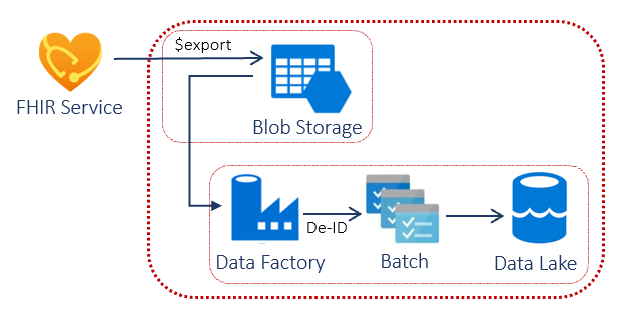

# Challenge 5: Export and Anonymize FHIR EHR Data

[< Previous Challenge](./Challenge04.md) - **[Home](../README.md)** - [Next Challenge>](./Challenge06.md)

## Introduction

In this challenge, you will leverage the API requests in FHIR service in Azure Health Data Services within the Azure Data Factory (ADF) pipeline to export and de-identify FHIR data according to a set of data redaction/transformation rules specified in a **[configuration file](https://github.com/microsoft/Tools-for-Health-Data-Anonymization/blob/master/docs/FHIR-anonymization.md#configuration-file-format)**. The goal of the of this challege is to apply the **[HIPAA Safe Harbor Method](https://www.hhs.gov/hipaa/for-professionals/privacy/special-topics/de-identification/index.html#safeharborguidance)** de-id requirements against FHIR data to create a research datasets.

**[FHIR Tool for Anonymization](https://github.com/microsoft/FHIR-Tools-for-Anonymization)** provides various tooling to anonymize healthcare FHIR data, on-premises or cloud, for secondary usage such as research, public health, etc. as follows:
- **[Command line tool](https://github.com/microsoft/Tools-for-Health-Data-Anonymization/blob/master/docs/FHIR-anonymization.md#anonymize-fhir-data-using-the-command-line-tool)**, 
- **[Azure Data Factory (ADF) pipeline](https://github.com/microsoft/Tools-for-Health-Data-Anonymization/blob/master/docs/FHIR-anonymization.md#anonymize-fhir-data-using-azure-data-factory)**
- **[De-ID $export](https://github.com/microsoft/Tools-for-Health-Data-Anonymization/blob/master/docs/FHIR-anonymization.md#how-to-perform-de-identified-export-operation-on-the-fhir-server)** FHIR service operation  

Below depicts the Azure Data Factory pipeline method for FHIR anonymization leveraged in this challenge:

## Description

You will deploy a **[FHIR Anonymization ADF pipeline](https://github.com/microsoft/Tools-for-Health-Data-Anonymization/blob/master/docs/FHIR-anonymization.md#anonymize-fhir-data-using-azure-data-factory)** to de-identify FHIR data.  You will run a PowerShell **[script](https://github.com/microsoft/Tools-for-Health-Data-Anonymization/tree/master/FHIR/src/Microsoft.Health.Fhir.Anonymizer.R4.AzureDataFactoryPipeline)** to create an ADF pipeline that reads data from a source container in Azure Blob storage and writes the outputted anonymized data to a destination containter in Azure Blob storage.

To test the FHIR Anonymization pipeline, call the **[$export endpoint](https://docs.microsoft.com/en-us/azure/healthcare-apis/fhir/export-data#calling-the-export-endpoint)** in FHIR service to export FHIR data into a blob storage container inside the storage account for the Anonymization pipeline.  Alternatively, you can directly upload the test Synthea generated FHIR Bundles to the container.

- **Setup ADF pipeline configuration for anonymization**
    - Download or Clone the **[Tools-for-Health-Data-Anonymization](https://github.com/microsoft/Tools-for-Health-Data-Anonymization)** GitHub repo
    - Configure the Anonymization pipeline deployment **[script](https://github.com/microsoft/Tools-for-Health-Data-Anonymization/tree/master/FHIR/src/Microsoft.Health.Fhir.Anonymizer.R4.AzureDataFactoryPipeline)** execution for your **[environment](https://github.com/microsoft/Tools-for-Health-Data-Anonymization/blob/master/docs/FHIR-anonymization.md#create-data-factory-pipeline)**.
    - Define **[command line environment variables](https://github.com/microsoft/Tools-for-Health-Data-Anonymization/blob/master/docs/FHIR-anonymization.md#create-data-factory-pipeline)** needed during the script execution to create and configure the Anonymization pipeline.
- **Deploy ADF pipeline for FHIR data anonymization**
    - Execute **[script](https://github.com/microsoft/Tools-for-Health-Data-Anonymization/tree/master/FHIR/src/Microsoft.Health.Fhir.Anonymizer.R4.AzureDataFactoryPipeline)** to created the Anonymization pipeline.
- **Upload test FHIR patient data for anonymization**
    - **[Configure](https://docs.microsoft.com/en-us/azure/healthcare-apis/fhir/configure-export-data)** and **[perform](https://docs.microsoft.com/en-us/azure/healthcare-apis/fhir/export-data)** the bulk FHIR export using the $export operation in FHIR service via Postman.
    - Alternatively, upload Synthea generated FHIR patient data to the source container configured in the linked service of ADF pipeline.
- **Trigger and monitor pipeline run to anonymize the uploaded test FHIR patient data**
    - **[Trigger pipeline run](https://github.com/microsoft/Tools-for-Health-Data-Anonymization/blob/master/docs/FHIR-anonymization.md#trigger-and-monitor-pipeline-run-from-powershell)** to de-ID test FHIR patient data.
- **Validate FHIR data export and anonymization** 
    - Compare pre de-identified data in the 'source' container  and post de-identified data in the 'destination' container in the Storage Account(s). 

## Success Criteria
- You have successfully configured and deployed the FHIR anonymization tool.
- You have successfully configured FHIR Bulk Export and called the $export operation to upload the test FHIR data for anonymization
- You have successfully triggered and monitored the Anonymization pipeline in ADF
- You have compared pre de-ided and post de-ided FHIR data in the resource and destination containers respectively.

## Learning Resources

- **[FHIR Tools for Anonymization](https://github.com/microsoft/FHIR-Tools-for-Anonymization)**
- **[Configure Bulk export FHIR service operation](https://docs.microsoft.com/en-us/azure/healthcare-apis/fhir/configure-export-data)**
- **[How to export FHIR data with $export opertation in FHIR service](https://docs.microsoft.com/en-us/azure/healthcare-apis/fhir/export-data)**
- **[HIPPA Safe Harbor Method](https://www.hhs.gov/hipaa/for-professionals/privacy/special-topics/de-identification/index.html)**
