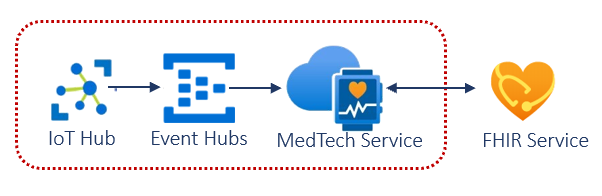

# Challenge 6: Ingest and Persist IoT Medical Device Data 

[< Previous Challenge](./Challenge05.md) - **[Home](../README.md)** - [Next Challenge>](./Challenge07.md)

## Introduction

In this challenge, you will work with IoT medical device data using the **[MedTech service](https://docs.microsoft.com/en-us/azure/healthcare-apis/iot/get-started-with-iot)** in Azure Health Data Services.  You will use **[MedTech service toolkit](https://github.com/microsoft/iomt-fhir/tree/main/tools/data-mapper)** to transform IoT medical device data into Fast Healthcare Interoperability Resources (FHIR®)-based Observation resources.  You will deploy a **[MedTech service data pipeline](https://learn.microsoft.com/en-us/azure/healthcare-apis/iot/iot-data-flow)** to ingest medical IoT data, normalize and group these messages,transform the grouped-normalized messages into FHIR-based Observation resources, and then persist the transformed messages into the FHIR service (previously deployed in challenge 1).

The **[MedTech service](https://docs.microsoft.com/en-us/azure/healthcare-apis/iot/get-started-with-iot)** in Azure Health Data Services uses an event hub to ingests streaming event data from IoT medical devices, transforms them into FHIR-based Observation resources, retrieves associated Patient resource from FHIR service, adds them as reference to the Observation resource created, and then persists the transformed messages to the FHIR service.

**[Azure IoMT Connector Data Mapper](https://github.com/microsoft/iomt-fhir/tree/main/tools/data-mapper)** is the MedTech toolkit to visualize and configure normalize mapping between the medical IoT data and FHIR.  Once you completed the FHIR mapping, you can export it and upload the mapping files to your **[MedTech service Device Mapping](https://docs.microsoft.com/en-us/azure/healthcare-apis/iot/how-to-use-device-mappings)** configuration in Azure Portal.

Below is the overview of the **[MedTech service data flow](https://learn.microsoft.com/en-us/azure/healthcare-apis/iot/iot-data-flow)**:

## Description

You will deploy an instance of MedTech service in your Azure Health Data Service workspace, and configure it to receive and transform medical IoT data for persitence in your FHIR service (deployed in challenge 1) as Observation resources.

- **Deploy **[Azure Event Hubs](https://docs.microsoft.com/en-us/azure/event-hubs/)** for MedTech service to **[ingest](https://docs.microsoft.com/en-us/azure/healthcare-apis/iot/iot-data-flow#ingest)** medical IoT device data**

    Hint: An Event Hubs namespace provides a unique scoping container, in which you create one or more event hubs. 

- ****[Deploy](https://docs.microsoft.com/en-us/azure/healthcare-apis/iot/deploy-iot-connector-in-azure)** a new instance of the MedTech service in your Azure Health Data Services workspace (deployed in challenge 1) and configure it to ingest IoT data from the above Event Hubs instance**
- **Deploy the **[IoT mapper tool](https://github.com/microsoft/iomt-fhir/tree/main/tools/data-mapper)****
  - Import **[sample IoT messages](https://github.com/microsoft/azure-health-data-services-workshop/tree/main/Challenge-09%20-%20MedTech%20service/SampleData/Answers)** into tool to customize device mapping to FHIR
    - You can also find the sample IoT message files (`devicecontent.json` and `fhirmapping.json`) in the `/MedTech-service/SampleData` folder of the Resources.zip file provided by your coach.
  - Export customized mapping in tool to generate the new Device Mapping and FHIR Mapping files
- **Import the newly generated FHIR mapping into your MedTech service**
  - Configure and save the **[Device mapping](https://learn.microsoft.com/en-us/azure/healthcare-apis/iot/how-to-use-device-mappings)** JSON in the MedTech service (Device Mapping setting)
  - Configure and save the **[Destination mapping](https://learn.microsoft.com/en-us/azure/healthcare-apis/iot/how-to-use-fhir-mappings)** JSON to in the MedTech service (Destination setting)
- **Send sample device data to persist in the FHIR service using Postman via **[MedTech service Event Hub service](https://docs.microsoft.com/en-us/rest/api/eventhub/get-azure-active-directory-token)****

## Success Criteria
- You have successfully configured device mapping to FHIR using the data mapper tool
- You have successfully generated a custom FHIR mapping for medical IoT device data
- You have successfully configured MedTech service for mapping IoT device data to FHIR
- You have successfully ingested sample medical IoT device data into the FHIR services as Observation resources.

## Learning Resources

- **[What is the MedTech service?](https://docs.microsoft.com/en-us/azure/healthcare-apis/iot/iot-connector-overview?WT.mc_id=Portal-Microsoft_Healthcare_APIs)**
- **[MedTech service data flow](https://docs.microsoft.com/en-us/azure/healthcare-apis/iot/iot-data-flow)**
- **[Deploy the MedTech service manually](https://docs.microsoft.com/en-us/azure/healthcare-apis/iot/deploy-iot-connector-in-azure#deploy-the-medtech-service-manually)**, which will allow you to use existing FHIR service deployed in challenge 1 in the MedTech service destination configuration.
- **[Deploy the MedTech service using Azure portal](https://docs.microsoft.com/en-us/azure/healthcare-apis/iot/deploy-iot-connector-in-azure#configure-device-mapping-properties)**, which will include the following Azure services: Event Hubs, Health Data Services workspace, FHIR service and MedTech service.
- **[Azure IoMT Connector Data Mapper](https://github.com/microsoft/iomt-fhir/tree/main/tools/data-mapper)**
- **[How to use Device mappings](https://docs.microsoft.com/en-us/azure/healthcare-apis/iot/how-to-use-device-mappings)**
- **[How to use the FHIR destination mappings](https://docs.microsoft.com/en-us/azure/healthcare-apis/iot/how-to-use-fhir-mappings)**
- **[Granting access to device message event hub and FHIR service](https://docs.microsoft.com/en-us/azure/healthcare-apis/iot/deploy-iot-connector-in-azure#granting-the-medtech-service-access-to-the-device-message-event-hub-and-fhir-service)**
- **[Receive device data through Azure IoT Hub](https://docs.microsoft.com/en-us/azure/healthcare-apis/iot/device-data-through-iot-hub)**
- **[Create an IoT Hub](https://docs.microsoft.com/en-us/azure/iot-hub/iot-hub-create-through-portal)**
- **[Connect IoT Hub to MedTech Service with Message Routing](https://docs.microsoft.com/en-us/azure/iot-hub/iot-hub-devguide-messages-d2c)**
- **[Upload files from connected devices to IoT Hub](https://docs.microsoft.com/en-us/azure/iot-hub/iot-hub-devguide-file-upload)**
- **[Ingest data from IoT devices](https://docs.microsoft.com/en-us/azure/healthcare-apis/iot/device-data-through-iot-hub#send-device-message-to-iot-hub)**
- **[Get an Azure Active Directory (Azure AD) token and use it send events to an event hub](https://docs.microsoft.com/en-us/rest/api/eventhub/get-azure-active-directory-token#send-messages-to-a-queue)**
