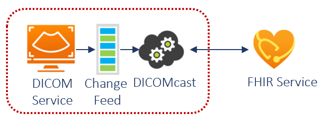

# Challenge 7: Load DICOM Imaging Data

[< Previous Challenge](./Challenge06.md) - **[Home](../README.md)**

## Introduction

In this challenge, you will deploy, configure and use **[DICOM service](https://docs.microsoft.com/azure/healthcare-apis/dicom/)** in **[Azure Health Data Services](https://docs.microsoft.com/azure/healthcare-apis/healthcare-apis-overview)** to work with medical images.  DICOM service facilitates transmission of imaging data with any DICOMweb™ enabled system or application through standard transactions including Store (STOW-RS), Search (QIDO-RS), and Retrieve (WADO-RS).  It persists imaging data in a *DICOMweb™-compliant server, and injects DICOM metadata into a FHIR server to create a holistic view of patient data.  You can upload PHI (Protected Health Information) data to the HIPAA/HITRUST compliant DICOM service, and the data will remain safely segregated within the compliance boundary in the Azure Health Data Services workspace.

Below is the overview of the **[DICOMcast synchronization pipeline](https://learn.microsoft.com/en-us/azure/healthcare-apis/dicom/dicom-cast-overview)**:

## Description

You will deploy an instance of DICOM service in your Azure Health Data Service workspace, and configure it to ingest DICOM files for persistence in the DICOM service.  Its DICOMcast pipeline will synchronize image metadata to FHIR service (deployed in challenge 1), which will enable healthcare organizations to integrate clinical and imaging data.  DICOMcast expands the health data use cases by supporting a longitudinal patient data and creating cohorts for medical studies, analytics, and machine learning.

- **Deploy a DICOM service instance within your Azure Health Data Services workspace (deployed in challenge 1).**

- **[Configure Azure roles for access to DICOM data](https://docs.microsoft.com/azure/healthcare-apis/configure-azure-rbac#assign-roles-for-the-dicom-service)**

  Hint: You will need to add the `DICOM Data Owner` role for yourself and the Postman service client (Service Principal created in challenge 1). 

- **Import and configure Postman environment and collection files to connect to DICOM service.**  
  - You can find the Postman template files (`WTHFHIR.Conformance-as-Postman.postman_collection.json` and `WTHFHIR.dicom-service.postman_environment.json`) in the `/Postman` folder of the Resources.zip file provided by your coach. 
  - Import the environment and collection template files into your Postman
  - Configure Postman environment variables specific to your DICOM service instance
    
    Hint:

    From your existing fhir-service Postman environment:
    - tenantId - AAD tenant ID (you also can find it in AAD -> Overview -> Tenant ID).
    - clientId - Application (client) ID for Postman service client app.
    - clientSecret - Client secret for your Postman app.

    New values you need to input:
    - resource - https://dicom.healthcareapis.azure.com
    - baseUrl - Service URL appended with /v1. Go to Portal -> Resource Group -> DICOM service -> Service URL. Copy and add /v1 on the end: https://<workspace-name>-<dicom-service-name>.dicom.azurehealthcareapis.com/v1

- **Use DICOM service to load imaging files**
  - Obtain access token to connect with your DICOM service
  - Store DICOM instances with sample DICOM files

    Hint:
    - Select corresponding POST `Store-single-instance (xxx.dcm)` in `WTH FHIR-Conformance-as-Postman` collection for each sample DICOM files (red-triangle.dcm, green-square.dcm and blue-circle.dcm)
    - You can find the sample DICOM files (`red-triangle.dcm`, `green-square.dcm` and `blue-circle.dcm`) in the `/DICOM-service/dcms` folder of the Resources.zip file provided by your coach.
    - Select the appropriate .dcm file (downloaded previously) for each API call in the `Body` tab.
    - For each sample .dcm file, send appropriate `POST Store-single-instance...` API call to populate your DICOM service with the three .dcm single instance files.

  - Use DICOM service API calls to Search for DICOM instance(s)
  - Use DICOM service API calls to Retrieve DICOM instance(s)
  - Check logs for changes in DICOM service via Change Feed
  - Manage extended query tags in your DICOM service instance(s)
    - Add extended query tags
    - List extended query tags
    - Get extended query tags
    - Update extended query tags
    - Delete extended query tags

## Success Criteria
- You have successfully provisioned and configured DICOM service for ingestion and storage of DICOM studies
- You have successfully used DICOM service to upload, search, and retrieve DICOM studies
- You have successfully checked log (Change Feed)
- You have successfully added/removed additional query tags.

## Learning Resources

- **[What is the DICOM service?](https://learn.microsoft.com/en-us/azure/healthcare-apis/dicom/dicom-services-overview)**
- **[DICOMcast architecture overview](https://learn.microsoft.com/en-us/azure/healthcare-apis/dicom/dicom-cast-overview)**
- **[DICOM Change Feed Overview](https://learn.microsoft.com/en-us/azure/healthcare-apis/dicom/dicom-change-feed-overview)**
- **[DICOM Extended Query Tag Overview](https://learn.microsoft.com/en-us/azure/healthcare-apis/dicom/dicom-extended-query-tags-overview)**
- **[Using DICOMweb™Standard APIs with DICOM services](https://learn.microsoft.com/en-us/azure/healthcare-apis/dicom/dicomweb-standard-apis-with-dicom-services)**
- **[HDICOM Conformance Statement-DICOMweb™ Standard Service Documentation](https://learn.microsoft.com/en-us/azure/healthcare-apis/dicom/dicom-services-conformance-statement)**
- **[DICOM Change Feed Overview](https://learn.microsoft.com/en-us/azure/healthcare-apis/dicom/dicom-change-feed-overview)**
- **[Pull DICOM changes using the Change Feed](https://learn.microsoft.com/en-us/azure/healthcare-apis/dicom/pull-dicom-changes-from-change-feed)**
- **[Obtain and use an access token for the DICOM service](https://learn.microsoft.com/en-us/azure/healthcare-apis/get-access-token?tabs=azure-cli#obtain-and-use-an-access-token-for-the-dicom-service)**
- **[Get started with the DICOM service](https://learn.microsoft.com/en-us/azure/healthcare-apis/dicom/get-started-with-dicom)**
- **[Deploy DICOM service using the Azure portal](https://learn.microsoft.com/en-us/azure/healthcare-apis/dicom/deploy-dicom-services-in-azure)**
- **[Configure Azure RBAC for the DICOM service](https://learn.microsoft.com/en-us/azure/healthcare-apis/configure-azure-rbac#assign-roles-for-the-dicom-service)**
- **[Register a client application for the DICOM service in Azure Active Directory](https://learn.microsoft.com/en-us/azure/healthcare-apis/dicom/dicom-register-application)**
- **[OSS DICOM Server: Medical Imaging Server for DICOM](https://github.com/microsoft/dicom-server)**