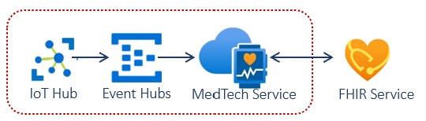

# Challenge 7: Bulk export, anonymize and store FHIR data into Data Lake

[< Previous Challenge](./Challenge06.md) - **[Home](../readme.md)** - [Next Challenge>](./Challenge08.md)

## Introduction

In this challenge, you will explore bulk exporting, anonymizing and storing FHIR data into Data Lake. 

The **[FHIR Tools for Anonymization](https://github.com/microsoft/FHIR-Tools-for-Anonymization)** is an open-source project that helps anonymize healthcare FHIR data, on-premises or in the cloud, for secondary usage such as research, public health, and more. This architecture uses multiple Azure services for creating an automated pipeline to process the bulk export and anonymization for FHIR. The goal of the template is to enable quick and continuous creation of research datasets while applying HIPAA safe harbor rules.

<center></center>

A Timer is used to trigger the Logic App which bulk exports data from FHIR and stores in a preset storage location. The Logic App loops on an adjustable 5 minute interval until Bulk Export finishes exporting all data from FHIR. Logic App runs Azure Data Factory which in triggers Azure Batch which performs the deidentification with the FHIR Tools for Anonymization. The deidentified data is stored in Azure Data Lake Gen 2 for further use. 

## Description

You will deploy using the [Microsoft Health Architectures](https://github.com/microsoft/health-architectures/tree/master/Research-and-Analytics/FHIRExportwithAnonymization).

- **Setup**
    - **[Download or Clone the Microsoft Health Archtectures GitHub repo](https://github.com/microsoft/health-architectures)**
    - Navigate to `health-architectures/Research-and-Analytics/FHIRExportwithAnonymization` and open the `./Assets/arm_template_parameters.json` file in your preferred JSON editor. Replace FHIR URL, client id, client secret, tenant id and export storage account with yours.
    - Save & close the parameters file.

- **Deploy**
    - Log into Azure using PowerShell
        ```powershell
        Connect-AzAccount
        Get-AzSubscription
        Select-AzSubscription -SubscriptionId "<SubscriptionId>"
        ```
    - Navigate to the repo directory
        ```powershell
        cd health-architectures-master\Research-and-Analytics\FHIRExportwithAnonymization
        ```
    - Create variables and deploy
        ```powershell
        $EnvironmentName = "<NAME HERE>" #The name must be lowercase, begin with a letter, end with a letter or digit, and not contain hyphens.
        $EnvironmentLocation = "<LOCATION HERE>" #optional input. The default is eastus2
 
        ./deployFHIRExportwithAnonymization.ps1 -EnvironmentName $EnvironmentName -EnvironmentLocation $EnvironmentLocation #Environment Location is optional
        ```
- **Validate deployment resources**
    - Resource Group `{ENVIRONMENTNAME}`
    - Azure Data Factory `{ENVIRONMENTNAME}adf`
    - Batch Account `{ENVIRONMENTNAME}batch`
    - Key Vault `{ENVIRONMENTNAME}kv`
    - Logic App `{ENVIRONMENTNAME}la`
    - Storage Account `{ENVIRONMENTNAME}dlg2`

- **Post-deployment setup**
    - In Azure Portal, navigate to the FHIR Integration Storage Account entered in the parameters file in the Setup above. Locate the storage account 'Access key' blade under 'Settings'. Copy one of the connection strings. 
    - Navigate to the new key vault `{ENVIRONMENTNAME}kv` deployed with the script. Open the key vault, locate 'Secrets' blade under 'Settings'. Click on the secret named 'blobstorageacctstring'. Then click "+ New Version". In the 'Value' box paste the connection string from the storage account. Then click the 'Create' button at the bottom the page. This will point the Azure Data Factory to the pre-configured FHIR Integration Storage Account.
    - Navigate to the Logic App Logic App `{ENVIRONMENTNAME}la` deployed with the script and click Run Trigger. Click on the Running status in Runs History below in the same screen. The time taken to complete depends on the volume of data you have in Azure API for FHIR.

- **Validate export and anonymization** 
    - Compare pre de-identified data in the container with the latest date in the Storage Account entered in the parameters file in the Setup above, and post de-identified data in the container with output as suffix in the Storage Account `{ENVIRONMENTNAME}dlg2` deployed with the script. Look for the container with output as suffix. 

## Success Criteria
- You have successfully deployed export and anonyization template.
- You have compared pre de-ided and post de-ided FHIR data.

## Learning Resources

- **[HIPPA Safe Harbor Method](https://www.hhs.gov/hipaa/for-professionals/privacy/special-topics/de-identification/index.html)**
- **[HL7 bulk export](https://hl7.org/Fhir/uv/bulkdata/export/index.html)**
- **[FHIR Tools for Anonymization](https://github.com/microsoft/FHIR-Tools-for-Anonymization)**
