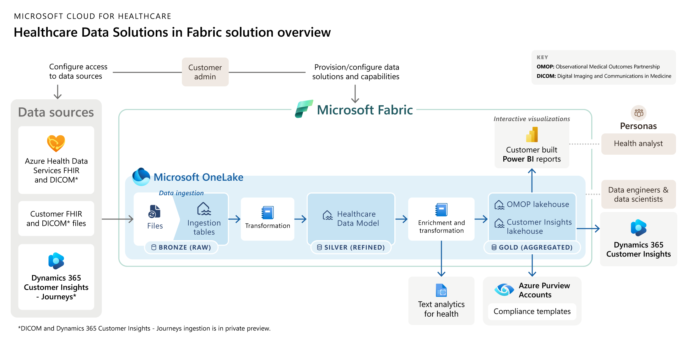

# Challenge 8: OMOP Analytics

[< Previous Challenge](./Challenge07.md) - **[Home](../README.md)**

## Introduction

In the [Healthcare data solutions in Fabric](https://learn.microsoft.com/en-us/industry/healthcare/healthcare-data-solutions/overview), `OMOP Analytics` capability within Fabric Lakehouse allows for the deployment of the Observational Medical Outcomes Partnership (OMOP) Common Data Model (CDM), giving researchers within the OMOP community access to OneLake’s scale and harness AI in Microsoft Fabric. This setup supports standardized analytics for observational studies, enabling researchers to compare procedures and drug exposures and explore drug-condition correlations.

Below is the overview of the **[Healthcare data solutions in Fabric](https://learn.microsoft.com/en-us/industry/healthcare/healthcare-data-solutions/solution-architecture) solution architecture**:

## Description

In this challenge, you will [deploy Healthcare data solutions](https://learn.microsoft.com/en-us/industry/healthcare/healthcare-data-solutions/deploy) to your Microsoft Fabric workspace to access the Healthcare data foundations and OMOP analytics capabilities. Configure them to meet OMOP standards, use pre-built pipelines to process data exported from your FHIR service, transform it to OMOP, and implement the OMOP CDM within the Microsoft Fabric medallion architecture, which consists of the following three core layers:
- `Bronze` (raw zone): this first layer stores the source data in its original format. The data in this layer is typically append-only and immutable.
- `Silver` (enriched zone): this layer receives data from the Bronze layer and refines it through validation and enrichment processes, improving its accuracy and value for downstream analytics.
- `Gold` (curated zone): this final layer, sourced from the Silver layer, refines data to align with specific downstream business and analytical needs.  It’s the primary source for high-quality, aggregated datasets, ready for in-depth analysis and insight extraction.

(Optional) Once FHIR data is transformed to OMOP standards in the Gold Lakehouse, utilize pre-built Notebooks to construct statistical models, conduct population studies, and generate Power BI reports for comparative analysis of various interventions on patient health outcomes.

**Prerequisites:**
- **[Deploy the Healthcare data solutions in Microsoft Fabric](https://learn.microsoft.com/en-us/industry/healthcare/healthcare-data-solutions/deploy#use-fhir-service)** Azure Marketplace offer and set up data connection to use FHIR service (deployed in challenge 1).  After the deployment, the following Azure resources are provisioned to your environment:
  - `Application Insights Smart Detection` (Action Group)
  - `Failure Anomalies` (Smart detection alert rule)
  - `msft-api-datamanager` (Application Insights)
  - `msft-asp-datamanager` (App Service Plan)
  - `msft-ds-delayDeployment` (Deployment Script)
  - `msft-funct-datamanager-export` (Function App)
  - `msft-kv` (Key Vault)
  - `msft-log datamanager` (Log Analytics workspace)
  - `msftst` (Storage Account)
  - `msftstexport` (Storage Account)

- **[Deploy Healthcare data foundations](https://learn.microsoft.com/en-us/industry/healthcare/healthcare-data-solutions/healthcare-data-foundations-configure#deploy-healthcare-data-foundations)** capability in Healthcare data solutions to provide ready-to-run data pipelines designed to efficiently structure data for analytics and AI/machine learning modeling. After the deployment, the following Lakehouse and Notebook artifacts are deployed to your workspace:
  - `msft_bronze` Lakehouse
  - `msft_gold_omop` Lakehouse
  - `msft_silver` Lakehouse
  - `msft_config_notebook` Notebook
  - `msft_bronze_silver_flatten` Notebook
  - `msft_raw_bronze_ingestion` Notebook
  - `msft_silver_sample_flatten_extensions_utility` Notebook

- **[Configure the global configuration (`msft_config_notebook`)](https://learn.microsoft.com/en-us/industry/healthcare/healthcare-data-solutions/healthcare-data-foundations-configure#configure-the-global-configuration-notebook)** Notebook deployed with Healthcare data foundation to set up and manage configurations for data transformation in Healthcare data solutions

- **[Deploy and configure FHIR data ingestion](https://learn.microsoft.com/en-us/industry/healthcare/healthcare-data-solutions/fhir-data-ingestion-configure)** capability to bring FHIR data (deployed in challenge 1) to Microsoft Fabric OneLake. After the deployment, the following Notebook artifact is deployed to your workspace:
  - `msft_fhir_export_service` Notebook

- **[Deploy & configure OMOP analytics](https://learn.microsoft.com/en-us/industry/healthcare/healthcare-data-solutions/omop-analytics-configure)** capability to prepare data for standardized analytics through OMOP open community standards.  After the deployment, the following Notebook artifacts are deployed to your workspace:
  - `msft_silver_omop` Notebook
  - `msft_omop_sample_drug_exposure_era` Notebook
  - `msft_omop_sample_drug_exposure_insights` Notebook
  
**First, run FHIR ingestion pipeline to export your FHIR data (deployed in challenge 1) and store the raw JSON in the lake**
  - **HINT:** Configure and run `msft_fhir_export_service` Notebook

**Ingest raw data into delta tables in the Bronze (`msft_bronze`) Lakehouse**
  - **HINT:** [Configure and run `msft_raw_bronze_ingestion`](https://learn.microsoft.com/en-us/industry/healthcare/healthcare-data-solutions/healthcare-data-foundations-configure#healthcare_msft_raw_bronze_ingestion) Notebook

**Flatten raw FHIR JSON files in Bronze (`msft_bonze`) Lakehouse and to ingest the resulting data into the Silver (`msft_silver`) Lakehouse**
  - **HINT:** [Configure and run `msft_bronze_silver_flatten`](https://learn.microsoft.com/en-us/industry/healthcare/healthcare-data-solutions/healthcare-data-foundations-configure#healthcare_msft_bronze_silver_flatten) Notebook

**Transform resources in the Sliver Lakehouse into OMOP Common Data Model and persist in Gold (`msft_gold_omop`) Lakehouse**
  - **HINT:** [Configure and run `msft_silver_omop`](https://learn.microsoft.com/en-us/industry/healthcare/healthcare-data-solutions/omop-analytics-configure#configure-the-omop-silver-notebook) Notebook
  

## Success Criteria

To complete this challenge successfully, you should be able to:
- Confirm that the raw FHIR data export is stored in the Bronze Lakehouse’s delta tables
- Verify that FHIR data has been flattened in preparation for standardized analytics through OMOP standards and is stored in the Silver Lakehouse
- Check that the flattened data in the Silver Lakehouse has been transformed into the OMOP Common Data Model (CDM) and is stored in the Gold Lakehouse.

## Learning Resources

- [What is Healthcare data solutions](https://learn.microsoft.com/en-us/industry/healthcare/healthcare-data-solutions/overview)
- [Healthcare data solution architecture overview](https://learn.microsoft.com/en-us/industry/healthcare/healthcare-data-solutions/solution-architecture)
- [Deploy Healthcare data solutions](https://learn.microsoft.com/en-us/industry/healthcare/healthcare-data-solutions/deploy)
- [Set up data connection using FHIR service](https://learn.microsoft.com/en-us/industry/healthcare/healthcare-data-solutions/deploy#use-fhir-service)
- [Set up Azure Language Service](https://learn.microsoft.com/en-us/industry/healthcare/healthcare-data-solutions/deploy#set-up-azure-language-service)
- [Deploy the Healthcare data solutions in Microsoft Fabric via Azure Marketplace](https://learn.microsoft.com/en-us/industry/healthcare/healthcare-data-solutions/deploy#deploy-azure-marketplace-offer)
- [Deploy and configure Healthcare data foundation](https://learn.microsoft.com/en-us/industry/healthcare/healthcare-data-solutions/healthcare-data-foundations-configure)
- [Configure the global configuration notebook](https://learn.microsoft.com/en-us/industry/healthcare/healthcare-data-solutions/healthcare-data-foundations-configure#configure-the-global-configuration-notebook)
- [Deploy and configure FHIR data ingestion](https://learn.microsoft.com/en-us/industry/healthcare/healthcare-data-solutions/fhir-data-ingestion-configure)
- [Configure the FHIR export service](https://learn.microsoft.com/en-us/industry/healthcare/healthcare-data-solutions/fhir-data-ingestion-configure#configure-the-fhir-export-service)
- [Configure and deploy `msft_raw_bronze_ingestion`](https://learn.microsoft.com/en-us/industry/healthcare/healthcare-data-solutions/healthcare-data-foundations-configure#healthcare_msft_raw_bronze_ingestion)
- [Configure and deploy `msft_bronze_silver_flatten`](https://learn.microsoft.com/en-us/industry/healthcare/healthcare-data-solutions/healthcare-data-foundations-configure#healthcare_msft_bronze_silver_flatten)
- [Overview of OMOP analytics in Healthcare data solutions](https://learn.microsoft.com/en-us/industry/healthcare/healthcare-data-solutions/omop-analytics-overview)
- [Deploy and configure OMOP analytics](https://learn.microsoft.com/en-us/industry/healthcare/healthcare-data-solutions/omop-analytics-configure)
- [Configure the OMOP Silver Notebook](https://learn.microsoft.com/en-us/industry/healthcare/healthcare-data-solutions/omop-analytics-configure#configure-the-omop-silver-notebook)

