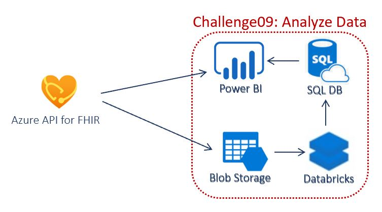

# Challenge 9: Analyze and Visualize FHIR data using PowerBI

[< Previous Challenge](./Challenge08.md) - **[Home](../readme.md)**

## Introduction

In this challenge, you will analyze and visualize FHIR data using PowerQuery Connector for FHIR and SQL DB Connector in PowerBI. 

Once the data is loaded into FHIR, there are many ways to utilize FHIR data to draw out additional insights whether it is to do some basic analysis or for some deep analysis.
One option is to use the [Power Query connector for FHIR](https://docs.microsoft.com/en-us/power-query/connectors/fhir/fhir) in PowerBI to import and shape data from a FHIR server.
Another option is to first structure the data using Databricks and store in Azure SQL DB. Then use Azure SQL DB Connector in PowerBI to visualze. 

## Description

You will deploy IoT Connector for FHIR and Setup IoT Device in IoT Central and Connect to FHIR.

- **Vizualize in PowerBI using PowerQuery Connector for FHIR**
    - Open PowerBI Desktop. [Download](https://powerbi.microsoft.com/en-us/downloads/) if you don't have one.
    - Go to **File** --> **Options and settings** --> **Data source settings** and click **Clear All Permissions**.
    - Click **Get Data** from the menu.
    - Search **FHIR**, select the result, and click **Connect**.
    - Enter your FHIR URL **https://{your resource prefix}.azurehealthcareapis.com**. You can get this from Azure API for FHIR resource in Azure Portal.
    - Click the **Sign In** button.
    - Enter user and password from Azure AD.
    - Click **Connect**.
    - Choose the tables you are interested in analyzing and click the **Transform data** button.
    - You should see all tables you selected are loaded into Power Query Editor.
    - Explore/transform/visualize!

- **Vizualize in PowerBI using Azure SQL DB Connector**
    - Process and Load FHIR data into Azure SQL Database using Azure Databricks
	- Create **Azure SQL Database**
	- **Export Data** from Azure API for FHIR into **Export Storage Account** using $export from Postman.
	- Create **Databricks** Environment. Connect to the Export Storage Account, Transform and load into Azure SQL Database.
    - **Vizualize in PowerBI**
	- Open PowerBI Desktop. [Download](https://powerbi.microsoft.com/en-us/downloads/) if you don't have one.
        - Go to **File** --> **Options and settings** --> **Data source settings** and click **Clear All Permissions**.
        - Click **Get Data** from the menu.
        - Search **Azure SQL**, select and click Connect.
        - Enter **SQL Server name** and ** SQL Database name** from Task #1 above. Leave Import checked. Click the **Ok** button.
        - Click Database on the left menu. Type in User name and Password from Task #1 above.
        - Choose all the tables you are interested in analyzing/visualizing and click Transform data.
        - Explore/transform/visualize!

## Success Criteria
- You have successfully analyzed FHIR data using PowerQuery Connector for FHIR.
- You have successfully analyzed FHIR data using SQL DB Connector for FHIR.

## Learning Resources

- **[HIPPA Safe Harbor Method](https://www.hhs.gov/hipaa/for-professionals/privacy/special-topics/de-identification/index.html)**
- **[HL7 bulk export](https://hl7.org/Fhir/uv/bulkdata/export/index.html)**
- **[FHIR Tools for Anonymization](https://github.com/microsoft/FHIR-Tools-for-Anonymization)**
