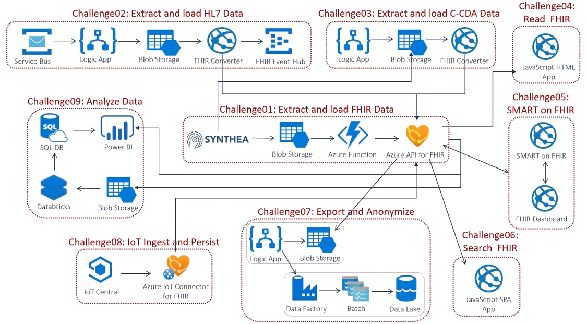

# FHIR Powered Healthcare
## Introduction
Contoso Healthcare is implementing FHIR (Fast Healthcare Interoperability Resources) to rapidly and securely exchange data in the HL7 FHIR standard format with a single, simplified data management solution for protected health information (PHI). FHIR service in the Azure Health Data Services platform is fully managed, enterprise-grade FHIR Server in the cloud lets you quickly connect existing data sources, such as electronic health record systems and research databases. Create new opportunities with analytics, machine learning, and actionable intelligence across your health data.

You will implement a collection of FHIR reference architectures from the **[Azure Health Data Service](https://docs.microsoft.com/en-us/azure/healthcare-apis/)** platform that best fit Contoso Healthcare requirements. Below is the holistic conceptual end-to-end Microsoft Health architecture for the FHIR ecosystem.

## Learning Objectives
This hack will help you:
1. Deploy FHIR service in Azure Health Data Services platform.
2. Generate and load synthetic Electronic Health Record (EHR) data into FHIR Service.
3. Convert and Load HL7v2 and C-CDA clinical data into FHIR Service.
4. Develop React Single Page App (SPA) to Search and view FHIR patient data.
5. Transform and explore FHIR data for secondary use analytics.
6. Export and anonymize FHIR data.
7. Ingest, transform and load medical IoT device data into MedTech and FHIR service.

## Scenario
Contoso Healthcare is implementing a FHIR-based data management solution. 
Your team's assistance is needed to implement the following scenarios through the FHIR Powered Healthcare hack that leverages the **[Azure Health Data Services](https://docs.microsoft.com/en-us/azure/healthcare-apis/)** platform as follows:
   * Ingest and process patient record in HL7 FHIR Bundle or legacy formats from EHR systems into a common FHIR-based standard format, and persist them into a FHIR Compliant store.
   * Securely connect and search FHIR patient data stored in a FHIR Server through a patient lookup web app to enhance patient engagement.
   * Auto export new FHIR data via FHIR Anaytics piple for data exporation in Synapse Studio and perform downstream transformation against raw health data.
   * Export de-identify FHIR data and store in staging Data Lake storage for downstream processing.
   * Ingest, transform, correlate and persist medical IoT device data in FHIR and MedTech services in Azure Health Data Services platform.

## Challenges

**These challenges must be completed in order:**
- Challenge 0: **[Pre-requisites - Ready, Set, GO!](Student/Challenge00.md)**
- Challenge 1: **[Extract and load FHIR synthetic Electronic Health Record (EHR) data](Student/Challenge01.md)**

**These challenges can be completed in any order:**
- Challenge 2: **[Extract, transform and load HL7v2 and C-CDA EHR data](Student/Challenge02.md)**
- Challenge 3: **[Create a new Single Page App (SPA) for patient search](Student/Challenge03.md)**
- Challenge 4: **[Analyze and Visualize FHIR data](Student/Challenge04.md)**
- Challenge 5: **[Bulk export, anonymize and store FHIR data into Data Lake storage](Student/Challenge05.md)**
- Challenge 6: **[Stream MedTech Device data into FHIR server](Student/Challenge06.md)**

## Prerequisites
The prerequisites for the hack are covered in [Challenge 0](Student/Challenge00.md).

## Repository Contents
- `../Student`
  - Student Challenge Guides
- `../Student/Resources`
  - Student's resource files, code, and templates to aid with challenges
- `../Coach`
   - Example solutions to the challenges (If you're a student, don't cheat yourself out of an education!)
   - [Lecture presentation](Coach/Lectures.pptx) with short presentations to introduce each challenge.
- `../Coach/Resources`
  - Coach's guide to solutions for challenges, including tips/tricks.

## Contributor
- Richard Liang

