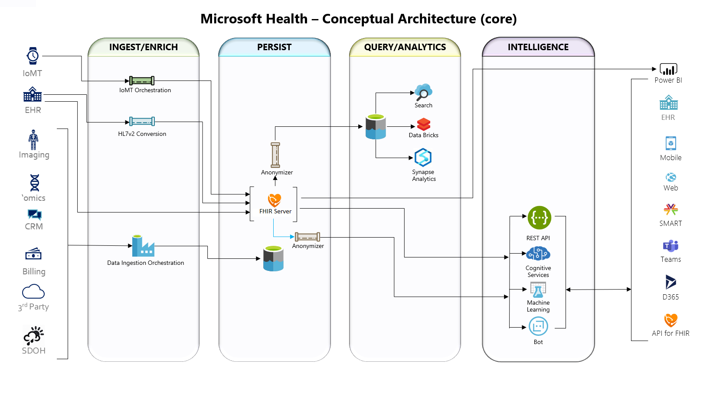
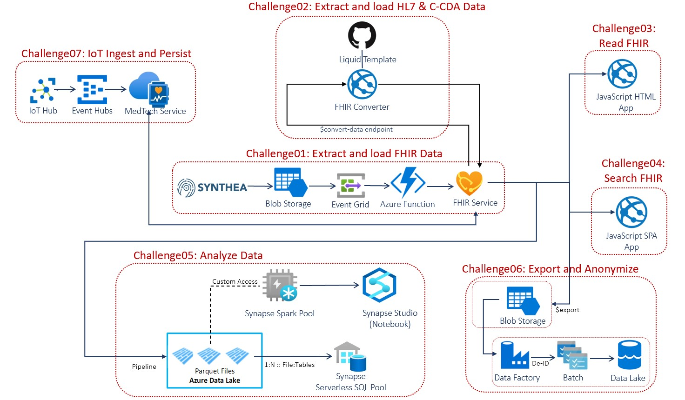

# FHIR Powered Healthcare
## Introduction
Contoso Healthcare is implementing FHIR (Fast Healthcare Interoperability Resources) to rapidly and securely exchange data in the HL7 FHIR standard format with a single, simplified data management solution for protected health information (PHI). Azure API for FHIR is fully managed, enterprise-grade FHIR service in the cloud lets you quickly connect existing data sources, such as electronic health record systems and research databases. Create new opportunities with analytics, machine learning, and actionable intelligence across your health data.

You will implement a collection of FHIR reference architectures frome **[Microsoft Health Architectures](https://github.com/microsoft/health-architectures)** that best fit Contoso Healthcare requirements. Below is the holistic conceptual end-to-end Microsoft Health architectures for Azure API for FHIR.

## Learning Objectives
This hack will help you:
1. Deploy Azure API for FHIR.
2. Generate and load synthetic medical data into FHIR Server.
3. Load HL7 and C-CDA data into FHIR Server.
4. Read FHIR data through a Dashboard, SMART on FHIR apps, JavaScript app and Single Page App.
5. Export and anonymize FHIR data.
6. Stream IoMT Device data into FHIR.
7. Visualize FHIR data using PowerBI.

## Scenario
Contoso Healthcare is implementing a FHIR-based data management solution. 
Your team's assistance is needed to implement the following scenarios using FHIR Powered Healthcare hack:
   * Ingest and process patient record in HL7 FHIR or legacy formats from EHR systems into a common FHIR-based standard format and persist them into a FHIR Compliant store.
   * Generate FHIR CUD (create, update, or delete) events whenever FHIR CUD operations take place in FHIR Server for post-processing.
   * Securely connect and read FHIR patient data from FHIR Server through a web app and add a patient lookup feature to improve user experience.
   * Explore a patient's medical records and encounters in FHIR Patient Dashboard and SMART on FHIR apps.
   * Bulk export data from FHIR, de-identify the data and store in Data Lake for further processing.
   * Ingest and Persist IoT device data from IoT Central using IoT Connector for FHIR.
   * Analyze and Visualize data (EHR, HL7, CCDA, IoMT) in PowerBI using PowerQuery Connector for FHIR and SQL DB Connector.

## Challenges

**These challenges must be completed in order:**
- Challenge 0: **[Pre-requisites - Ready, Set, GO!](Student/Challenge00.md)**
- Challenge 1: **[Extract and load FHIR synthetic medical data](Student/Challenge01.md)**

**These challenges can be completed in any order:**
- Challenge 2: **[Extract, transform and load HL7 medical data](Student/Challenge02.md)**
- Challenge 3: **[Extract, transform and load C-CDA synthetic medical data](Student/Challenge03.md)**
- Challenge 4: **[Connect to FHIR Server and read FHIR data through a JavaScript app](Student/Challenge04.md)**
- Challenge 5: **[Explore FHIR medical records through FHIR Dashboard and SMART on FHIR apps](Student/Challenge05.md)**
- Challenge 6: **[Create a new Single Page App (SPA) for patient search](Student/Challenge06.md)**
- Challenge 7: **[Bulk export, anonymize and store FHIR data into Data Lake](Student/Challenge07.md)**
- Challenge 8: **[Stream IoMT Device data into FHIR from IoT Central](Student/Challenge08.md)**
- Challenge 9: **[Analyze and Visualize FHIR data using PowerBI](Student/Challenge09.md)**

## Disclaimer
You **MUST** be able to log into your Azure subscription and connect to Azure AD primary tenant with directory admin role access (or secondary tenant with directory admin role access if you don't have directory admin role access in the primary AD tenant) required for the FHIR Server deployment (Challenge 1).
  - If you have full Administrator directory access to your AD tenant where you can create App Registrations, Role Assignments, Azure Resources and grant login directory admin consent, then your Primary AD tenant is same as Secondary AD tenant and should use the same AD tenant for both.
  - If you don't have directory Administrator access:
      - Primary (Resource) AD tenant: This tenant is Resource Control Plane where all your Azure Resources will be deployed to.
      - Secondary (Data) AD tenant: This tenant is Data Control Plane where all your App Registrations will be deployed to.

## Prerequisites
The prerequisites for the hack are covered in [Challenge 0](Student/Challenge00.md).

## Repository Contents
- `../Student`
  - Student Challenge Guides
- `../Student/Resources`
  - Student's resource files, code, and templates to aid with challenges
- `../Coach`
   - Example solutions to the challenges (If you're a student, don't cheat yourself out of an education!)
   - [Lecture presentation](Coach/Lectures.pptx) with short presentations to introduce each challenge.
- `../Coach/Resources`
  - Coach's guide to solutions for challenges, including tips/tricks.

## Contributors
- Aruna Ranganathan
- Richard Liang

