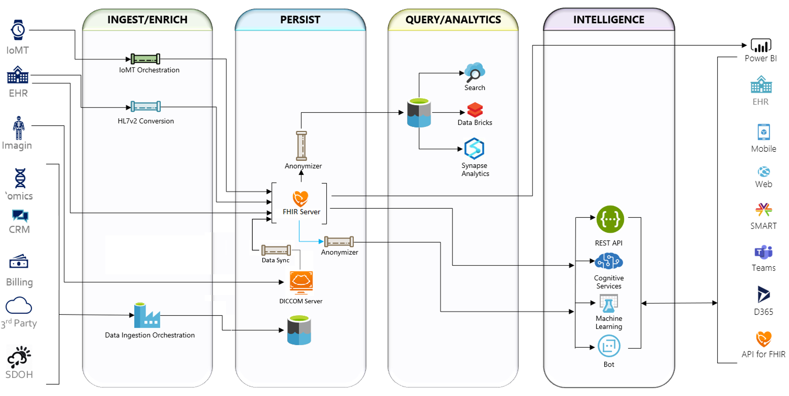

# FHIR Powered Healthcare
## Introduction
Contoso Healthcare is implementing FHIR (Fast Healthcare Interoperability Resources) to rapidly and securely exchange data in the HL7 FHIR standard format with a single, simplified data management solution for protected health information (PHI). Azure API for FHIR is fully managed, enterprise-grade FHIR service in the cloud lets you quickly connect existing data sources, such as electronic health record systems and research databases. Create new opportunities with analytics, machine learning, and actionable intelligence across your health data.

You will implement a collection of FHIR reference architectures frome **[Microsoft Health Architectures](https://github.com/microsoft/health-architectures)** that best fit Contoso Healthcare requirements. Below is the holistic conceptual end-to-end Microsoft Health architectures for Azure API for FHIR.

## Learning Objectives
FHIR Powered Healthcare hack uses these Azure Services to implement Azure API for FHIR (PaaS) use cases:
1. **[Azure API for FHIR](https://docs.microsoft.com/en-us/azure/healthcare-apis/overview)** as a centralized FHIR Compliant data management solution to persist FHIR bundles.
2. **[FHIR Bulk Load](https://github.com/microsoft/fhir-server-samples)** for bulk ingestions performed by a function app that is triggered whenever new or modified BLOB arrives in the `fhirimport` BLOB container.
3. **[FHIR Converter](https://github.com/microsoft/FHIR-Converter)** is a logic app based workflow to ingest and convert C-CDA and HL7v2 message into FHIR bundle.
4. **[FHIR Proxy](https://github.com/microsoft/health-architectures/tree/master/FHIR/FHIRProxy)** is a function app solution that acts as an intelligent and secure gateway (reverse proxy) to FHIR Server and provides a consolidated approach to **[pre and post processing](https://github.com/microsoft/health-architectures/tree/master/FHIR/FHIRProxy#pre-and-post-processing-support)** of FHIR Server, i.e. `PublishFHIREventPostProcess` to publish FHIR CUD events for resources to a configured eventhub.  It acts as a FHIR specific reverse proxy rewriting responses and brokering requests to FHIR Servers.
5. **[SMART on FHIR](https://docs.microsoft.com/en-us/azure/healthcare-apis/use-smart-on-fhir-proxy)** proxy to integrate partner apps with FHIR Servers and EMR systems through FHIR interfaces.
6. **[Azure Event Hubs](https://docs.microsoft.com/en-us/azure/event-hubs/event-hubs-about)** event-driven architecture that handles FHIR CUD events from the FHIR Server to enable post-processing for topic subscribers to kickoff downstream workflows.
7. **[Azure Logic Apps](https://docs.microsoft.com/en-us/azure/logic-apps/logic-apps-overview)** conversion workflow to ingest C-CDA data, call FHIR Converter API for C-CDA to FHIR bundle conversion and load the resulted FHIR bundle into FHIR Server.
8. **[Azure Functions](https://docs.microsoft.com/en-us/azure/azure-functions/functions-overview)** as the event trigger mechanism to auto ingest and convert HL7v2 messages, pushed to the FHIR Service Bus, into FHIR bundles.
9. **[Azure App Service](https://docs.microsoft.com/en-us/azure/app-service/overview)** to host the frontend web app to search for patient(s) stored in FHIR Server and display the results in web page(s).
10. **[Azure Batch](https://docs.microsoft.com/en-us/azure/batch/)** runs large-scale applications efficiently in the cloud. Schedule compute-intensive tasks and dynamically adjust resources for your solution without managing infrastructure.
11. **[Azure Service Bus](https://docs.microsoft.com/en-us/azure/service-bus-messaging/service-bus-messaging-overview)** is a fully managed enterprise integration message broker. Service Bus can decouple applications and services. 
12. **[Azure Blob Storage](https://docs.microsoft.com/en-us/azure/storage/blobs/storage-blobs-introduction)** is Microsoft's object storage solution, optimized for storing massive amounts of unstructured data. 
13. **[Azure Data Lake Store Gen2](https://docs.microsoft.com/en-us/azure/storage/blobs/data-lake-storage-introduction)** is a set of capabilities dedicated to big data analytics, is the result of converging the capabilities of our two existing storage services, Azure Blob storage and Azure Data Lake Storage Gen1.
14. **[Azure Storage Explorer](https://azure.microsoft.com/en-us/features/storage-explorer/)** is Azure storage management used to upload, download, and manage Azure blobs, files, queues, and tables, as well as Azure Cosmos DB and Azure Data Lake Storage entities.
15. **[Azure Data Factory](https://docs.microsoft.com/en-us/azure/data-factory/)** is Azure's cloud ETL service for scale-out serverless data integration and data transformation.
16. **[Azure Databricks](https://docs.microsoft.com/en-us/azure/databricks/scenarios/what-is-azure-databricks)** is an Apache Spark-based analytics platform optimized for the Microsoft Azure cloud services platform. 
17. **[Azure SQL Database](https://docs.microsoft.com/en-us/azure/azure-sql/)** is a managed, secure, and intelligent product that use the SQL Server database engine in the Azure cloud.
18. **[PowerBI](https://docs.microsoft.com/en-us/power-bi/fundamentals/power-bi-overview)** is a collection of software services, apps, and connectors that work together to turn your unrelated sources of data into coherent, visually immersive, and interactive insights.
19. **[IoT Central](https://docs.microsoft.com/en-us/azure/iot-central/healthcare/concept-continuous-patient-monitoring-architecture)** helps create, customize, and manage healthcare IoT solutions using IoT Central application templates. Continuous patient monitoring is one application template in healthcare IoT space.

## Scenario
Contoso Healthcare is implementing a FHIR-based data management solution. 
Your team's assistance is needed to implement the following scenarios using FHIR Powered Healthcare hack:
   * Ingest and process patient record in HL7 FHIR or legacy formats from EHR systems into a common FHIR-based standard format and persist them into a FHIR Compliant store.
   * Generate FHIR CUD (create, update, or delete) events whenever FHIR CUD operations take place in FHIR Server for post-processing.
   * Securely connect and read FHIR patient data from FHIR Server through a web app and add a patient lookup feature to improve user experience.
   * Explore a patient's medical records and encounters in FHIR Patient Dashboard and SMART on FHIR apps.
   * Bulk export data from FHIR, de-identify the data and store in Data Lake for further processing.
   * Ingest and Persist IoT device data from IoT Central using IoT Connector for FHIR.
   * Analyze and Visualize data (EHR, HL7, CCDA, IoMT) in PowerBI using PowerQuery Connector for FHIR and SQL DB Connector.

## Challenges

**These challenges must be completed in order:**
- Challenge 0: **[Pre-requisites - Ready, Set, GO!](Student/Challenge00.md)**
- Challenge 1: **[Extract and load FHIR synthetic medical data](Student/Challenge01.md)**

**These challenges can be completed in any order:**
- Challenge 2: **[Extract, transform and load HL7 medical data](Student/Challenge02.md)**
- Challenge 3: **[Extract, transform and load C-CDA synthetic medical data](Student/Challenge03.md)**
- Challenge 4: **[Connect to FHIR Server and read FHIR data through a JavaScript app](Student/Challenge04.md)**
- Challenge 5: **[Explore FHIR medical records through FHIR Dashboard and SMART on FHIR apps](Student/Challenge05.md)**
- Challenge 6: **[Create a new Single Page App (SPA) for patient search](Student/Challenge06.md)**
- Challenge 7: **[Bulk export, anonymize and store FHIR data into Data Lake](Student/Challenge07.md)**
- Challenge 8: **[Stream IoMT Device data into FHIR from IoT Central](Student/Challenge08.md)**
- Challenge 9: **[Analyze and Visualize FHIR data using PowerBI](Student/Challenge09.md)**

## Disclaimer
You **MUST** be able to log into your Azure subscription and connect to Azure AD primary tenant with directory admin role access (or secondary tenant with directory admin role access if you don't have directory admin role access in the primary AD tenant) required for the FHIR Server deployment (Challenge 1).
  - If you have full Administrator directory access to your AD tenant where you can create App Registrations, Role Assignments, Azure Resources and grant login directory admin consent, then your Primary AD tenant is same as Secondary AD tenant and should use the same AD tenant for both.
  - If you don't have directory Administrator access:
      - Primary (Resource) AD tenant: This tenant is Resource Control Plane where all your Azure Resources will be deployed to.
      - Secondary (Data) AD tenant: This tenant is Data Control Plane where all your App Registrations will be deployed to.

## Prerequisites
The prerequisites for the hack are covered in [Challenge 0](Student/Challenge00.md).

## Repository Contents
- `../Student`
  - Student Challenge Guides
- `../Student/Resources`
  - Student's resource files, code, and templates to aid with challenges
- `../Coach`
   - Example solutions to the challenges (If you're a student, don't cheat yourself out of an education!)
   - [Lecture presentation](Coach/Lectures.pptx) with short presentations to introduce each challenge.
- `../Coach/Resources`
  - Coach's guide to solutions for challenges, including tips/tricks.

## Contributors
- Aruna Ranganathan
- Richard Liang

