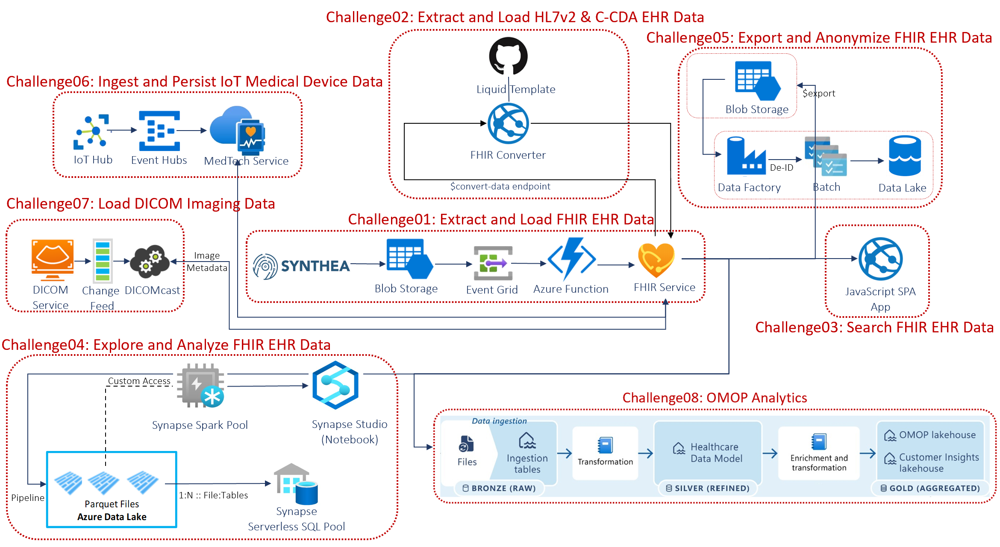

# FHIR Powered Healthcare
## Introduction
Contoso Healthcare is implementing FHIR (Fast Healthcare Interoperability Resources) to rapidly and securely exchange data in the HL7 FHIR standard format with a single, simplified data management solution for protected health information (PHI). Azure API for FHIR is fully managed, enterprise-grade FHIR service in the cloud lets you quickly connect existing data sources, such as electronic health record systems and research databases. Create new opportunities with analytics, machine learning, and actionable intelligence across your health data.

You will implement a collection of FHIR reference architectures frome **[Microsoft Health Architectures](https://github.com/microsoft/health-architectures)** that best fit Contoso Healthcare requirements. Below is the holistic conceptual end-to-end Microsoft Health architectures for Azure API for FHIR.

## Learning Objectives
This hack will help you:
1. Deploy Azure API for FHIR.
2. Generate and load synthetic medical data into FHIR Server.
3. Load HL7 and C-CDA data into FHIR Server.
4. Read FHIR data through a JavaScript app and Single Page App.
5. Visualize FHIR data in Parquet file for secondary analytics use.
6. Export and anonymize FHIR data.
7. Stream IoMT Device data into FHIR.

## Scenario
Contoso Healthcare is implementing a FHIR-based data management solution. 
Your team's assistance is needed to implement the following scenarios using FHIR Powered Healthcare hack:
   * Ingest and process patient record in HL7 FHIR or legacy formats from EHR systems into a common FHIR-based standard format and persist them into a FHIR Compliant store.
   * Securely connect and read FHIR patient data from FHIR Server through a web app and add a patient lookup feature to improve user experience.
   * Auto export new FHIR data via FHIR Anaytics piple for data exporation in Synapse Studion and downstream transformation via Spark Pool against raw health data in Parquet files
   * Bulk export data from FHIR, de-identify the data and store in Data Lake for further processing.
   * Ingest and Persist IoT device data from IoT Central using IoT Connector for FHIR.

## Challenges

**These challenges must be completed in order:**
- Challenge 0: **[Pre-requisites - Ready, Set, GO!](Student/Challenge00.md)**
- Challenge 1: **[Extract and load FHIR synthetic Electronic Health Record (EHR) data](Student/Challenge01.md)**

**These challenges can be completed in any order:**
- Challenge 2: **[Extract, transform and load HL7v2 and C-CDA EHR data](Student/Challenge02.md)**
- Challenge 3: **[Connect to FHIR Server and read FHIR data through a JavaScript app](Student/Challenge03.md)**
- Challenge 4: **[Create a new Single Page App (SPA) for patient search](Student/Challenge05.md)**
- Challenge 5: **[Analyze and Visualize FHIR data](Student/Challenge05.md)**
- Challenge 6: **[Bulk export, anonymize and store FHIR data into Data Lake](Student/Challenge07.md)**
- Challenge 7: **[Stream IoMT Device data into FHIR from IoT Central](Student/Challenge07.md)**

## Prerequisites
The prerequisites for the hack are covered in [Challenge 0](Student/Challenge00.md).

## Repository Contents
- `../Student`
  - Student Challenge Guides
- `../Student/Resources`
  - Student's resource files, code, and templates to aid with challenges
- `../Coach`
   - Example solutions to the challenges (If you're a student, don't cheat yourself out of an education!)
   - [Lecture presentation](Coach/Lectures.pptx) with short presentations to introduce each challenge.
- `../Coach/Resources`
  - Coach's guide to solutions for challenges, including tips/tricks.

## Contributor
- Richard Liang

