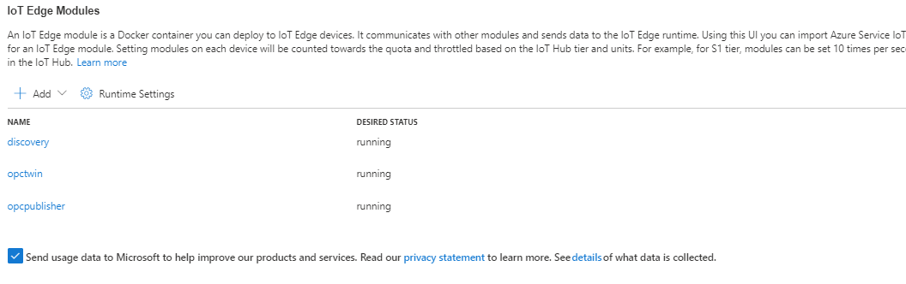

# Challenge 3: Deploy Industrial IoT solution

[< Previous Challenge](./Challenge-02.md) - **[Home](README.md)** - [Next Challenge >](./Challenge-04.md)

## Notes and Guidance

Encourage participants to [use deployments](https://docs.microsoft.com/en-us/azure/iot-edge/how-to-deploy-at-scale?view=iotedge-2018-06) to deploy their modules and IoT Runtime updates to understand how this works at scale versus doing it in the portal 1 by 1 for each device.
* * *

For this module to be successful, participants must have the following tasks completed:
1. Creation of IoT Hub and Edge device in the Azure portal and the ability to describe where to navigate to find keys/connection strings and validation of understanding from participants on how they plan to deploy modules to the device.  
1. Creation of an IoT Edge device on a VNET in Azure (Linux VM Strongly recommended as IoT Edge was designed/built on Linux; but Windows would work)
1. Deployment of [IoT Edge Runtime components ](https://docs.microsoft.com/en-us/azure/iot-edge/how-to-install-iot-edge?view=iotedge-2018-06&tabs=windows)
1. Configuration of IoT Edge Runtime to communicate with deployed hub
1. Creation of a deployment to push Industrial IoT modules to the Edge; or manually if the participants have challenges
1. Configuration of OPCPublisher module as per documentation -- this requires customization to the deployment/modules running on the Edge as shown in the tips below.
1. Validation that the OPCPublisher is collecting data from the OPC service (VM or Azure Container Instance depending on what was selected).
1. Illustration that the participants understand how to view logs of running modules on the hub and see the current status from the portal.
1. Illustration that the participants understand how to add tags, adjust polling intervals and define the names for published values to IoT hub.
1. Illustration that participants understand the options passed to the OPCPublisher module and how they work 
1. Explanation from the team on what protocol was choose to communicate to IoT hub and what ports at the Contoso's plants would need to be opened
* * *

## Tips
+ IoT Edge needs to be running the following modules:
    -
    
    - mcr.microsoft.com/iotedge/opc-publisher:latest
    - mcr.microsoft.com/iotedge/opc-twin:latest
    - mcr.microsoft.com/iotedge/discovery:latest  

+ Details on the OPCPublisher module, command line options and configuration file format [look here](https://github.com/azure/iot-edge-opc-publisher)  This is important for participants to understand many OPC servers require authentication and tags may have different polling intervals/update requirements. 

+ [Details on container create options](https://github.com/Azure/Industrial-IoT/blob/main/docs/modules/publisher-commandline.md) for the OPCPublisher module
    - Worth noting some parameters that can impact cost such as:
        -  --ms that highlights the size of messages to be sent to IoT hub.  making this 0 for instance will cause more data to be sent.  
        - --ih has to do with the protocol used to transmit data to IoT hub which is important to understand for participants to know what FW rules would be needed on the plant-floor.
        - --op highlights the publishing interval from OPC UA servers
        - --di controls the diagnostics logs emitted on the IoT Edge device 
        - --site controls the name of the site reported to IoT Hub
+ Considering that the OPC Publisher configuration isn't the most straight forward, students and coaches may use the following guides to help move forward if needed. 
    - [Ingesting OPC UA data with Azure Digital Twins](https://learn.microsoft.com/en-us/azure/digital-twins/how-to-ingest-opcua-data)
    - [Step-by-step guide to installing OPC Publisher on Azure IoT Edge](https://www.linkedin.com/pulse/step-by-step-guide-installing-opc-publisher-azure-iot-kevin-hilscher/)

* * *  
### Configuring the OPC Publisher file
You can see the endpoint by opening the OPC Publisher service configuration file on the Edge as called out in the container create options referenced above.  The name of this file and path doesn't matter, but the OPCPublisher container create options need to align to be able to read these settings. [Here is a completed example of this file](./assets/pn.json) showing pulling data from the Microsoft PLC simulator running as an Azure container instance using some of the default OPC tags.

Important to note int the pn.json are the paths on the IoT edge that need to be created and the bindings to that path referenced in the container create options.  It's important these values all align so when the module starts on the IoT Edge it's able to locate/load this configuration file.  

* * * 
## Advanced Challenges (Optional)
It would also make sense to discuss the [Device Provisioning service](https://docs.microsoft.com/en-us/azure/iot-dps) and understand how this could be used to provision Edge devices in 'plants' around the globe using TPM or certificate based attestation.  While it's too challenging to perform these tasks as part of this lab; there are some paths that could be employed to provision a VM in Azure with a virtual TPM chip.  This would be a stretch assignment but something that could be explored with advanced teams.  [TPM Attestation](https://docs.microsoft.com/en-us/azure/iot-dps/concepts-tpm-attestation)
