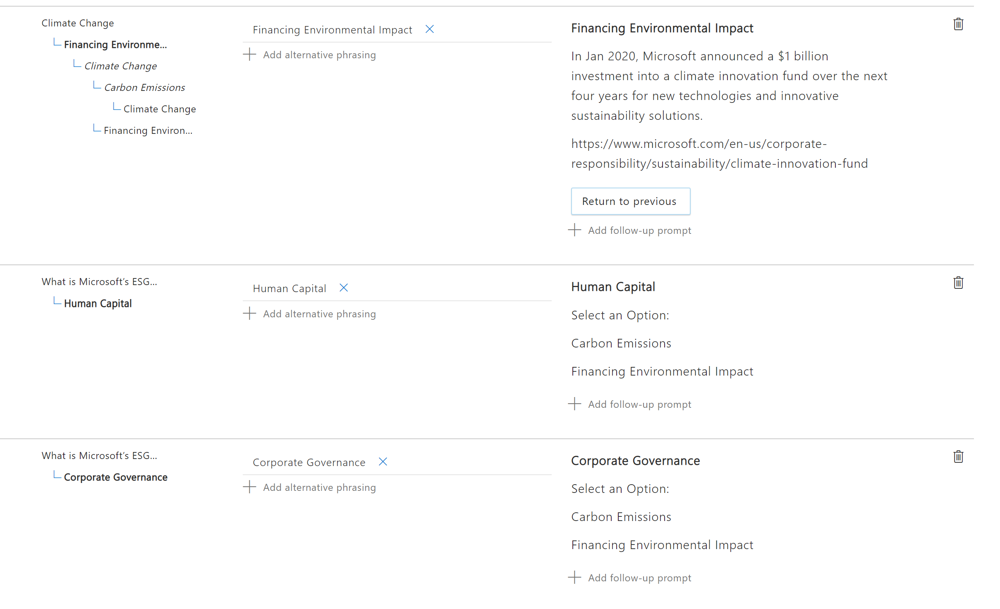

# Challenge 1: QnA Maker

[< Previous Challenge](./Solution-0.md) - **[Home](./Readme.md)** - [Next Challenge>](./Solution-2.md)

## Notes & Guidance
- The free tier will be fine for this What the Hack
- To connect to their QnA service they need to note what subscription they made it under, it will take a few moments for the newly created QnA service to populate.
- No need to add chit chat
- They need to have multi-turn extractions selected, if not it won't break the doc down correctly
- They have to add follow-up prompts under Carbon Emissions and Financing Environment with the display text "Return to Previous" and link it to the "Climate Change" QnA
- It's ok if not all of the Qnas have the follow up prompts

- Here is an example of what their QnaMaker could look like
- 
- 

- There should be no major roadblocks to integrating a Qna Knowledge base in Bot Composer if they were able to create a sample in the previous challenge
