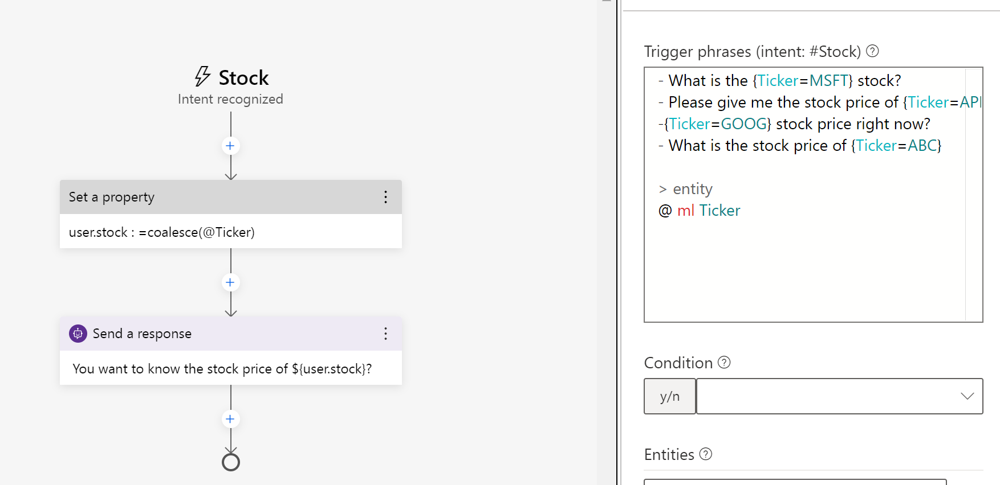

# Challenge 2: Implementing LUIS

[< Previous Challenge](./Solution-1.md) - **[Home](./Readme.md)** - [Next Challenge>](./Solution-3.md)

## Notes & Guidance
- The participants will likely run into issues getting synced with LUIS. Make sure they're creating their LUIS resource as seen in [Create LUIS resources in the azure portal](https://docs.microsoft.com/en-us/azure/cognitive-services/luis/luis-how-to-azure-subscription#create-luis-resources-in-the-azure-portal). This will ensure they have the necessary fields created. 
- Ensure that the participants are not hard coding the bot to respond to only one stock.
- Make sure they understand how to pull out and save the entities for later conversations. They should be saving these an a variable, but this challenge will work without doing so
  - Here are some useful links for that
    - [LG File Format](https://docs.microsoft.com/en-us/azure/bot-service/file-format/bot-builder-lg-file-format?view=azure-bot-service-4.0#entities)
    - [LUIS for entity extraction](https://docs.microsoft.com/en-us/composer/how-to-define-intent-entity#luis-for-entity-extraction)

- Here's an example of what their trigger phrases could look like:
- 

- This challenge should be pretty straight forward once they figure out the syntax. Here is how you extract the entity and set it as a variable
- 
