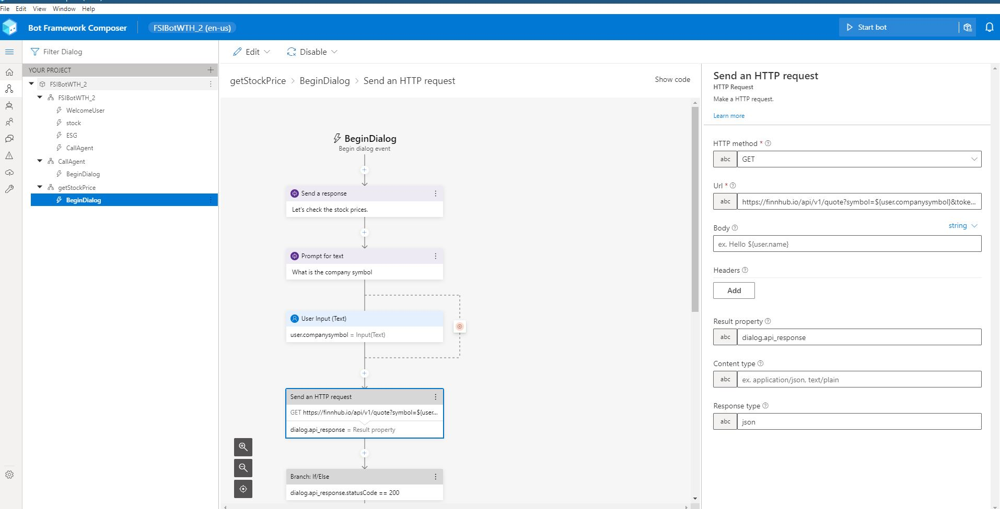
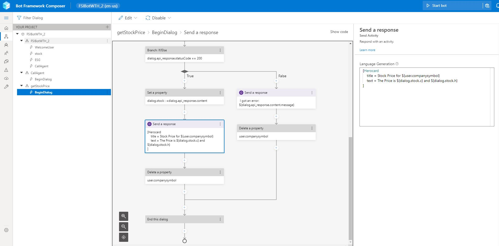

# Challenge 3: Making API calls

[< Previous Challenge](./Solution-2.md) - **[Home](./Readme.md)** - [Next Challenge>](./Solution-4.md)

## Notes & Guidance
- Relatively straight forward section as long as they're able to get the key for the API. 
- They'll need to use the entity pulled out from Solution 2 to make the call to the API, they can do this by setting the entity to a variable and calling it in the HTTP call using syntax similar to: ${user.companysymbol}
- Make sure they are pulling out the **opening** stock price, not just returning the entire JSON object.
   - You can index into the returned object using ${dialog.stock.o}

