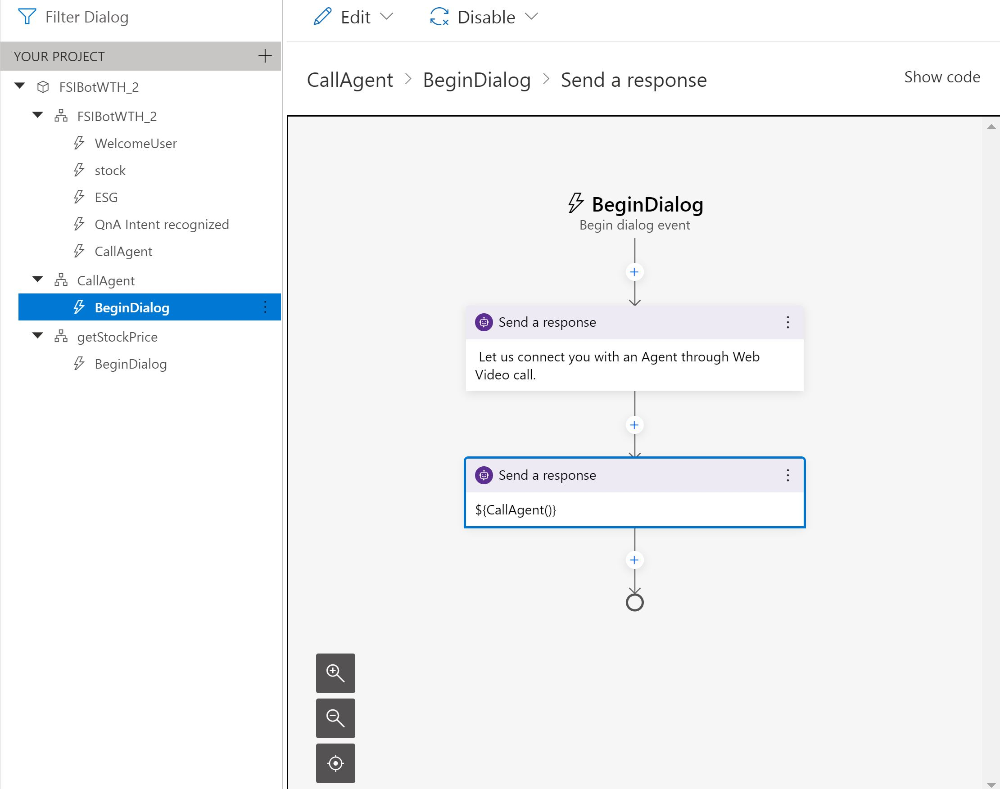

# Challenge 6: Azure Communication Services
[< Previous Solution](./Solution-5.md) - **[Home](./Readme.md)** - [Next Solution>](./Solution-7.md)
## Notes & Guidance

Please note that this is a Human Handoff scenario in the Bot because we do not a have the functionality right out of box from Bot Composer. This feature is something that Microsoft Engineering Team is working on. Please refer to [this GitHub Issue](https://github.com/microsoft/BotFramework-Composer/issues/3077) for reference if you want to implement it in production.

The intend of solution below is for demonstrating what you can do with Azure Communication services. 

1.	Create Communications Service from Azure Portal leveraging the following link:  [Quickstart - Create and manage resources in Azure Communication Services](https://nam06.safelinks.protection.outlook.com/?url=https%3A%2F%2Fdocs.microsoft.com%2Fen-us%2Fazure%2Fcommunication-services%2Fquickstarts%2Fcreate-communication-resource%3Ftabs%3Dwindows%26pivots%3Dplatform-azp&data=04%7C01%7CAnnie.Xu.Dan%40microsoft.com%7C3c9f2316780d4f03254308d8be72ba71%7C72f988bf86f141af91ab2d7cd011db47%7C1%7C0%7C637468747244978780%7CUnknown%7CTWFpbGZsb3d8eyJWIjoiMC4wLjAwMDAiLCJQIjoiV2luMzIiLCJBTiI6Ik1haWwiLCJXVCI6Mn0%3D%7C1000&sdata=56T9mKeNodJtny%2FLspPlv4hWuhD0AMoI9tbWxB8SyfQ%3D&reserved=0).  It is important to note connection information (connection endpoint and connection string).
2.	Leverage the Bot Composer to include an action to escalate to a video call with an agent leveraging the Azure Communication Service URL - Additional information can be found in the following link:  [Send an HTTP request  - Bot Composer](https://nam06.safelinks.protection.outlook.com/?url=https%3A%2F%2Fdocs.microsoft.com%2Fen-us%2Fcomposer%2Fhow-to-send-http-request&data=04%7C01%7CAnnie.Xu.Dan%40microsoft.com%7C3c9f2316780d4f03254308d8be72ba71%7C72f988bf86f141af91ab2d7cd011db47%7C1%7C0%7C637468747244978780%7CUnknown%7CTWFpbGZsb3d8eyJWIjoiMC4wLjAwMDAiLCJQIjoiV2luMzIiLCJBTiI6Ik1haWwiLCJXVCI6Mn0%3D%7C1000&sdata=nHJibpVdZmUG%2FK9g2ukmAfJiDRfqxNJ%2FZBSeZ3V7lO4%3D&reserved=0)
 
3.  The following depicts the entries required in the Bot Composer for a successful implementation for this challenge:

        

