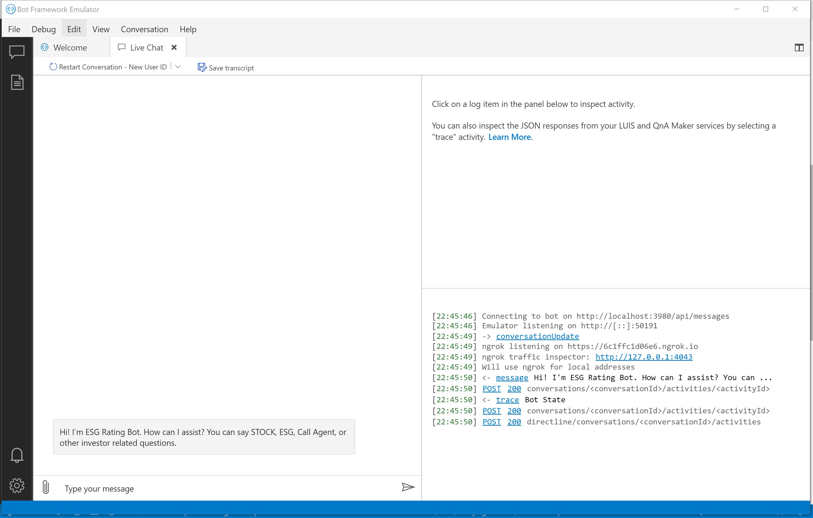

# Challenge 0 - Setup and Introduction
**[Home](../README.md)** - [Next Challenge>](./Challenge1-QnA.md)
## Introduction

Bot Composer is an open source visual authoring canvas for developers and multidisciplinary teams to build bots. Composer is available as a desktop application and a web-based component. In the past a company could build out a bot using the Bot Framework SDK, Bot Composer is built with the latest features of the SDK in one self contained environment. In this challenge, you will set up your local machine and cloud environment with the minimum requirements that will set you up for success in later challenges.  

## Description
1. Download the latest Microsoft Bot Framework Composer through the [desktop application](https://github.com/microsoft/BotFramework-Composer/releases/latest) or [web-based component](https://github.com/microsoft/BotFramework-Composer). 
2. Run the application, you should be brought to a walk-through which will show you some of the key elements of Bot Composer. If you haven't used Bot Composer before it's recommended that you go through it to get a lay of the land.
3. Create a new bot from scratch. Name it something appropriate such as FSI-Bot. 
4. Write a dialog welcoming the user and prompting them to ask a question about a Stock Prices or an ESG rating.
    - Hint: Change what response is sent in the "Greeting" Action. Look at The Bot Responses tab to see how WelcomeUser() propagates through the bot logic.
5. Test your bot locally in the Bot Framework Emulator, if you do not currently have it on your computer you can install it from [here](https://github.com/Microsoft/BotFramework-Emulator/blob/master/README.md)
    - Hint: If you are running into issues installing and running the Composer try uninstalling and reinstalling the application.

## Success Criteria
- You have successfully installed Bot Framework Composer and the Bot Framework Emulator
- When the bot Emulator is booted up you get a message from your bot welcoming the user and prompting the next conversational flow.

## Learning Resources
1. [BotFramework-Emulator](https://github.com/Microsoft/BotFramework-Emulator/blob/master/README.md)
2. [Introduction to Bot Framework Composer](https://docs.microsoft.com/en-us/composer/introduction)
3. [Install Bot Framework Composer](https://docs.microsoft.com/en-us/composer/install-composer)
4. [Create your first bot - Bot Composer](https://docs.microsoft.com/en-us/composer/quickstart-create-bot)

[Next Challenge - Create Multi-Turn QNA Knowledge Base >](./Challenge1-QnA.md)
