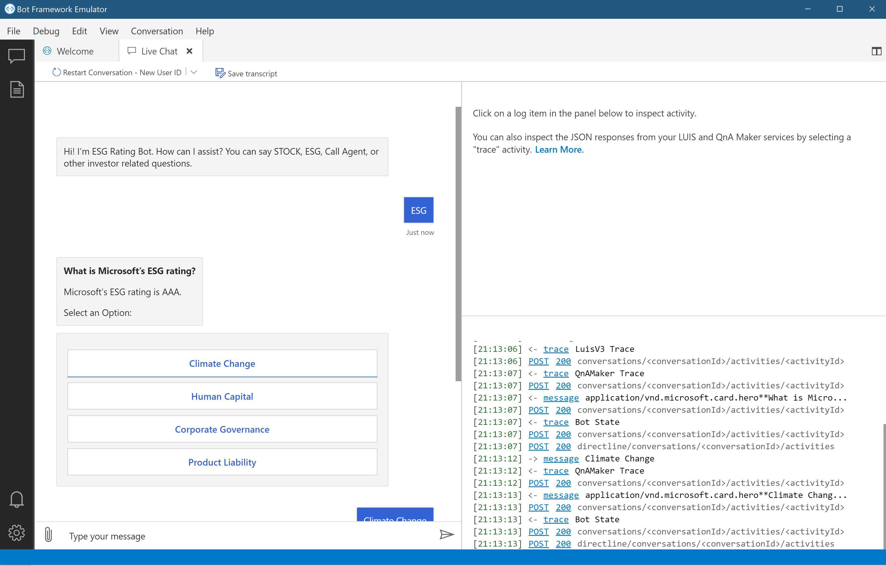

# Challenge 1 - Create Multi-Turn QNA Knowledge Base
[< Previous Challenge](./Challenge0-Setup.md) - **[Home](../README.md)** - [Next Challenge>](./Challenge2-LUIS.md)
## Introduction
QnA maker is a no code experience that allows you to create a natural conversational layer over you data. It is used to find the most appropriate answer for any input from your custom knowledge base of information. We're going to be building out a QnA based off of the FSI Industry Use Case Document that is in the Student folder of this GitHub. However you can build QnA out of a website, excel document, FAQ, etc. Our QnA Knowledge base will deal with the ESG portion of our project. You can imagine that a Investment Manager is looking at their stocks and considering what to buy. They can interact with the bot to ask for the ESG rating of a specific company and then dive deeper into  the Company belief's for specific Environmental topics. In this hack we're just focusing on Microsoft, but building out a enterprise bot you would have a much larger knowledge base to pull from. 

## Description

1. You are going to upload two different sources into a QnA knowledge base. You should be doing this through Bot Composer and **not** through the QnaMaker UI. 

	- Create a new QNA KB using [Microsoft Investor FAQ](https://www.microsoft.com/en-us/Investor/FAQ.aspx)
	- Also upload the  [FSI Use Case document](https://github.com/microsoft/WhatTheHack/blob/master/030-ConversationalAI/Student/Resources/T20-FSI-ESG-BOT-ACS-IndustryUseCase.docx?raw=true). 
	
2. Look at how the format from the word doc was automatically uploaded -- fine tune as necessary
3. Ensure that you are using the multi-turn conversation feature so that when you ask - for example - " What Is Microsoft's ESG rating?" you have the option of clicking "Climate Change", "Human Capital", "Corporate Governance", and "Product Liability".
4. Under "Carbon Emissions" and "Financing Environment" add a follow-up to return to the previous conversation flow - it should be titled "Return to previous".
5. Test your bot locally using the Bot Framework Emulator. You should be able to flow through the conversations easily.

## Successful Criteria
- Your bot runs without errors in the Bot Framework Emulator
- You are able to recreate the conversational flow from the source document, this includes being able to have multi-turn conversations and return to the previous conversation.

	
## Resources
- [What is QnA Maker?](https://docs.microsoft.com/en-us/azure/cognitive-services/qnamaker/overview/overview)
- [Create a QnA Maker Knowledge base](https://docs.microsoft.com/en-us/composer/how-to-create-qna-kb)
-  [Add a QnA Maker knowledge base to your bot](https://docs.microsoft.com/en-us/composer/how-to-add-qna-to-bot#:~:text=Composer%20allows%20you%20to%20build%20bots%20that%20contain,a%20bot%20using%20QnA%20Maker%20and%20LUIS%20intents.)
- [Create a QnA KB in Composer](https://docs.microsoft.com/en-us/composer/how-to-create-qna-kb)
- [Multiturn Conversations](https://docs.microsoft.com/en-us/azure/cognitive-services/QnAMaker/how-to/multiturn-conversation)

[Next Challenge - Create LUIS Intents to direct conversations >](./Challenge2-LUIS.md)
