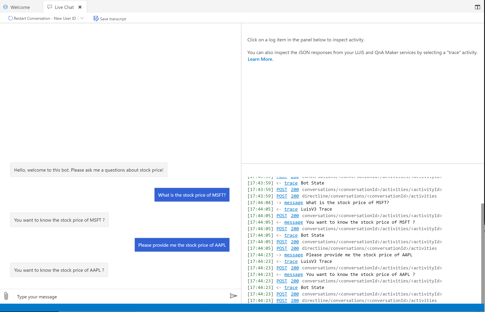

# Challenge 2 - Create LUIS Intents to direct conversations
[< Previous Challenge](./Challenge1-QnA.md) - **[Home](../README.md)** - [Next Challenge>](./Challenge3-API.md)
## Introduction

We are going to build out a LUIS triggered dialog flow to help answer the current stock price, we'll implement returning the actual price in the next challenge. For now we are just going to recognize that the utterance is Stock based and pull out the Ticker Symbol entity that is included in the utterance. Below goes into more depth.

- This intent needs to recognize when a Stock Price question is asked. So it should recognize questions like
  - What is the MSFT stock today?
  - Get me the stock price of TSLA
  - Provide me with more information on the stock opening price for AAPL 
- We also want to pull out the entity information for the Ticker Symbol in each utterance, in the above examples the entities we would pull out would be: MSFT, TSLA, and AAPL 

## Description
1. Add a new trigger by Intent for recognizing Stock Price questions
2. Train your LUIS model with trigger phrases to recognize the intent and entities. 
4. Add dialog in this trigger action to print back out the stock that they are asking for, we will add additional functionality in future challenges. The flow of the Bot should essentially look like this to the user:

   - Bot: *\<Greeting and prompt for a question>*
   - User: " What is the stock price of MSFT?"
   - Bot: "You want to know the stock price of MSFT?"
   
   - User: "TSLA stock price?"
   - Bot: "You want to know the stock price of TSLA?"

5. Test your bot locally with unknown phrases and entities

## Success Criteria
- The bot runs without errors in the Bot Framework Emulator
- The bot can recognize when the utterance has a StockPrice intent and triggers the correct conversational flow
- You bot returns the correct Stock Ticker price when it is responding.

## Resources
- [Introduction to LUIS](https://docs.microsoft.com/en-us/composer/tutorial/tutorial-luis)
- [Define intents with entities](https://docs.microsoft.com/en-us/composer/how-to-define-intent-entity)

[Next Challenge -  Make API Calls from your Bot >](./Challenge3-API.md)
