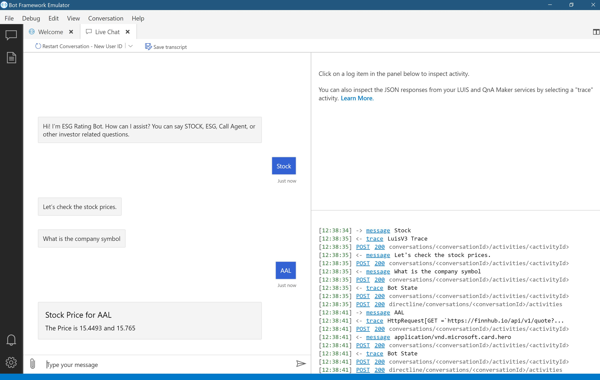

# Challenge 3:  Make API Calls from your Bot  
[< Previous Challenge](./Challenge2-LUIS.md) - **[Home](../README.md)** - [Next Challenge>](./Challenge4-Deployment.md)
## Introduction

The power of the Bot Service is the ability to add your own APIs. In this challenge you will add a HTTP call out to a free API endpoint to get the stock price of certain companies. We'll be building onto the Dialog from the prior challenge and utilizing the entities pulled out from the utterance to make dynamic API calls. As the investment manager it's critical that you get the latest stock data, as prices can change within the hour, minute, or even second. Therefore pulling from a database won't be sufficient for this task.

## Description

1. From your LUIS challenge you're going to extract the entity and call an API. You should already have the syntax necessary for pulling out the entities.
2. Get a [Finnhub](https//finnhub.io/dashboard) API key, we're going to be using it to get the current stock price.
3. We're going to be using the "Quote" feature from Finnhub, look at their [API documentation](https://finnhub.io/docs/api#quote) and get a better understanding of the requirements.
5. Dynamically call the API with the stock ticker name that the user sent. You should *not* be hard coding the symbol in your HTTP request.
7. Respond to the user with the *opening price* of the stock that they asked about. You can also respond with other data you receive back, but don't print out the entire JSON object.

## Success Criteria
- The bot successfully calls the Finnhub API without any errors
- The bot can return the opening stock price of a variety of different companies such as MSFT, AAPL, JNJ, or FB. 
- The bot runs in the Bot Framework Emulator and displays the opening stock price.

## Resources
- [API Documentation for Finnhub](https://finnhub.io/docs/api)
- [Send an HTTP request  - Bot Composer](https://docs.microsoft.com/en-us/composer/how-to-send-http-request)
- [Intents and Entities](https://docs.microsoft.com/en-us/composer/how-to-define-intent-entity)

[Next Challenge - Publish your Bot to Azure and enable Teams Channel >](./Challenge4-Deployment.md)
