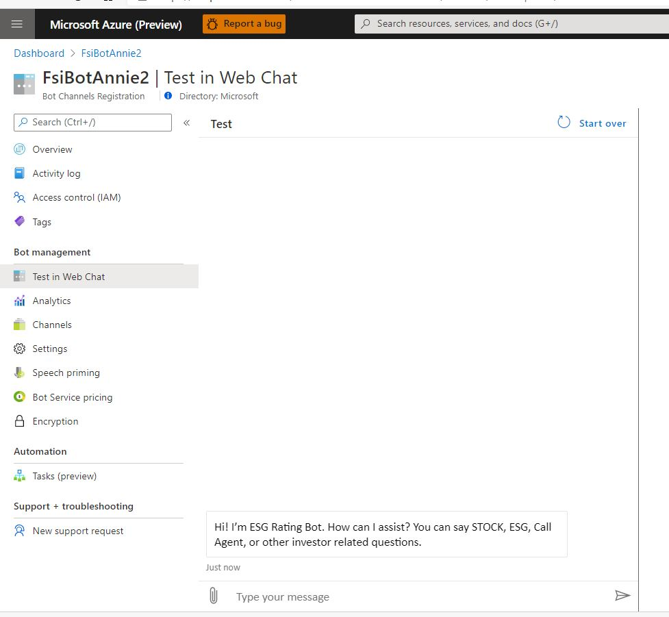
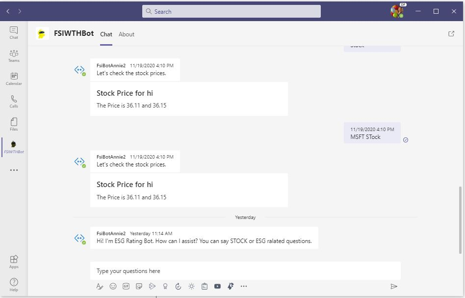

# Challenge 4: Publish your Bot to Azure and enable Teams Channel
[< Previous Challenge](./Challenge3-API.md) - **[Home](../README.md)** - [Next Challenge>](./Challenge5-FrontEnd.md)
## Introduction
Now that we've finished developing our bot locally, we can deploy the bot. Deployment is key so that we can get the bot in our Testers' hands to ensure our dialogs are robust enough. Fortunately, deployment is semi-built into the Bot Composer interface.
    
## Description
1. First, you must deploy your bot to Azure Web Apps:
     - In your Bot Composer project, add a new publish profile and choose to publish bot to Azure Web App.
     - Ensure that no errors occurred and test your bot through the Azure portal.
     - Test your endpoint using the Bot Framework Emulator. You will need to install [Ngrok](https://ngrok.com/) 
2. Then, we can integrate with Teams. (if you do not have Teams licenses in your organization, this challenge is optional for you.)
     - In your Azure Bot Channel Registration, create a Teams Channel
     - Add the bot as an app in Microsoft Teams
     - You can use the sample image icons as your Teams App icon - those png files are in the [Resource folder](./Resources/).

## Success Criteria
* The bot has been deployed out to Azure Web Apps, and you're able to test against it using the Bot Framework Emulator.
* Successfully message the bot in Microsoft Teams 
     * If you do not have Teams licenses in your organization, this challenge is optional for you.
* What a sample result looks like

## Resources
* [How to publish a Bot](https://docs.microsoft.com/en-us/composer/how-to-publish-bot)
* [Connect a bot to Microsoft Teams](https://docs.microsoft.com/en-us/azure/bot-service/channel-connect-teams?view=azure-bot-service-4.0) 

[Next Challenge - Embed your Bot to the sample Front End Web Application and enable Direct Line Speech  >](./Challenge5-FrontEnd.md)