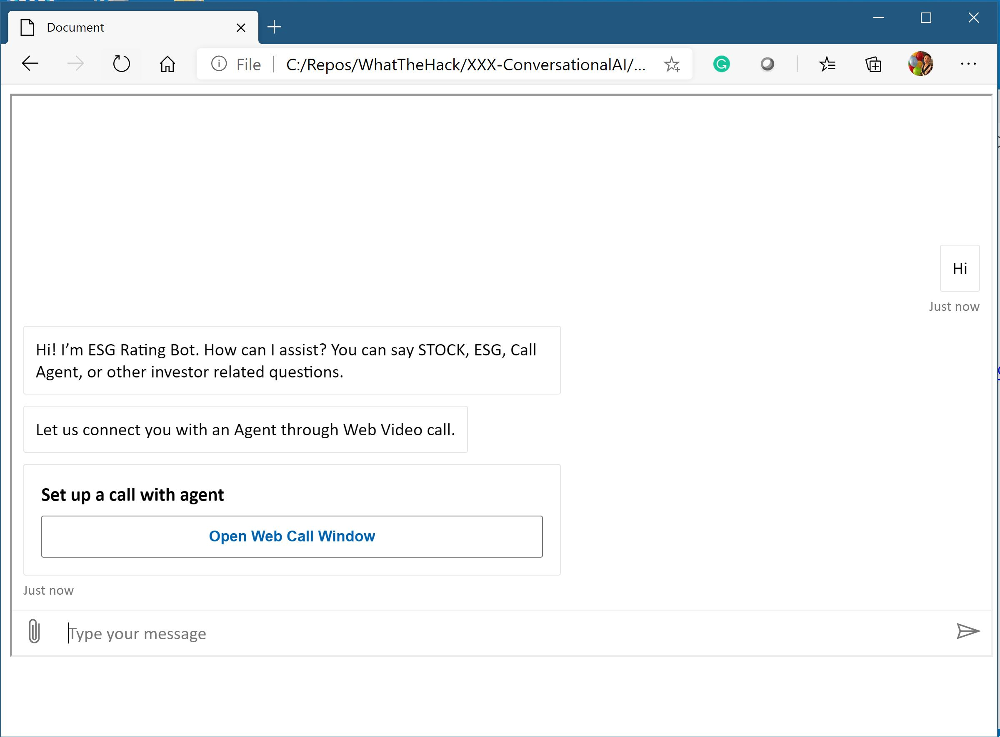
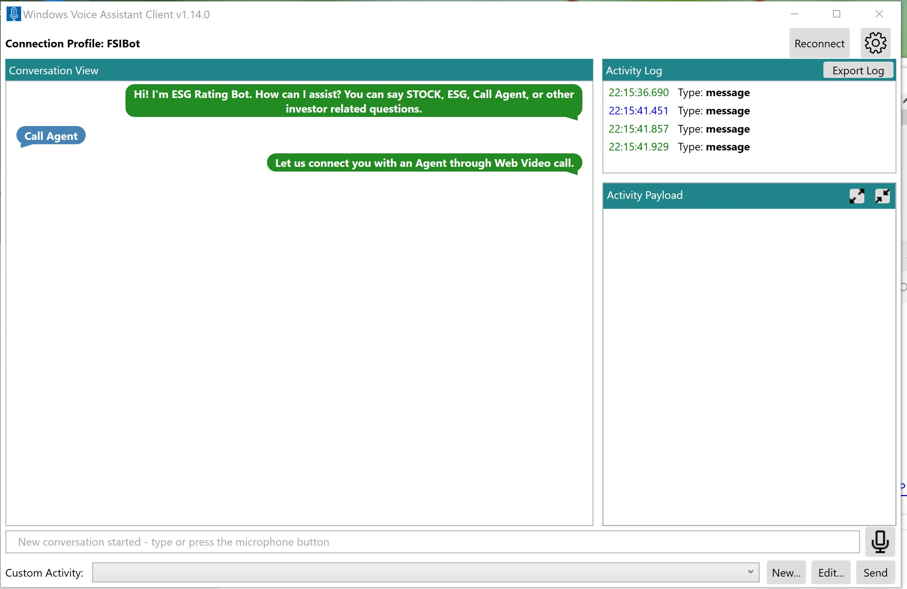

# Challenge 5: Embed your Bot to the sample Front End Web Application and enable Direct Line Speech  
[< Previous Challenge](./Challenge4-Deployment.md) - **[Home](../README.md)** - [Next Challenge>](./Challenge6-ACS.md)

## Introduction
Now that we've finished deployed our Bot into Azure. You can then enriching your Bot user interface through a sample web application. Also, in this challenge, let's explore how you can enable the speech capabilities of your FSI Bot. 
    
## Description
1. Embed the Bot into a HTML Web Page. 

2. Make your Bot into a Voice-Enabled Bot through the Direct Line Speech channel

3. Explore different capabilities you can do with the Direct Line Speech channel

4. Demonstrate to the coach that your voice-enabled Bot through Windows Voice Assistant Client. 

5. (optional) Can you make a simple page with a speech-to-text and text-to-speech feature from the Direct Line Speech channel? 

## Success Criteria
* Created a Web Page with your Bot embedded on it. 
* Demonstrated the speech capability of your Bot through Microsoft Speech SDK. 
* What a sample result looks like:

## Resources
- [Connect a bot to Direct Line Speech](https://docs.microsoft.com/en-us/azure/bot-service/bot-service-channel-connect-directlinespeech?view=azure-bot-service-4.0#:~:text=Add%20the%20Direct%20Line%20Speech%20channel%20In%20your,the%20bot.%20In%20the%20left%20panel%2C%20select%20Channels.)
- [Sample - Web Chat Integrating with Direct Line Speech channel](https://github.com/microsoft/BotFramework-WebChat/tree/master/samples/03.speech/a.direct-line-speech)

[Next Challenge - Integrate your Bot with Azure Communication Services >](./Challenge6-ACS.md)
