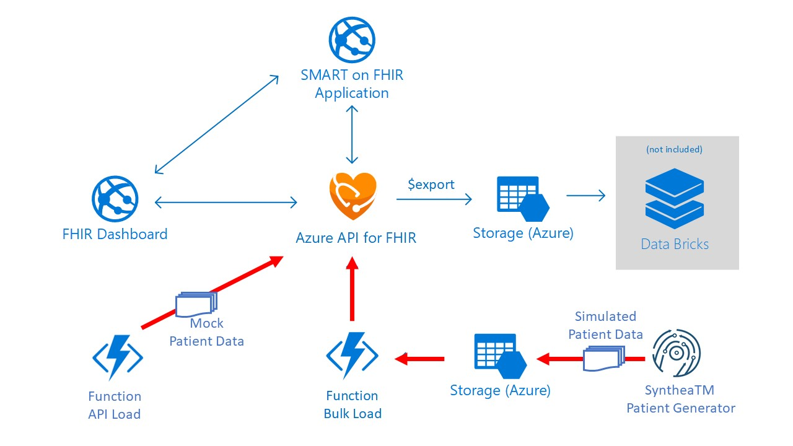

# Challenge 1: Extract, transform and load patient data

[< Previous Challenge](./Challenge00.md) - **[Home](../readme.md)** - [Next Challenge>](./Challenge02.md)

## Introduction

In this challenge, you will extract patient data from Electronic Health Record (EHR) systems and load to FHIR Server.  
Note: For this hack, you will auto-generate test FHIR patient data.



## Description

- Deploy Azure API for FHIR for data ingestion of FHIR patient data
- (API Load option) Mock patient data and load them into FHIR Server via Serverless Function
   - Develop a serverless function to auto-generate mock FHIR patient data
      Note: Sample NodeJS code snippet to be provided.
   - Update and configure the above serverless function to call FHIR Server API to load auto-generated patient data into FHIR Server one at a time  
   - Run data generation function app to mock patient data and load them into FHIR Server
   - (Optional) Setup Postman to access patient data inserted into FHIR Server via API call

- (Bulk Load option) Simulate patient data via **[SyntheaTM Patient Generator](https://github.com/synthetichealth/synthea#syntheatm-patient-generator)** and bulk load them into FHIR Server via FHIR Server Bulk Load
   - Auto generate FHIR patient data via **[SyntheaTM Patient Generator tool](https://github.com/synthetichealth/synthea#generate-synthetic-patients)**.  
      - SyntheaTM will output patient records in C-CDA and FHIR formats in ./output folder. 
      
      Note: SyntheaTM is a Synthetic Patient Population Simulator that outputs synthetic patient data and associated health records in FHIR and other formats, i.e. C-CDA, etc.

   - Deploy **[FHIR Server sample (PaaS scenario) Bulk Load Function and Blob Storage](https://github.com/microsoft/fhir-server-samples)** to load Synthea generated FHIR patient bundles into FHIR Server

      Note: In the Azure API for FHIR (PaaS scenario) deployments depicted below, a storage account will be deploy and in this storage account there is a BLOB container called fhirimport, patient bundles generated with Synthea can dumped in this storage container and they will be loaded into the FHIR server. The bulk load is performed by an Azure Function.

      

      - First, clone this 'FHIR Server Samples' git repo to local project repo, i.e. c:/projects and change directory to deploy/scripts folder:

         ```
         $ git clone https://github.com/Microsoft/fhir-server-samples
         $ cd fhir-server-samples/deploy/scripts
         ```
      - Deploy FHIR Server Samples Function Bulk Load and Storage fhirimport via deployment template (azuredeploy-importer.json) in fhir-server-samples/deploy/templates
- Use Azure data utility tools to copy Synthea generated FHIR patient bundle data files to fhirimport Blob Container for bulk load into FHIR Server 
   - You can **[copy data to Azure Storage using Azure AzCopy tool](https://docs.microsoft.com/en-us/azure/storage/common/storage-use-azcopy-v10)**
   - Alternatively, you can **[copy data to Azure Storage using Azure Storage Explorer](https://docs.microsoft.com/en-us/azure/storage/common/storage-use-azcopy-v10#use-azcopy-in-azure-storage-explorer)**     
   - (Optional) Setup Postman to access patient data inserted into FHIR Server via API call

## Success Criteria

   - Standup Azure API for FHIR managed service in Azure.
   - Auto generate test patient data in FHIR-based format via Serverless Function or Synthea Patient Generator tool
   - Load FHIR patient test data into FHIR Server via FHIR API Load or Bulk Load.
   - (Optional) Verify patient data is loaded into FHIR Server via Postman

## Learning Resources

- **[Create Mock Data Server in Azure Function](https://medium.com/@hharan618/create-your-own-mock-data-server-in-azure-functions-7a93972fbfd1)**
- **[Azure API for FHIR samples](https://github.com/microsoft/fhir-server-samples)**
- **[Azure FHIR Importer Function](https://github.com/microsoft/fhir-server-samples/tree/master/src/FhirImporter)**
- **[Synthea Patient Generator](https://github.com/synthetichealth/synthea#syntheatm-patient-generator)**
- **[Synthea wiki](https://github.com/synthetichealth/synthea/wiki)**
- **[Copy data to Azure Storage using Azure AzCopy tool](https://docs.microsoft.com/en-us/azure/storage/common/storage-use-azcopy-v10)**
- **[Copy data to Azure Storage using Azure Storage Explorer](https://docs.microsoft.com/en-us/azure/storage/common/storage-use-azcopy-v10#use-azcopy-in-azure-storage-explorer)** 
