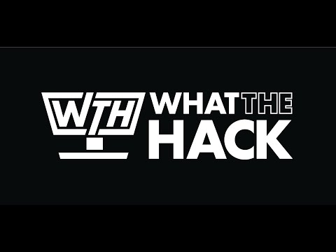

# Challenge 03: Track Your Work with GitHub Project Boards - Coach's Guide

[< Previous Solution](./Solution-02.md) - **[Home](./README.md)** - [Next Solution >](./Solution-04.md)

## Notes & Guidance

- Make sure students don't get the new "Project (Beta)" confused with the traditional Project boards.
- Students wont be able to assign tickets to others if they are not invited and accepted as collaborators.
- Issues and PRs are very similar as they use issues underneath both.

- To add collaborators
    - In your repository, select "Settings"
    - On the left hand side, select "Collaborators"
    - Select "Add people"
    - In the popup, enter the user you wish to add
    - The user will need to accept the invite before this is complete.
- Create Automated Kanban Board
    - In your repository, select "Projects"
    - Make sure on the left hand side you select "Projects",
    - Change "Link Project" to be "New Project" and Select "New Project"
    - Select "Team backlog" in the project templates.
    - Select "Create"
- Creating Issues
    - In your board select "Add Items"
    - Create the draft issue for each challenge. 
    - Convert draft issues to issues. Make sure you select the repository for each one.
    - New issues if linked properly should show up in the "New" column.  Once you set to closed, it should move to "Done" column.  If you are viewing the issues in the kanban board, you are able to drag the issues across the columns.

## Videos

### Challenge 3 Solution

