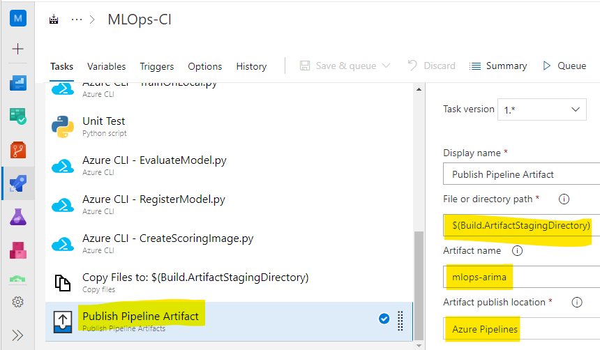
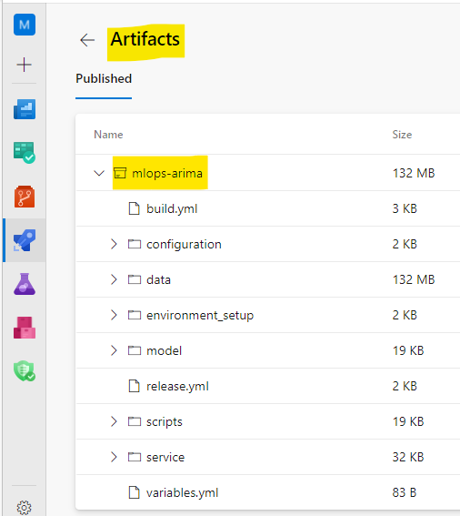

# Challenge 2 – Create a Build Pipeline in Azure DevOps

[< Previous Challenge](./Solution-01.md) - **[Home](./README.md)** - [Next Challenge >](./Solution-03.md)

## Solution

1.  Make sure you have setup a new project, imported the code, created service connections, and configured Azure ML Workspace for the project.

### Classic GUI pipeline

1.  Create a `Build` pipeline
    1.  Use the classic editor to create a pipeline without YAML
    1.  Select the repo that was imported in the previous challenge
    1.  Create an `Empty Job`
1.  Setup `Agent Job 1`
    1.  Set Agent Pool to `Azure Pipelines`
    1.  Set Agent Specification to `ubuntu-18.04`

        
1.  Setup `Build` pipeline – Add the following tasks (click the `+` next to `Agent job 1` to add each task)

    

    1.  Python version – `3.6`

        

    1.  Bash task to setup environment with `pip install -r ./environment_setup/requirements.txt` in the Inline Script.

        

    1.  Azure CLI task for Azure ML Workspace connection with `python service/code/WorkSpace.py` in the Inline Script.

        

    1.  Azure CLI task to acquire time series transactions data with `python service/code/AcquireData.py` in the Inline Script.
    1.  Azure CLI task to train ARIMA model to forecast transactions with `python service/code/TrainOnLocal.py` in the Inline Script.
    1.  Azure CLI task to evaluate the model performance with `python service/code/EvaluateModel.py` in the Inline Script.
    1.  Azure CLI task to register the model in Azure ML Workspace for model versioning with `python service/code/RegisterModel.py` in the Inline Script.
    1.  Azure CLI task to score the model, to forecast future transactions with `python service/code/CreateScoringImage.py` in the Inline Script.
    1.  Create a build artifact for your `Build` pipeline to publish.
        - Use Copy Files task to copy files from `$(Build.SourcesDirectory)` to `$(Build.ArtifactStagingDirectory)`.

          

        - Use Publish Artifact task with `$(Build.ArtifactStagingDirectory)` as path to publish.

          

        **NOTE:** Alternatively, you have more Artifact options such as Model Artifact that you could use if you want to go that route.
    
**Complete CI pipeline**

### YAML pipeline

1.  Create a `build.yml` file.
1.  Add code similar to the [example build file](./Solutions/build.yml).
1.  Create a `variables.yml` file.
1.  Add code similar to the [example variables file](./Solutions/variables.yml).
1.  Import these files into the repo.
1.  Create a new `pipeline` (not a Release pipeline).
    1.  Under the `Pipelines` page in Azure DevOps, click `New pipeline`.
    1.  Select `Azure Repos Git`.
    1.  Select your repo.
    1.  Select `Existing Azure Pipelines YAML file`.
    1.  Specify the `path` to the `build.yml` file.
1.  Rename the pipeline something like `MLOps - Build`. This same value is used in the `Release` pipeline that is defined in [Challenge-04](./Solution-04.md).

### Run & Review Results

1.  Run the `Build` pipeline. This will either be by clicking on the `Save & queue` button or the `Queue` button (depending on if the students have already saved the pipeline).

    

1.  Review `Build` Outputs - confirm that the model and Azure Container Image have been registered in the [Azure ML workspace](https://ml.azure.com/) in respective registries.

    

1.  Verify that a `Build` artifact was created. Note the name of the artifact as it will be used in the release pipeline.

    
    