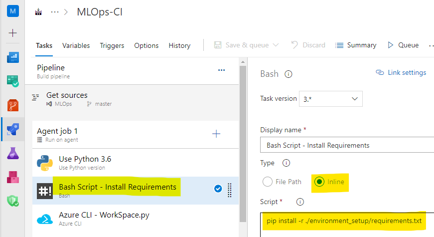
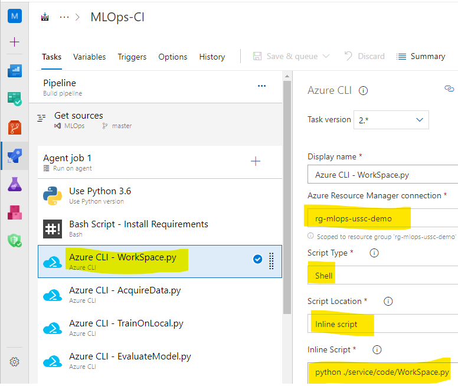

# Challenge 2 – Create a Build Pipeline in Azure DevOps

[< Previous Challenge](./Solution-01.md) - **[Home](./README.md)** - [Next Challenge >](./Solution-03.md)

## Solution

1.  Make sure you have setup a new project, imported the code, created service connections, and configured Azure ML Workspace for the project.
1.  Create a Build pipeline
    1.  Use the classic editor to create a pipeline without YAML
    1.  Select the repo that was imported in the previous challenge
    1.  Create an Empty Job
1.  Setup Agent Job
    1.  Set Agent Pool to Azure Pipelines
    1.  Set Agent Specification to ubuntu-18.04
    
1.  Setup Build pipeline – Add the following tasks (click the `+` next to `Agent job 1` to add each task)
    
    1.  Python version – 3.6
    
    1.  Bash task to setup environment with `pip install -r ./environment_setup/requirements.txt` in the Inline Script.
    
    1.  Azure CLI task for Azure ML Workspace connection with `python service/code/WorkSpace.py` in the Inline Script.
    
    1.  Azure CLI task to acquire time series transactions data with `python service/code/AcquireData.py` in the Inline Script.
    1.  Azure CLI task to train ARIMA model to forecast transactions with `python service/code/TrainOnLocal.py` in the Inline Script.
    1.  Azure CLI task to evaluate the model performance with `python service/code/EvaluateModel.py` in the Inline Script.
    1.  Azure CLI task to register the model in Azure ML Workspace for model versioning with `python service/code/RegisterModel.py` in the Inline Script.
    1.  Azure CLI task to score the model, to forecast future transactions with `python service/code/CreateScoringImage.py` in the Inline Script.
    1.  At this point, you have the option of choosing an artifact for your Release pipeline (An artifact is the deployable component of your applicaton/model). If you like to use Build Artifact, then you have two following steps to perform in Build pipeline. 
        - Use Copy Files task to copy files from `$(Build.SourcesDirectory)` to `$(Build.ArtifactStagingDirectory)`
        
        - Use Publish Artifact task with `$(Build.ArtifactStagingDirectory)` as path to publish.
        
        **NOTE:** Alternatively, you have more Artifact options such as Model Artifact that you could use if you want to go that route.
    
**Complete CI pipeline**  

1.  Run the Build pipeline. This will either be by clicking on the `Save & queue` button or the `Queue` button (depending on if the students have already saved the pipeline).

1.  Review Build Outputs - confirm that the model and Azure Container Image have been registered in the [Azure ML workspace](https://ml.azure.com/) in respective registries.
