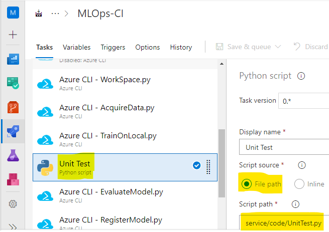

# Challenge 3 – Create a Unit Test Locally and in Azure DevOps

[< Previous Challenge](./Solution-02.md) - **[Home](./README.md)** - [Next Challenge >](./Solution-04.md)

## Solution

1.  Make sure you have created a new project in Azure DevOps, created new service connections and have Azure ML workspace configured for the project using config.json file.
1.  Write a Python snippet to validate that AdventureWorks data is indeed downloaded and extracted into `Data/` folder. Do a preview of file count in the data folder. Additionally, you could also pick a csv file visualize the data. 
    - Example code:
      ```python
      import glob

      file_count = 0
      # count number of files in data directory
      for filepath in glob.iglob(r'./data/*.csv', recursive=False):
          file_count = file_count + 1

      print("# of CSV files is " + str(file_count))

      if(file_count != 3):
          raise Exception("Number of CSV files does not match. Expected: 3. Actual: " + str(file_count))
      ```
1.  Save this as a script in the repo so the pipeline can run it.

### Classic GUI pipeline

1.  Add a Python script task in the `Build` pipeline to run the unit test script created earlier.

    

### YAML pipeline
```yaml
- task: PythonScript@0
  displayName: 'Unit Test'
  inputs:
    scriptPath: ./service/code/UnitTest.py
```
