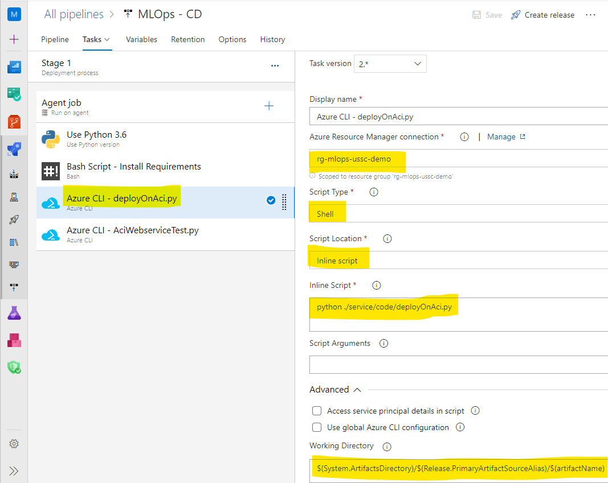
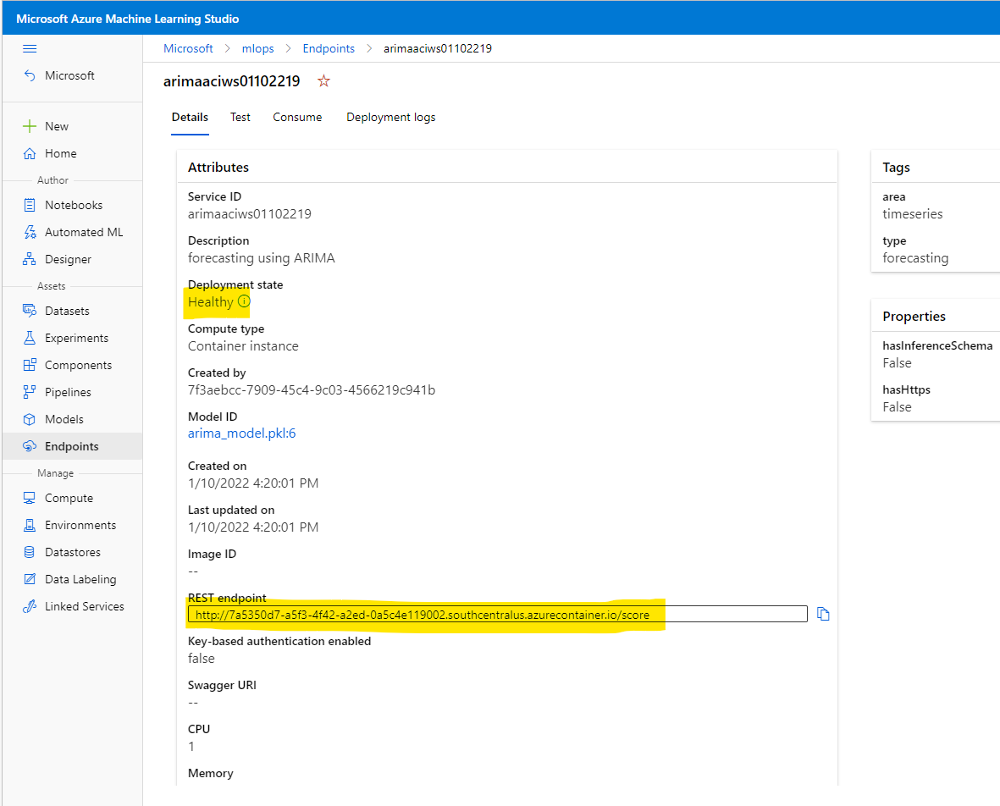

# Challenge 4 – Create a Release Pipeline In Azure DevOps

[< Previous Challenge](./Solution-03.md) - **[Home](./README.md)** - [Next Challenge >](./Solution-05.md)

## Solution

### Classic GUI pipeline

1.  Create a `Release` pipeline with an empty Job
1.  Add `Build` Artifact that you created in the [previous challenge](Solution-03.md)

    

1.  Setup Agent Job
    1.  Set Agent Pool to `Azure Pipelines`
    1.  Set Agent Specification to `ubuntu-18.04`

        

1.  Create a variable to hold the `artifact name` that was set in the `Build` job.

    

1.  Setup `Release` pipeline – Create a new pipeline, edit the pipeline and add the following tasks (similar to what you have in the Build pipeline)
    1.  Python version – `3.6`.
    1.  `Bash` task to setup environment using `install_environment.sh` file. Make special note of the script path. Artifacts get downloaded to a directory specified by default pipeline variables. You have to specify the path (including the name of the build artifact).

        

    1.  `Azure CLI` task to deploy the scoring image on ACI using `deployOnAci.py` file. Make special note of the `Working Directory`. The script expects to be run from the directory where all the other files are located. By default, the task does not run at this location.

        

    1.  `Azure CLI` task to test the ACI web service using `AciWebserviceTest.py` file.

### YAML pipeline

1.  Create a `release.yml` file.
1.  Add code similar to the [example release file](./Solutions/release.yml).
1.  Use the same `variables.yml` file from the `Build` pipeline.
1.  Import this file into the repo.
1.  Create a new `pipeline` (not a Release pipeline).
    1.  Under the `Pipelines` page in Azure DevOps, click `New pipeline`.
    1.  Select `Azure Repos Git`.
    1.  Select your repo.
    1.  Select `Existing Azure Pipelines YAML file`.
    1.  Specify the `path` to the `release.yml` file.

**NOTE:** The name used in the `release.yml` file for the `pipeline.source` (around line 9), must be **exactly** the same as the name of the `Build` pipeline created earlier (in this example, `MLOps - Build`).

```yaml
resources:
  pipelines:
    - pipeline: mlops_build
      source: 'MLOps - Build'
```

### Run & review results

1.  Run the `Release` pipeline.

    **NOTE:** The first time you run the `Release` pipeline, you may have to authorize it to create an environment. You will see this on the `Summary` page of the execution.

    

1.  Verify via the `Release` pipeline logs that deployment & testing were successful.

    
    

1.  A “healthy” ACI deployment will be created under Azure ML Endpoints. It contains a Scoring URI/Endpoint. Navigate to the `Machine Learning Studio` resource in the [Azure portal](https://portal.azure.com).

    
    